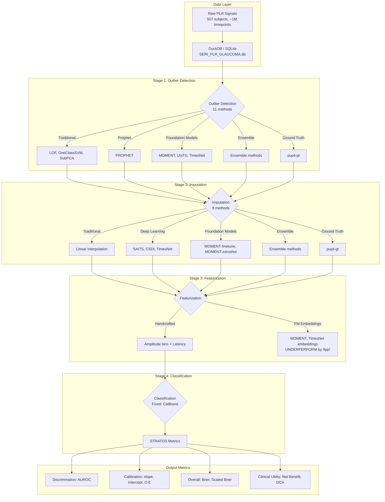
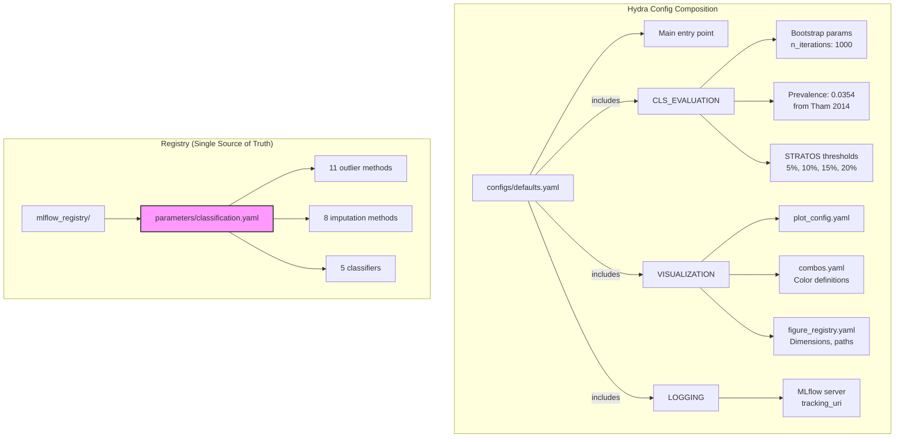
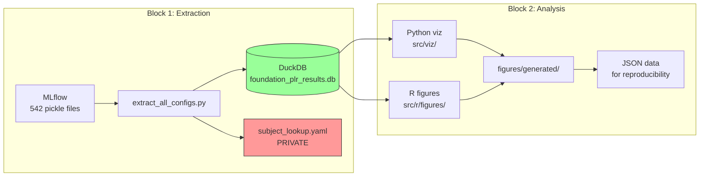
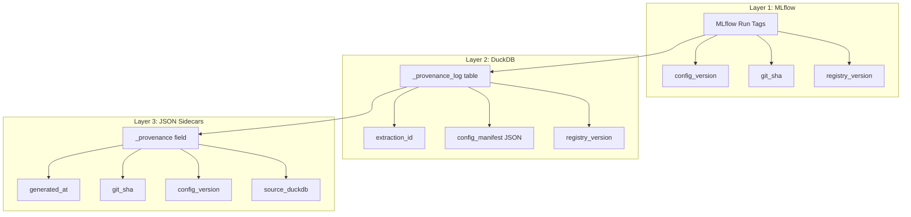

# Foundation PLR Architecture

> **Research Question**: How do preprocessing choices (outlier detection → imputation) affect downstream classification performance for glaucoma screening using handcrafted physiological features?

## Pipeline Overview



## Error Propagation Chain

The core research insight: **errors at each stage propagate downstream**.

```
Raw PLR Signal (with blinks, artifacts, noise)
    │
    ▼
┌─────────────────────────────────────────────────────────────────┐
│ STAGE 1: OUTLIER DETECTION                                      │
│ Question: Can FMs detect artifacts as well as humans?           │
│                                                                 │
│ Entry point: src/anomaly_detection/flow_anomaly_detection.py    │
│                                                                 │
│ ⚠️ ERRORS HERE → Missed artifacts become imputation inputs     │
└─────────────────────────────────────────────────────────────────┘
    │
    ▼
┌─────────────────────────────────────────────────────────────────┐
│ STAGE 2: IMPUTATION                                             │
│ Question: Can FMs reconstruct missing segments well?            │
│                                                                 │
│ Entry point: src/imputation/flow_imputation.py                  │
│                                                                 │
│ ⚠️ ERRORS HERE → Incorrect values corrupt feature extraction   │
└─────────────────────────────────────────────────────────────────┘
    │
    ▼
┌─────────────────────────────────────────────────────────────────┐
│ STAGE 3: FEATURIZATION                                          │
│ Approach: Handcrafted features (amplitude bins + latency)       │
│                                                                 │
│ Entry point: src/featurization/flow_featurization.py            │
│                                                                 │
│ Note: FM embeddings underperform handcrafted by 9pp AUROC!      │
└─────────────────────────────────────────────────────────────────┘
    │
    ▼
┌─────────────────────────────────────────────────────────────────┐
│ STAGE 4: CLASSIFICATION                                         │
│ Fixed classifier: CatBoost (established as best)                │
│                                                                 │
│ Entry point: src/classification/flow_classification.py          │
│                                                                 │
│ Output: ALL STRATOS-compliant metrics (not just AUROC!)         │
└─────────────────────────────────────────────────────────────────┘
```

## Module Entry Points

| Stage | Module | Entry Point | Description |
|-------|--------|-------------|-------------|
| **Pipeline** | `src/` | `pipeline_PLR.py` | Main Hydra/Prefect orchestrator |
| **1. Outlier** | `src/anomaly_detection/` | `flow_anomaly_detection.py` | Coordinates 11 outlier detection methods |
| **2. Imputation** | `src/imputation/` | `flow_imputation.py` | Coordinates 7 imputation methods |
| **3. Features** | `src/featurization/` | `flow_featurization.py` | Amplitude bins + latency extraction |
| **4. Classification** | `src/classification/` | `flow_classification.py` | CatBoost training + bootstrap evaluation |
| **Data I/O** | `src/data_io/` | `flow_data.py` | DuckDB import/export |
| **Stats** | `src/stats/` | N/A (library) | STRATOS metrics, calibration, clinical utility |
| **Visualization** | `src/viz/` | `generate_all_figures.py` | Figure generation for manuscript |
| **Logging** | `src/log_helpers/` | `mlflow_utils.py` | MLflow experiment tracking |

## Directory Structure

```
foundation_PLR/
├── src/                          # Source code
│   ├── anomaly_detection/        # Stage 1: 11 outlier methods
│   │   ├── momentfm_outlier/     # MOMENT foundation model
│   │   ├── extra_eval/           # TSB-AD evaluation
│   │   └── *.py                  # LOF, SVM, Prophet, TimesNet
│   ├── imputation/               # Stage 2: 7 imputation methods
│   │   ├── momentfm/             # MOMENT imputation
│   │   ├── pypots/               # [VENDORED] PyPOTS library
│   │   └── nuwats/               # [VENDORED] NuwaTS
│   ├── featurization/            # Stage 3: Feature extraction
│   │   └── embedding/            # FM embedding alternatives
│   ├── classification/           # Stage 4: CatBoost + evaluation
│   │   ├── tabpfn/               # [VENDORED] TabPFN
│   │   └── tabpfn_v1/            # [VENDORED] TabPFN v1
│   ├── stats/                    # Statistical methods (STRATOS)
│   ├── viz/                      # Visualization pipeline
│   ├── data_io/                  # Data import/export
│   └── log_helpers/              # MLflow integration
│
├── configs/                      # Hydra configuration
│   ├── defaults.yaml             # Main config
│   ├── mlflow_registry/          # Experiment metadata
│   ├── VISUALIZATION/            # Figure settings
│   └── schema/                   # Data schemas
│
├── tests/                        # Test suite
├── apps/visualization/           # React + D3.js figures
├── figures/                      # Generated figures + JSON data
├── notebooks/                    # Jupyter notebooks
├── scripts/                      # Utility scripts
└── .claude/                      # AI assistant context
```

## Data Flow

### 1. Data Sources

| Source | Path | Contents |
|--------|------|----------|
| **Raw PLR Database** | `SERI_PLR_GLAUCOMA.db` | 507 subjects, ground truth masks |
| **MLflow Experiments** | `/home/petteri/mlruns/` | 542 pickle files, bootstrap results |
| **Extracted Metrics** | `manuscripts/.../data/*.duckdb` | Aggregated results for figures |

### 2. Subject Counts

| Task | N Subjects | Reason |
|------|------------|--------|
| **Outlier Detection** | 507 | All subjects have ground truth outlier masks |
| **Imputation** | 507 | All subjects have ground truth denoised signals |
| **Classification** | 208 | Only labeled subjects (152 control + 56 glaucoma) |

### 3. Pipeline Combinations

The experiment explores a **factorial design**:

```
11 outlier methods × 7 imputation methods × 5 classifiers = 525 combinations
```

But the research question fixes the classifier:
```
11 outlier methods × 7 imputation methods × CatBoost = 105 relevant combinations
```

## Key Configuration Files

| File | Purpose |
|------|---------|
| `configs/defaults.yaml` | Main Hydra configuration |
| `configs/VISUALIZATION/plot_config.yaml` | Figure styling |
| `configs/VISUALIZATION/plot_hyperparam_combos.yaml` | Standard pipeline combinations |
| `configs/VISUALIZATION/figure_registry.yaml` | Figure specifications |
| `configs/demo_subjects.yaml` | Representative subjects for figures |

### Configuration Hierarchy



## Orchestration

The pipeline uses **Prefect** for workflow orchestration and **MLflow** for experiment tracking.

```python
# From src/pipeline_PLR.py
def flowMain_PLR_experiment(cfg: DictConfig) -> None:
    init_mlflow(cfg=cfg)

    if prefect_flows["OUTLIER_DETECTION"]:
        df = flow_import_data(cfg=cfg)
        flow_anomaly_detection(cfg=cfg, df=df)

    if prefect_flows["IMPUTATION"]:
        flow_imputation(cfg=cfg)

    if prefect_flows["FEATURIZATION"]:
        flow_featurization(cfg=cfg)

    if prefect_flows["CLASSIFICATION"]:
        flow_classification(cfg=cfg)
```

### Two-Block Architecture

The reproducibility system decouples extraction from analysis:



**Key principle**: All metric computation happens in Block 1 (extraction). Block 2 only reads and visualizes.

| Block | Input | Output | Commands |
|-------|-------|--------|----------|
| **1. Extraction** | MLflow pickles | DuckDB + private lookup | `make extract` |
| **2. Analysis** | DuckDB only | Figures + JSON | `make analyze` |
| **Full Pipeline** | Both | Everything | `make reproduce` |

### Design Rationale

The extraction flow produces PII-cleaned DuckDB artifacts that are far more portable than
raw MLflow runs (~200 GB). The extraction is deterministic and reproducible without LLMs.
The DuckDB (~50 MB) supports all imaginable downstream visualizations without re-extraction
from MLflow. In 5-10 years the MLflow data may be gone, but the DuckDB files will persist
in Dropbox.

### What DuckDB Must Support (Without Re-Extraction)

- All STRATOS-compliant metrics (discrimination, calibration, clinical utility, overall)
- ROC curves, calibration curves, DCA curves at full resolution
- Subject-level predictions (for per-patient uncertainty analysis)
- Retention/cohort curves at fine granularity (for selective classification, AURC)
- Probability distributions by outcome class
- Bootstrap confidence intervals

### DuckDB Tables

| Table | Purpose | Key Columns |
|-------|---------|-------------|
| `essential_metrics` | Scalar metrics per config | auroc, brier, calibration_slope, net_benefit_*pct |
| `predictions` | Subject-level predictions | config_id, subject_id, y_true, y_prob |
| `calibration_curves` | Smoothed calibration data | x_smooth, y_smooth, ci_lower, ci_upper |
| `dca_curves` | DCA curve data | threshold, net_benefit_model/all/none |
| `retention_metrics` | Retention curve data | retention_rate, metric_name, metric_value |
| `cohort_metrics` | Cohort curve data | cohort_fraction, metric_name, metric_value |
| `distribution_stats` | Distribution statistics | auroc, median/mean_cases/controls, n_cases/controls |

### Enforcement

Computation decoupling is enforced by:
1. **Pre-commit hook**: `scripts/check_computation_decoupling.py` — AST-checks ALL `src/viz/*.py` for banned sklearn/stats imports
2. **Guardrail tests**: `tests/test_guardrails/test_computation_decoupling.py` — hard errors (not warnings)
3. **Code review**: CLAUDE.md rules prohibit sklearn imports in viz code

## STRATOS-Compliant Metrics

Following Van Calster et al. 2024 guidelines, we report:

| Category | Metrics | Implementation |
|----------|---------|----------------|
| **Discrimination** | AUROC with 95% CI | `src/stats/classifier_metrics.py` |
| **Calibration** | Slope, intercept, O:E ratio | `src/stats/calibration_extended.py` |
| **Overall** | Brier score, Scaled Brier (IPA) | `src/stats/scaled_brier.py` |
| **Clinical Utility** | Net Benefit, DCA | `src/stats/clinical_utility.py` |
| **Stability** | pminternal (Riley 2023) | `src/stats/pminternal_wrapper.py` |

## Vendored Code (Skip for Documentation)

The following directories contain vendored third-party code:

- `src/anomaly_detection/extra_eval/TSB_AD/` - TSB-AD benchmark
- `src/imputation/pypots/` - PyPOTS imputation library
- `src/imputation/nuwats/` - NuwaTS model
- `src/classification/tabpfn/` - TabPFN v2
- `src/classification/tabpfn_v1/` - TabPFN v1

These are excluded from docstring coverage requirements.

## LabOps: Configuration & Reproducibility Systems

The project implements a "LabOps" approach for maximum reproducibility, combining config versioning, provenance tracking, and automated integrity checks.

### Two-Tier Config Versioning

Every YAML config file has a version in the format: `MAJOR.MINOR.PATCH-CONTENTHASH`

```yaml
# Example from configs/defaults.yaml
VERSION: "1.0.0"
_content_hash: "8f3a7bc"  # Auto-generated SHA256 prefix
```

| Component | Maintained By | Purpose |
|-----------|---------------|---------|
| **Semantic Version** | Human | Breaking changes, features, fixes |
| **Content Hash** | Pre-commit hook | Detects any content modification |

### Pre-Commit Hooks

The following hooks enforce config integrity:

| Hook | File | Purpose |
|------|------|---------|
| `auto-version-configs` | `scripts/auto_version_configs.py` | Auto-bumps patch version when content changes |
| `frozen-config-check` | `scripts/check_frozen_configs.py` | Prevents modification of frozen experiment configs |
| `registry-integrity` | `scripts/verify_registry_integrity.py` | Validates method counts against registry |
| `registry-validation` | `tests/test_registry.py` | Enforces 11/8/5 method counts |
| `r-hardcoding-check` | `scripts/check_r_hardcoding.py` | Prevents hardcoded colors in R scripts |
| `computation-decoupling` | `scripts/check_computation_decoupling.py` | Ensures viz code doesn't compute metrics |

### CI Validation (GitHub Actions)

The `.github/workflows/config-integrity.yml` workflow:

1. Validates all config content hashes
2. Catches `git commit --no-verify` bypasses
3. Checks frozen configs aren't modified in PRs
4. Verifies version manifest consistency

### Version Manifest

The `configs/_version_manifest.yaml` tracks all 67+ config files:

```yaml
manifest_version: "1.0.0"
generated_at: "2026-02-02T..."
git_head: "7c63e4d7..."
total_configs: 67
configs:
  configs/defaults.yaml:
    version: "1.0.0"
    content_hash: "abc123..."
    last_modified: "2026-02-02T..."
```

### Provenance Tracking

Provenance is tracked at three layers:



| Layer | Location | Tracked Information |
|-------|----------|---------------------|
| **MLflow** | Run tags | Git SHA, config versions, registry version |
| **DuckDB** | `_provenance_log` table | Extraction ID, config manifest, MLflow run count |
| **JSON** | `_provenance` field | Generation timestamp, git SHA, source database |

### Frozen Registry

The `configs/mlflow_registry/FROZEN_2026-02.yaml` file:

- Documents the frozen state for publication
- Contains SHA256 checksums of all registry files
- Lists canonical method counts (11/8/5)
- Provides verification commands

```bash
# Verify registry integrity
sha256sum configs/mlflow_registry/parameters/*.yaml \
          configs/mlflow_registry/metrics/*.yaml
```

### Reproducibility Commands

| Command | Description |
|---------|-------------|
| `make reproduce` | Full pipeline (extraction + analysis) |
| `make extract` | Block 1: MLflow → DuckDB extraction |
| `make analyze` | Block 2: DuckDB → Figures |
| `uv run python scripts/config_versioning.py verify` | Verify manifest integrity |
| `uv run python scripts/config_versioning.py generate` | Regenerate manifest |

## Test Harness

### Test Categories

| Category | Marker | Purpose |
|----------|--------|---------|
| **Unit** | `@pytest.mark.unit` | Fast, isolated tests |
| **Integration** | `@pytest.mark.integration` | Multi-component tests |
| **E2E** | `@pytest.mark.e2e` | End-to-end pipeline tests |
| **Slow** | `@pytest.mark.slow` | Long-running tests (training, bootstrap) |

### Key Test Files

| File | Tests |
|------|-------|
| `tests/unit/test_config_versioning.py` | Config version format, content hash, manifest |
| `tests/unit/test_hyperparam_validation.py` | Hyperparameter validity (CatBoost, XGBoost, LogReg) |
| `tests/e2e/test_training_reproducibility.py` | Seed determinism, bootstrap reproducibility |
| `tests/test_registry.py` | Registry integrity (11/8/5 counts) |
| `tests/test_figure_qa/` | Figure data provenance, STRATOS compliance |

### Running Tests

```bash
# All tests
pytest

# Unit tests only
pytest -m unit

# Include slow tests
pytest -m slow

# Specific file
pytest tests/unit/test_config_versioning.py -v
```

## Related Repositories

| Repository | Path | Contents |
|------------|------|----------|
| **Manuscript** | `sci-llm-writer/manuscripts/foundationPLR/latent-methods-results/` | LaTeX source |
| **Literature** | `sci-llm-writer/manuscripts/foundationPLR/appendix-literature-review/` | Background theory |
| **Bibliography** | `sci-llm-writer/biblio/biblio-pupil/` | Reference papers |
