# Foundation PLR

[](https://github.com/petteriTeikari/foundation_PLR/actions/workflows/ci.yml)
[](https://www.python.org/downloads/)
[](https://www.r-project.org/)
[](LICENSE)
[](https://github.com/astral-sh/ruff)
[](https://github.com/astral-sh/uv)
[](https://petteriTeikari.github.io/foundation_PLR/)

<p align="center">
  
</p>

> **Can foundation models improve biosignal preprocessing for glaucoma screening?**

<p align="center">
  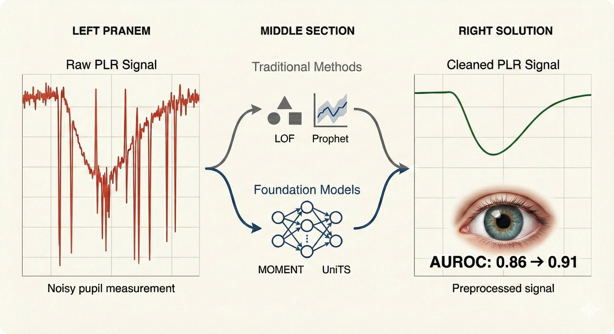
</p>

This repository evaluates whether **time-series foundation models** (MOMENT, UniTS) can replace traditional methods (LOF, SVM, linear interpolation) for **pupillary light reflex (PLR) biosignal preprocessing** in glaucoma screening. TimesNet is included as a non-TSFM baseline (trains from scratch per task). We fix the classifier (CatBoost), vary the preprocessing, and measure effects across **all** [STRATOS](http://arxiv.org/abs/2412.10288)-compliant metrics.

**Data**: 507 subjects from [Najjar et al. 2023](https://doi.org/10.1136/bjophthalmol-2021-319938) (Br J Ophthalmol), 208 with classification labels.

### Key Findings

| Finding | Value |
|---------|-------|
| Best AUROC | **0.913** (ground truth + CatBoost) |
| Handcrafted vs FM embeddings | **0.891 vs 0.812** (8pp gap) |
| FMs for preprocessing | Competitive with traditional methods |
| Preprocessing effect size | **eta-squared = 0.15** |

---

## The Pipeline

<p align="center">
  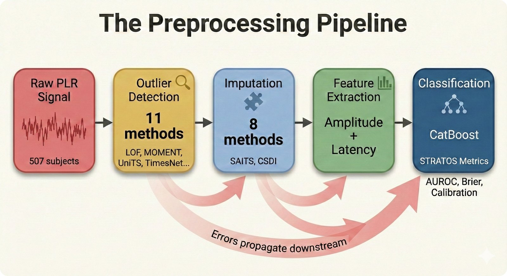
</p>

We **fix** the classifier and **vary** the preprocessing. This is NOT about comparing classifiers.

| Stage | # Methods | Examples |
|-------|-----------|---------|
| **Outlier Detection** | 11 | pupil-gt, MOMENT, UniTS, TimesNet, LOF, ensembles |
| **Imputation** | 8 | pupil-gt, SAITS, CSDI, TimesNet, MOMENT, ensemble |
| **Featurization** | Fixed | Handcrafted physiological features |
| **Classification** | Fixed | CatBoost (primary) |

<details>
<summary>Why foundation models for preprocessing?</summary>

<p align="center">
  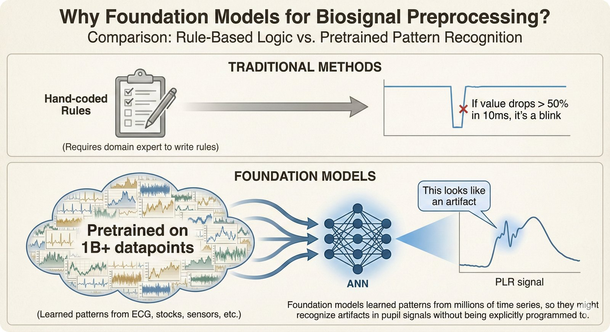
</p>

Traditional methods rely on hand-tuned rules. Foundation models learn temporal patterns from large pretraining corpora and transfer them to PLR artifact removal.

</details>

---

## Architecture

<p align="center">
  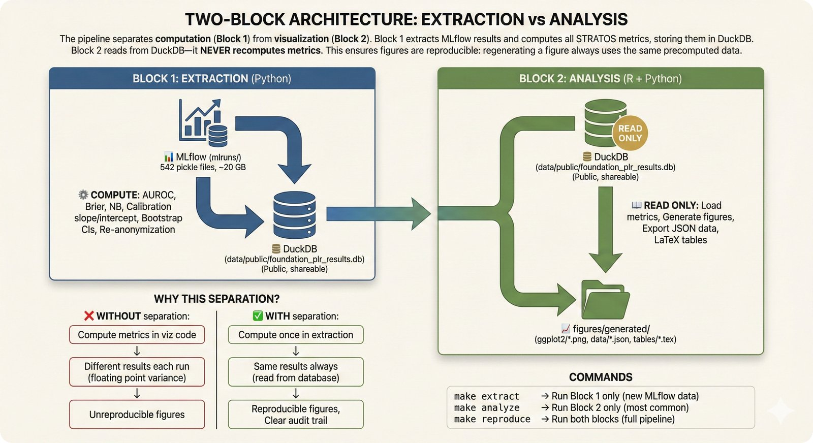
</p>

The project uses a **two-block architecture** that cleanly separates computation from visualization:

| Block | Purpose | Entry Point |
|-------|---------|-------------|
| **Extraction** | MLflow pickles to DuckDB | `src/orchestration/flows/extraction_flow.py` |
| **Analysis** | DuckDB to figures + LaTeX | `src/orchestration/flows/analysis_flow.py` |

All metric computation happens in extraction. Visualization code reads DuckDB only -- never computes metrics.

<details>
<summary>Experiment pipeline: 6 Prefect subflows</summary>

<p align="center">
  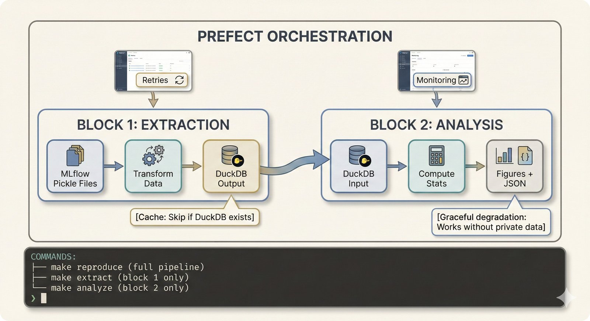
</p>

Each subflow uses **"MLflow as contract"** -- reading inputs from and writing outputs to MLflow -- enabling independent development by different team members.

| # | Subflow | Professional Persona |
|---|---------|---------------------|
| 1 | Data Import | Data Engineer |
| 2 | Outlier Detection | Signal Processing Expert |
| 3 | Imputation | Signal Processing Expert |
| 4 | Featurization | Domain Expert |
| 5 | Classification | Biostatistician |
| 6 | Deployment | MLOps Engineer |

</details>

---

## STRATOS-Compliant Evaluation

<p align="center">
  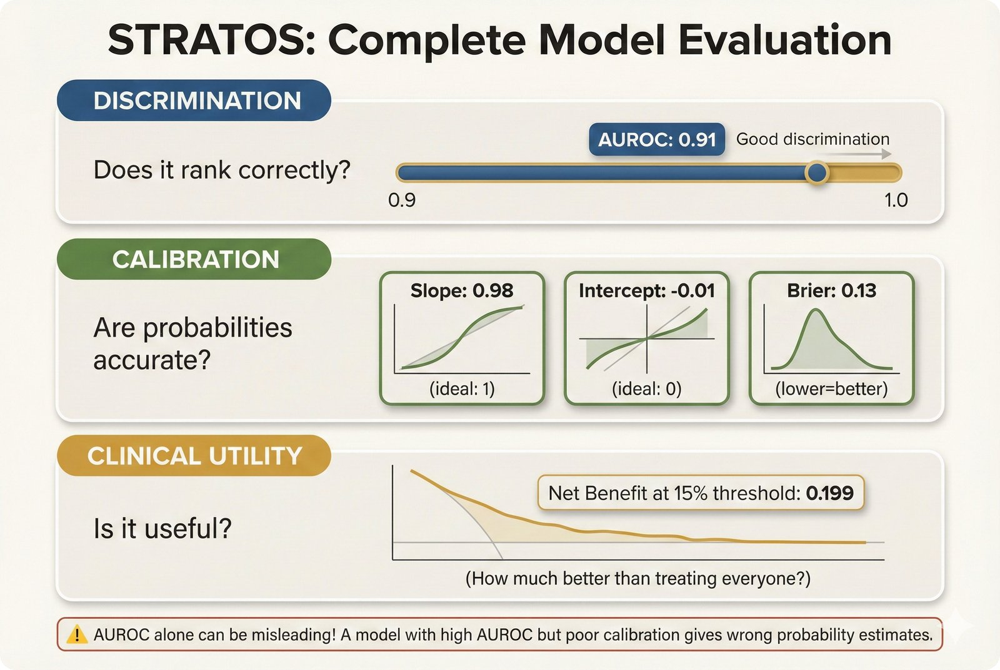
</p>

Every comparison reports **all five metric domains** -- not just AUROC:

| Domain | Metrics |
|--------|---------|
| **Discrimination** | AUROC with 95% CI |
| **Calibration** | Slope, intercept, O:E ratio |
| **Overall** | Brier score, scaled Brier (IPA) |
| **Clinical Utility** | Net Benefit, Decision Curve Analysis |
| **Distributions** | Probability distributions per outcome |

---

## Quick Start

### Docker (Recommended)

```bash
make docker-build    # Build full environment (Python + R + Node.js)
make docker-test     # Run tests
make docker-shell    # Interactive shell
```

### Local Development

```bash
# One-command setup (Ubuntu/Debian, macOS)
./scripts/infra/setup-dev-environment.sh
```

<details>
<summary>Manual setup</summary>

```bash
pip install uv                # Install package manager
uv venv --python 3.11         # Create virtual environment
uv sync                       # Install all dependencies
source .venv/bin/activate      # Activate
```

</details>

### Run the Pipeline

```bash
# Full reproducible pipeline
make reproduce

# Or step by step:
make extract    # MLflow to DuckDB
make analyze    # DuckDB to figures
```

<details>
<summary>MLflow and Prefect UIs</summary>

<p align="center">
  
</p>

```bash
prefect server start           # http://localhost:4200
mlflow ui --port 5000          # http://localhost:5000
```

</details>

---

## Configuration

<p align="center">
  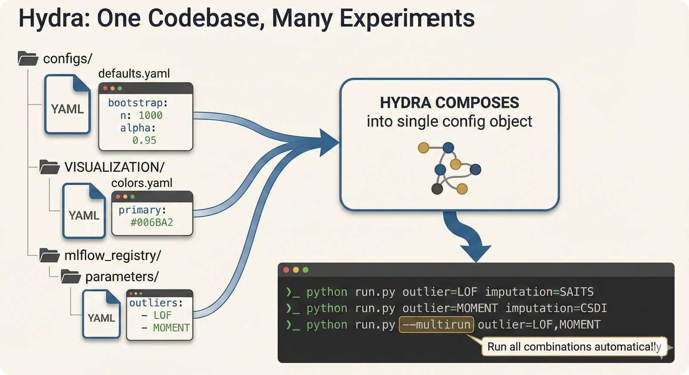
</p>

All configuration via [Hydra](https://hydra.cc/) -- change experiments by editing YAML, not source code:

```bash
python src/pipeline_PLR.py                                          # Default config
python src/pipeline_PLR.py --config-name=hyperparam_sweep           # Custom config
python src/pipeline_PLR.py PREFECT.PROCESS_FLOWS.CLASSIFICATION=true  # CLI override
```

See [configs/README.md](configs/README.md) for details.

---

## Standard Comparisons

<p align="center">
  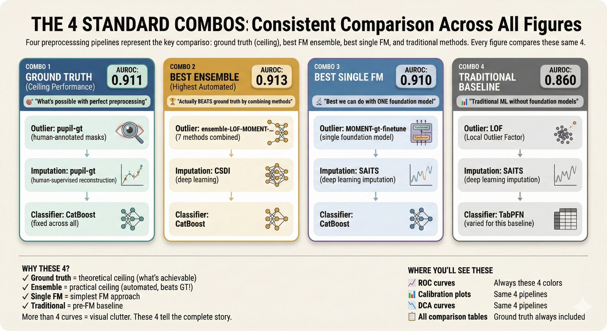
</p>

All figures compare the same 4 preprocessing pipelines (loaded from YAML, never hardcoded):

| ID | Outlier | Imputation | AUROC |
|----|---------|------------|-------|
| Ground Truth | pupil-gt | pupil-gt | 0.911 |
| Best Ensemble | Ensemble | CSDI | 0.913 |
| Best Single FM | MOMENT-gt-finetune | SAITS | 0.910 |
| Traditional | LOF | SAITS | 0.860 |

---

## Error Propagation

<p align="center">
  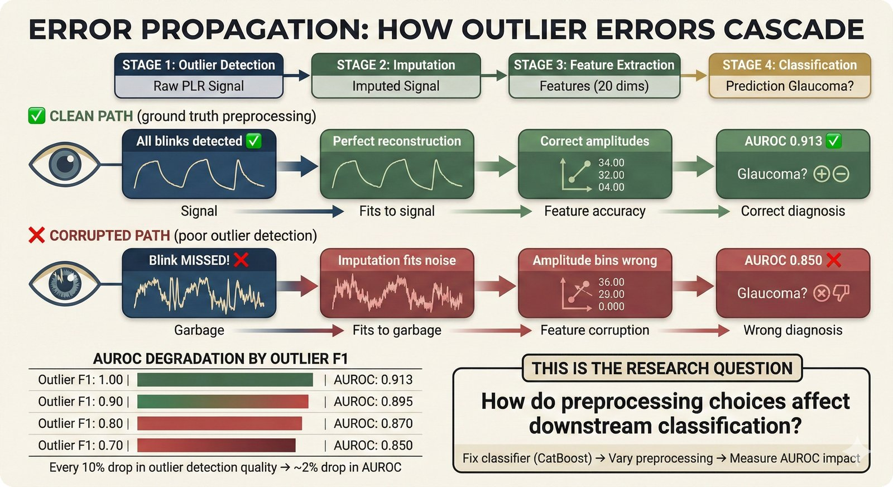
</p>

Errors at each preprocessing stage propagate downstream. This is why preprocessing choices matter -- even when the classifier is fixed.

---

## Project Structure

```
foundation_PLR/
├── src/                    # Source code (pipeline stages)
│   ├── anomaly_detection/  # Stage 1: 11 outlier methods
│   ├── imputation/         # Stage 2: 8 imputation methods
│   ├── featurization/      # Stage 3: Feature extraction
│   ├── classification/     # Stage 4: CatBoost + evaluation
│   ├── stats/              # STRATOS-compliant metrics
│   ├── viz/                # Figure generation (DuckDB read-only)
│   └── data_io/            # Data import/export + registry
├── configs/                # Hydra configuration
├── tests/                  # Test suite (2000+ tests)
├── figures/                # Generated figures + JSON data
├── docs/                   # MkDocs documentation site
├── apps/visualization/     # React + D3.js interactive figures
└── src/r/                  # R figure scripts (renv-locked)
```

See [ARCHITECTURE.md](ARCHITECTURE.md) for detailed documentation.

---

## Extending the Pipeline

<p align="center">
  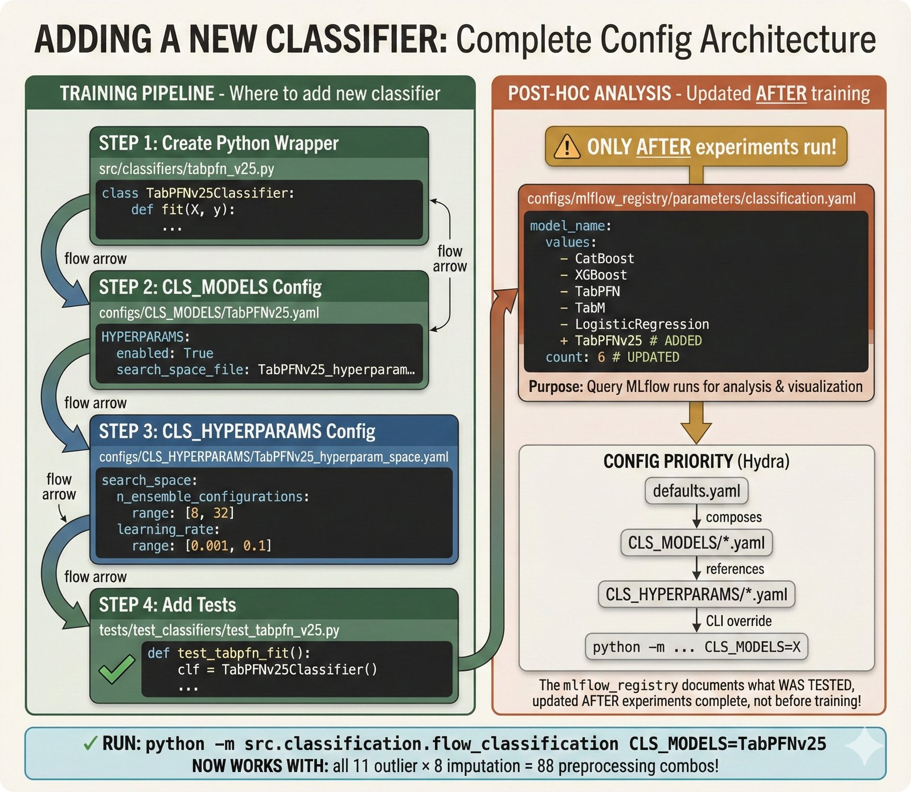
</p>

Adding a new method requires 4 files: wrapper, model config, HPO space, and tests. The [mlflow_registry](configs/mlflow_registry/) is updated post-hoc after experiments complete. See the [tutorials](https://petteriTeikari.github.io/foundation_PLR/tutorials/adding-new-methods/) for step-by-step guides.

---

## Quality Gates

<p align="center">
  
</p>

Pre-commit hooks enforce:
- No hardcoded hex colors, paths, method names, or dimensions
- No sklearn/stats imports in visualization code (computation decoupling)
- Registry integrity (exactly 11 outlier, 8 imputation, 5 classifier methods)
- Code formatting via ruff

```bash
make test-fast          # Unit + guardrail tests (~2 min)
make test-integration   # Integration + e2e tests
```

<details>
<summary>Test tiers</summary>

| Tier | Marker | What It Tests | CI | Local |
|------|--------|---------------|:---:|:-----:|
| 0 | -- | Lint (ruff) | Y | Y |
| 1 | `unit`, `guardrail` | Pure functions, code quality | Y | Y |
| 2 | -- | Quality gates (registry, decoupling) | Y | Y |
| 3 | `integration`, `e2e` | Full pipeline | Y | Y |
| Local | `data`, `r_required` | Production data, R scripts | -- | Y |

</details>

---

## Reproducibility

| Language | Lockfile | Tool | Restore |
|----------|----------|------|---------|
| **Python** | `uv.lock` | [uv](https://github.com/astral-sh/uv) | `uv sync` |
| **R** | `renv.lock` | [renv](https://rstudio.github.io/renv/) | `renv::restore()` |

Synthetic data is isolated from production via a [4-gate architecture](https://petteriTeikari.github.io/foundation_PLR/) preventing contamination of real results.

---

## Data Provenance

**Source**: Najjar RP, et al. "Handheld chromatic pupillometry can accurately and rapidly reveal functional loss in glaucoma." *Br J Ophthalmol* 2023;107:663-670. [DOI: 10.1136/bjophthalmol-2021-319938](https://doi.org/10.1136/bjophthalmol-2021-319938)

<p align="center">
  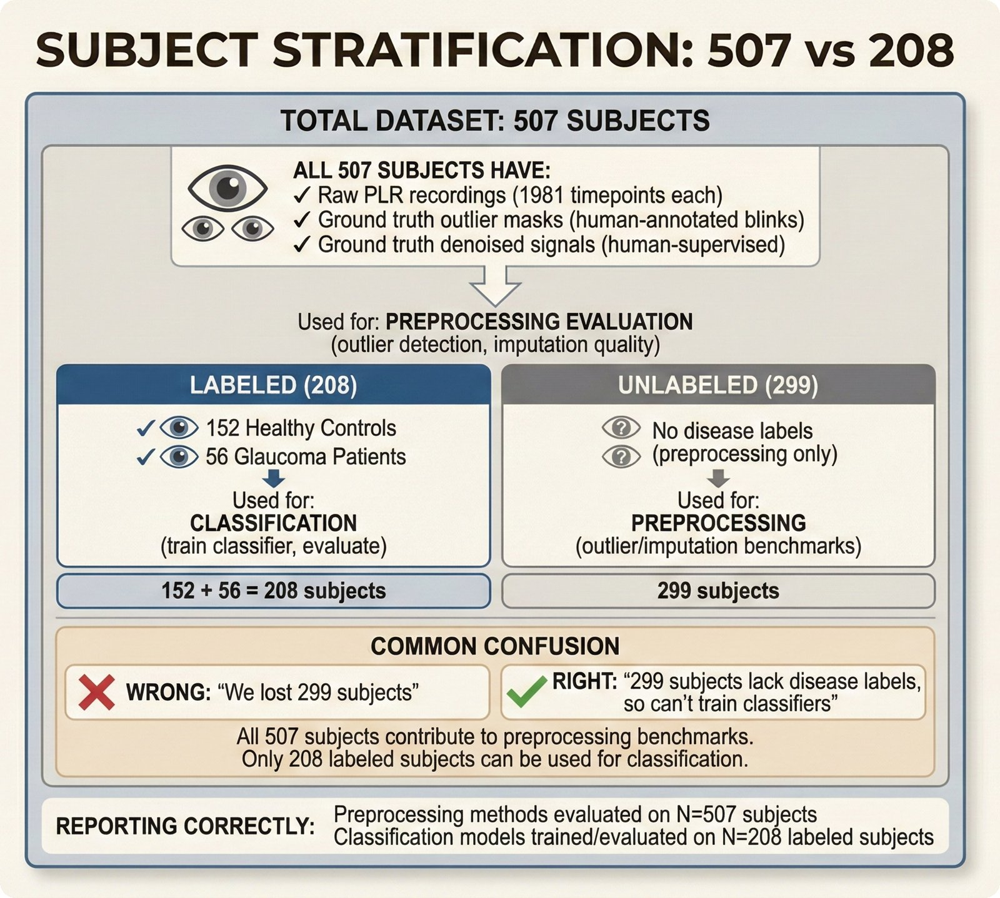
</p>

| Dataset | N | Notes |
|---------|---|-------|
| Najjar original | 322 | Full Singapore dataset (SNEC) |
| Our subset (preprocessing) | 507 | All with ground truth outlier masks |
| Our subset (classification) | 208 | 152 control + 56 glaucoma |

---

## Documentation

Full documentation is available at **[petteriTeikari.github.io/foundation_PLR](https://petteriTeikari.github.io/foundation_PLR/)** (MkDocs + Material).

| Resource | Description |
|----------|-------------|
| [ARCHITECTURE.md](ARCHITECTURE.md) | Pipeline overview, error propagation, module entry points |
| [CONTRIBUTING.md](CONTRIBUTING.md) | How to contribute, code style, PR process |
| [configs/README.md](configs/README.md) | Hydra configuration system |
| [figures/README.md](figures/README.md) | Figure generation, JSON data, naming conventions |
| [Figure Catalogue](docs/repo-figures/figure-alt-text-catalog.md) | All ~130 repository figures with descriptions |

---

## Citation

If you use this code, please cite:

```
TO-COME
```

And the original data source:

```bibtex
@article{najjar2023pupillometry,
  title={Handheld chromatic pupillometry can accurately and rapidly reveal
         functional loss in glaucoma},
  author={Najjar, Raymond P and others},
  journal={British Journal of Ophthalmology},
  volume={107},
  pages={663--670},
  year={2023},
  doi={10.1136/bjophthalmol-2021-319938}
}
```

---

## References

### Our Manuscript

<!-- TODO: Update when preprint is published -->
- **Teikari P, et al.** "Foundation models for pupillary light reflex preprocessing: a sensitivity analysis." *(In preparation)*
- Background theory: [Literature Review PDF](https://github.com/petteriTeikari/foundation_PLR/blob/main/docs/literature-theory.pdf) <!-- TODO: update link when available -->

### Key Papers

#### PLR and Glaucoma Screening
- **Najjar RP, et al.** (2023). Handheld chromatic pupillometry can accurately and rapidly reveal functional loss in glaucoma. *Br J Ophthalmol*, 107, 663-670. [DOI: 10.1136/bjophthalmol-2021-319938](https://doi.org/10.1136/bjophthalmol-2021-319938)

#### STRATOS Reporting Guidelines
- **Van Calster B, Collins GS, Vickers AJ, et al.** (2024). Performance evaluation of predictive AI models to support medical decisions. STRATOS Initiative Topic Group 6. [arXiv: 2412.10288](http://arxiv.org/abs/2412.10288)
- **Collins GS, et al.** (2024). TRIPOD+AI statement: updated guidance for reporting clinical prediction models that use regression or machine learning methods. *BMJ*, 385, e078378.

#### Model Stability and Sample Size
- **Riley RD, et al.** (2023). Stability of clinical prediction models developed using statistical or machine learning methods. *BMC Med Res Methodol*. [pminternal R package](https://cran.r-project.org/package=pminternal)
- **Legha A, et al.** (2026). Minimum sample size for developing a multivariable prediction model using machine learning. *J Clin Epidemiol*.

#### Time-Series Foundation Models

Our pipeline evaluates TSFMs for preprocessing tasks (outlier detection, imputation) -- not forecasting. Only MOMENT and UniTS support the full task stack needed; other TSFMs like MIRA and Chronos are forecasting-only and cannot perform the preprocessing tasks evaluated here. TimesNet is included as a non-TSFM baseline that trains from scratch per task.

| Model | Tasks in Our Pipeline | Pretrained? | Key Capability |
|-------|----------------------|-------------|----------------|
| **MOMENT** | Outlier detection, imputation | Yes (1.2B timestamps, 13 domains) | Full-stack TSFM: zero-shot + fine-tune |
| **UniTS** | Outlier detection, imputation | Yes (35M+ timesteps, multi-domain) | Unified model: single weights across 38 tasks |
| **TimesNet** | Outlier detection, imputation | No (trains from scratch) | Non-TSFM baseline for comparison |
| **MIRA** | *Not used* | Yes (454B medical timepoints) | Forecasting-only; no anomaly/imputation/classification |

- **Goswami M, et al.** (2024). MOMENT: A family of open time-series foundation models. *ICML 2024*. [arXiv: 2402.03885](https://doi.org/10.48550/arXiv.2402.03885) -- T5 encoder-based TSFM pretrained on the Time Series Pile (13 domains, 1.23B timestamps) supporting forecasting, classification, anomaly detection, and imputation in both zero-shot and fine-tuned modes. The only open TSFM with full-stack task coverage evaluated on standard benchmarks across all four tasks.
- **Gao S, et al.** (2024). UniTS: Building a unified time series model. *NeurIPS 2024*. [arXiv: 2403.00131](https://arxiv.org/abs/2403.00131) -- Transformer architecture with separate generative and classification towers that handles 38 multi-domain tasks with a single set of shared weights, achieving state-of-the-art in 27/38. Supports anomaly detection, imputation, classification, and forecasting via token-based task specification.
- **Li H, et al.** (2025). MIRA: Medical time series foundation model for real-world health data. [arXiv: 2506.07584](https://doi.org/10.48550/arXiv.2506.07584) -- Decoder-only TSFM with continuous-time positional encoding and mixture-of-experts, pretrained on 454B medical timepoints (MIMIC-III/IV, PTB-XL, Sleep-EDF). Handles irregular sampling natively but **evaluates forecasting only** -- anomaly detection, imputation, and classification are not supported, making it inapplicable to our preprocessing pipeline.
- **Wu H, et al.** (2023). TimesNet: Temporal 2D-variation modeling for general time series analysis. *ICLR 2023*. -- CNN-based architecture using FFT period discovery and 2D convolutions that achieves state-of-the-art across all five mainstream time-series tasks (forecasting, imputation, classification, anomaly detection, short-term forecasting). Not a pretrained foundation model -- trains from scratch per task -- but included in our evaluation as a strong non-TSFM baseline.

##### Towards medical biosignal TSFMs

<p align="center">
  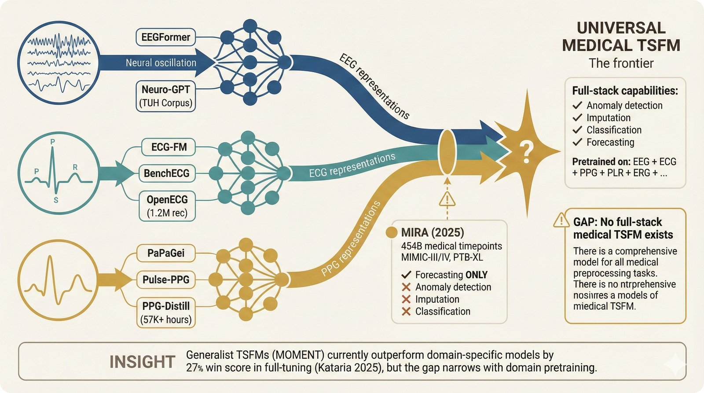
</p>

*Medical biosignal foundation models are proliferating by modality (EEG, ECG, PPG), but no universal medical TSFM yet supports the full preprocessing task stack. MIRA provides medical pretraining but forecasting only -- the frontier is a full-stack medical TSFM.*

<p align="center">
  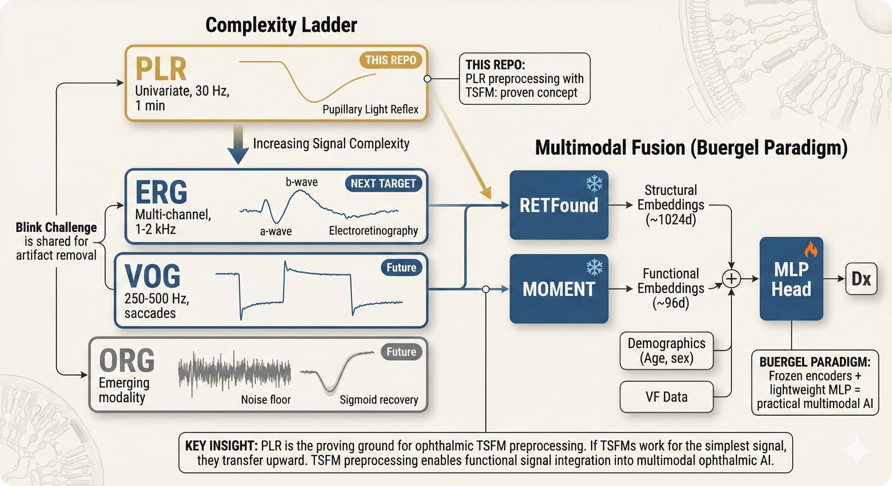
</p>

*PLR is the simplest ophthalmic time series -- the ideal TSFM proving ground. If zero-shot preprocessing works here, the approach transfers to more complex ophthalmic signals (ERG, VOG, ORG) and ultimately to multimodal ophthalmic foundation models.*

MIRA demonstrates that domain-specific medical TSFMs are emerging, but its forecasting-only capability leaves a gap: no medical TSFM yet supports the full preprocessing task stack (outlier detection, imputation, classification) needed for pipelines like ours. We anticipate post-MIRA development of MOMENT-like universal TSFMs pretrained on dense medical time series. The most active modalities driving this development are **EEG**, **ECG**, and **PPG** -- the three dominant biosignal types with large-scale public datasets:

**Reviews and benchmarks:**
- **Kuruppu G, et al.** (2025). EEG foundation models: A critical review of current progress and future directions. [arXiv: 2507.11783](https://doi.org/10.48550/arXiv.2507.11783) -- Surveys ten early EEG foundation models across three pillars (input representation, self-supervised modeling, evaluation), finding that most adopt transformer backbones with masked temporal reconstruction but evaluations remain heterogeneous, making off-the-shelf clinical utility hard to assess.
- **Han Y, et al.** (2025). A systematic review on foundation models for electrocardiogram analysis: Initial strides and expansive horizons. [arXiv: 2410.19877](https://doi.org/10.48550/arXiv.2410.19877) -- First comprehensive systematic review of ECG foundation models, providing a structured taxonomy of architectures, pretraining strategies, and adaptation techniques across tasks including arrhythmia detection, risk stratification, and sleep staging.
- **Kataria S, et al.** (2025). Generalist vs specialist time series foundation models: Investigating potential emergent behaviors in assessing human health using PPG signals. [arXiv: 2510.14254](https://doi.org/10.48550/arXiv.2510.14254) -- Benchmarks generalist TSFMs (e.g., MOMENT) against domain-specific biosignal models across 51 PPG health assessment tasks, finding that specialist models achieve a 27% higher win score than generalists in full-tuning, suggesting domain-specific pretraining provides substantial advantage for biosignal analysis.

**EEG foundation models:**
- **Chen Y, et al.** (2024). EEGFormer: Towards transferable and interpretable large-scale EEG foundation model. [arXiv: 2401.10278](https://doi.org/10.48550/arXiv.2401.10278) -- Self-supervised transformer pretrained on compound (multi-dataset) EEG data for improved cross-dataset generalization, with interpretable attention patterns revealing which learned temporal features transfer across tasks including anomaly detection.
- **Cui W, et al.** (2024). Neuro-GPT: Towards a foundation model for EEG. *IEEE ISBI 2024*, 1-5. [DOI: 10.1109/ISBI56570.2024.10635453](https://doi.org/10.1109/ISBI56570.2024.10635453) -- GPT-based autoregressive foundation model for EEG pretrained on the TUH EEG Corpus (~1,500 hours), combining a large language model backbone with EEG-specific tokenization for downstream classification and generation tasks.

**ECG foundation models:**
- **McKeen K, et al.** (2025). ECG-FM: An open electrocardiogram foundation model. *JAMIA Open*, 8(5), ooaf122. [DOI: 10.1093/jamiaopen/ooaf122](https://doi.org/10.1093/jamiaopen/ooaf122) -- Open-source ECG foundation model demonstrating that self-supervised pretraining on large ECG corpora enables competitive performance across arrhythmia detection, patient stratification, and clinical outcome prediction with minimal fine-tuning.
- **Lunelli R, et al.** (2025). BenchECG and xECG: A benchmark and baseline for ECG foundation models. [arXiv: 2509.10151](https://doi.org/10.48550/arXiv.2509.10151) -- Introduces BenchECG (standardized multi-dataset benchmark) alongside xECG, an xLSTM-based recurrent baseline trained with SimDINOv2 self-supervised learning that outperforms transformer-based alternatives across all benchmark tasks.
- **Wan Z, et al.** (2025). OpenECG: Benchmarking ECG foundation models with public 1.2 million records. [arXiv: 2503.00711](https://doi.org/10.48550/arXiv.2503.00711) -- Demonstrates that pretraining on 1.2M diverse public 12-lead ECG recordings from 9 medical centers can rival proprietary data, with BYOL and MAE self-supervised approaches outperforming contrastive methods (SimCLR) for ECG representation learning.

**PPG foundation models:**
- **Pillai A, et al.** (2025). [PaPaGei](https://github.com/Nokia-Bell-Labs/papagei-foundation-model): Open foundation models for optical physiological signals. [arXiv: 2410.20542](https://doi.org/10.48550/arXiv.2410.20542) -- Open-source ResNet1D with mixture-of-experts pretrained on 57,000+ hours (20M segments) of PPG data, evaluated across 20 downstream tasks spanning cardiovascular health, sleep disorders, pregnancy monitoring, and wellbeing assessment.
- **Saha M, et al.** (2025). Pulse-PPG: An open-source field-trained PPG foundation model for wearable applications across lab and field settings. [arXiv: 2502.01108](https://doi.org/10.48550/arXiv.2502.01108) -- First PPG foundation model pretrained on uncurated field data (120 participants, 100 days) rather than clinical recordings, demonstrating that exposure to real-world motion artifacts and noise yields representations that generalize better to both lab and wearable settings.
- **Ni J, et al.** (2025). PPG-Distill: Efficient photoplethysmography signals analysis via foundation model distillation. [arXiv: 2509.19215](https://doi.org/10.48550/arXiv.2509.19215) -- Knowledge distillation framework compressing large PPG foundation models into lightweight versions (7x faster inference, 19x reduced memory) suitable for wearable deployment, using morphology and rhythm distillation to preserve both local waveform patterns and inter-beat temporal structure.

**Multimodal sleep:**
- **Thapa R, et al.** (2026). A multimodal sleep foundation model for disease prediction. *Nature Medicine*, Jan 6, 1-11. [DOI: 10.1038/s41591-025-04133-4](https://doi.org/10.1038/s41591-025-04133-4) -- Foundation model combining EEG, EOG, EMG, and cardiorespiratory signals from polysomnography for disease prediction, published in Nature Medicine -- demonstrating that multimodal biosignal pretraining can capture clinically meaningful patterns beyond what any single modality provides.

<p align="center">
  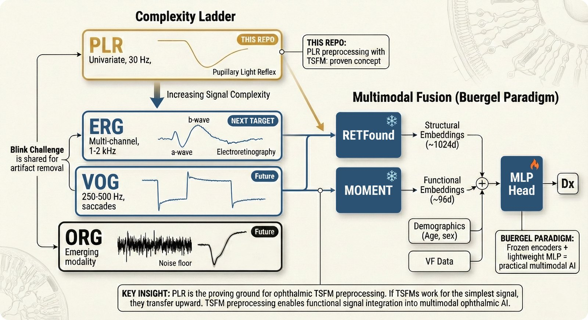
</p>

*Preprocessing challenges are device-agnostic: blinks, tracking failures, and baseline drift affect all pupillometry hardware equally. Metrological artifacts are targets for TSFM-based preprocessing; physiological artifacts (hippus) require experimental control.*

### Pupil Preprocessing

Raw pupil diameter signals require substantial preprocessing (blink removal, interpolation, baseline correction) before any downstream analysis, regardless of the acquisition device. Our study uses a **custom-built handheld pupillometer** developed at the Singapore Eye Research Institute (SERI) with infrared pupil tracking at 30 Hz, delivering chromatic stimuli (blue 469 nm, red 640 nm). The broader pupillometry literature employs both dedicated pupillometers and research eye trackers (EyeLink, Tobii, Pupil Labs), and the preprocessing challenges -- blink artifacts, tracking failures, baseline drift -- are shared across devices. The preprocessing sensitivity analysis in this repository is therefore relevant to pupillometric studies regardless of hardware platform.

- **Fink L, et al.** (2024). From pre-processing to advanced dynamic modeling of pupil data. *Behav Res Methods*, 56(3), 1376-1412. [DOI: 10.3758/s13428-023-02098-1](https://doi.org/10.3758/s13428-023-02098-1) -- Comprehensive review covering the full pupillometry analysis pipeline from blink detection and interpolation through time-frequency decomposition and dynamic modeling, with benchmarks of filtering approaches on empirical data.
- **Kret ME & Sjak-Shie EE.** (2019). Preprocessing pupil size data: Guidelines and code. *Behav Res Methods*, 51(3), 1336-1342. [DOI: 10.3758/s13428-018-1075-y](https://doi.org/10.3758/s13428-018-1075-y) -- Practical step-by-step guidelines for detecting and removing noise from pupillometry recordings across diverse hardware, with open-source MATLAB code for the full preprocessing pipeline.
- **Mathot S, et al.** (2018). Safe and sensible preprocessing and baseline correction of pupil-size data. *Behav Res Methods*, 50(1), 94-106. [DOI: 10.3758/s13428-017-1007-2](https://doi.org/10.3758/s13428-017-1007-2) -- Demonstrates that baseline correction can distort results when applied to unrealistically small measurements caused by blinks or data loss, recommending five evidence-based practices including subtractive correction and artifact screening.
- **Mathot S & Vilotijevic A.** (2023). Methods in cognitive pupillometry: Design, preprocessing, and statistical analysis. *Behav Res Methods*, 55(6), 3055-3077. [DOI: 10.3758/s13428-022-01957-7](https://doi.org/10.3758/s13428-022-01957-7) -- Unified workflow for trial-based cognitive pupillometry addressing the lack of methodological consensus, with Python toolboxes demonstrating how preprocessing choices directly impact downstream statistical inference.
- **Niehorster DC, et al.** (2025). The fundamentals of eye tracking Part 4: Tools for conducting an eye tracking study. *Behav Res Methods*, 57(1), 46. [DOI: 10.3758/s13428-024-02529-7](https://doi.org/10.3758/s13428-024-02529-7) -- Multi-author guide covering hardware selection, software tools, and data quality assessment for eye tracking studies, relevant to the instrument-agnostic preprocessing approaches evaluated here.
- **Landes J, et al.** (2025). Impact of preprocessing on classification results of eye-tracking-data. *Datenbank-Spektrum*, 25(3), 153-166. [DOI: 10.1007/s13222-025-00518-4](https://doi.org/10.1007/s13222-025-00518-4) -- Directly parallels our research question by showing that preprocessing choices significantly affect downstream classification accuracy on eye-tracking data, validating the sensitivity analysis approach taken in this repository.

<p align="center">
  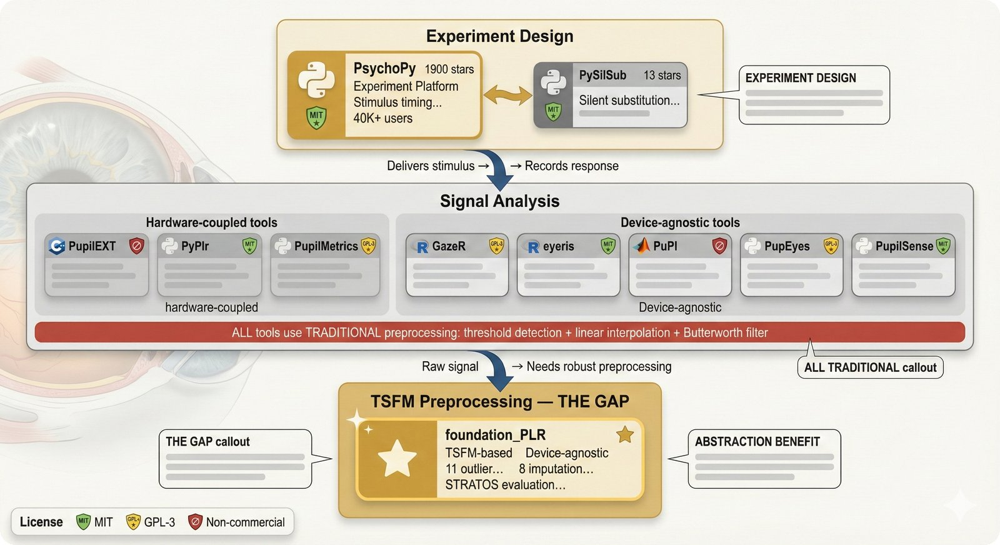
</p>

*The pupillometry ecosystem as a three-layer hierarchy. All existing analysis tools use traditional preprocessing (threshold + interpolation). foundation_PLR introduces TSFM-based preprocessing as a device-agnostic drop-in layer.*

### Open-Source Pupillometry Libraries

| Library | Language | Paper | Summary |
|---------|----------|-------|---------|
| [**PyPlr**](https://github.com/PyPlr/cvd_pupillometry) | Python | [Martin et al. 2022](https://doi.org/10.3758/s13428-021-01759-3) | Integrated hardware/software system for PLR research using Pupil Core eye trackers, with interfaces to Spectra Tune Lab light engines and Ocean Optics spectrometers for end-to-end stimulus design and pupil analysis. |
| [**PySilSub**](https://github.com/PySilentSubstitution/pysilsub) | Python | [Martin et al. 2023](https://doi.org/10.1167/jov.23.7.10) | Toolbox for silent substitution in vision and nonvisual photoreception research, solving photoreceptor-targeting problems via linear algebra with CIEPO06/CIES026-compliant action spectra. |
| [**PupilEXT**](https://github.com/openPupil/Open-PupilEXT) | C++ (Qt) | [Zandi et al. 2021](https://doi.org/10.3389/fnins.2021.676220) | Cross-platform pupillometry platform integrating six detection algorithms (Starburst, Swirski2D, ExCuSe, ElSe, PuRe, PuReST) with stereo camera support and industrial-grade Basler USB3 hardware. |
| [**PupilMetrics**](https://github.com/JulesGoninRIO/PupilMetrics) | Python | [Amiot et al. 2024](https://doi.org/10.1038/s41598-024-79920-z) | Clinical pupillometry support system for NeuroLight and Diagnosys devices, with automated artifact detection, Savitzky-Golay filtering, and interactive GUI for correction validation. |
| [**eyeris**](https://github.com/shawntz/eyeris) | R | [Schwartz et al. 2025](https://doi.org/10.1101/2025.06.01.657312) | CRAN-published modular preprocessing framework following FAIR data principles and BIDS-like conventions, with auto-generated HTML quality reports and DuckDB integration. |
| [**GazeR**](https://github.com/dmirman/gazer) | R | [Geller et al. 2020](https://doi.org/10.3758/s13428-020-01374-8) | Comprehensive R pipeline bridging raw eye-tracking data (EDF, Tobii, Pupil Labs) to growth curve modeling, with blink detection, interpolation, and temporal binning. |
| [**PupEyes**](https://github.com/HanZhang-psych/pupeyes) | Python | [Zhang & Jonides 2026](https://doi.org/10.3758/s13428-025-02830-z) | Interactive preprocessing and visualization library with Plotly Dash viewers for pupil data, fixation data, and AOI drawing, emphasizing step-by-step quality inspection. |
| [**PuPl**](https://github.com/kinleyid/PuPl) | MATLAB | [Kinley & Levy 2022](https://doi.org/10.3758/s13428-021-01717-z) | GUI-based pupillometry pipeliner with GNU Octave compatibility, combining point-and-click accessibility with reproducible scripting via exportable command histories. |
| [**PupilSense**](https://github.com/stevenshci/PupilSense) | Python | [Islam & Bae 2024](https://doi.org/10.48550/arXiv.2404.14590) | Deep learning system for detecting depressive episodes from smartphone-captured pupil images using Detectron2 segmentation and pupil-to-iris ratio biomarkers. |
| [**MTSC**](https://github.com/LaverdeS/Multivariate-Time-Series-Classification) | Python | -- | General-purpose multivariate time-series classification toolkit with pupillometry use cases (partner selection detection, user identification from gaze/pupil patterns). |

### Factors Affecting Pupil Size

Pupil diameter is influenced by numerous physiological confounders beyond the stimulus of interest. Understanding these factors is essential for interpreting PLR-based classification results and designing appropriate preprocessing strategies.

- **Tryon WW.** (1975). Pupillometry: A survey of sources of variation. *Psychophysiology*, 12(1), 90-93. [DOI: 10.1111/j.1469-8986.1975.tb03068.x](https://doi.org/10.1111/j.1469-8986.1975.tb03068.x) -- Early systematic survey of factors causing pupil size variation, establishing the baseline understanding of luminance, accommodation, age, drugs, and emotional state as confounders.
- **Winn B, et al.** (1994). Factors affecting light-adapted pupil size in normal human subjects. *Invest Ophthalmol Vis Sci*, 35(3), 1132-1137. -- Quantifies the effects of age, luminance, and field size on steady-state pupil diameter under photopic conditions, providing normative data for clinical pupillometry.
- **Hammond CJ, et al.** (2000). Factors affecting pupil size after dilatation: The Twin Eye Study. *Br J Ophthalmol*, 84(10), 1173-1176. [DOI: 10.1136/bjo.84.10.1173](https://doi.org/10.1136/bjo.84.10.1173) -- Twin study demonstrating significant genetic heritability of pupil size and dilation response, with age and iris color as additional significant predictors.
- **Knapen T, et al.** (2016). Cognitive and ocular factors jointly determine pupil responses under equiluminance. *PLOS ONE*, 11(5), e0155574. [DOI: 10.1371/journal.pone.0155574](https://doi.org/10.1371/journal.pone.0155574) -- Demonstrates that even under equiluminant conditions, both cognitive load and microsaccades independently modulate pupil diameter, complicating simple luminance-based preprocessing models.
- **Sharma S, et al.** (2016). Factors influencing the pupillary light reflex in healthy individuals. *Graefes Arch Clin Exp Ophthalmol*, 254(7), 1353-1359. [DOI: 10.1007/s00417-016-3311-4](https://doi.org/10.1007/s00417-016-3311-4) -- Directly relevant to our dataset: identifies age, iris color, refractive error, and baseline pupil size as significant factors influencing PLR parameters in healthy subjects.
- **Ishikawa M.** (2021). Clinical factors affecting pupillary light reflex parameters: A single-centre, cross-sectional study. *Ophthalmic Physiol Opt*, 41(5), 952-960. [DOI: 10.1111/opo.12858](https://doi.org/10.1111/opo.12858) -- Cross-sectional clinical study identifying age, sex, iris color, and axial length as independent predictors of PLR parameters including constriction velocity and latency.
- **Jendritza R, et al.** (2024). Influencing factors on pupillary light responses as a biomarker for local retinal function in a large normative cohort. *Invest Ophthalmol Vis Sci*, 65(6), 3. [DOI: 10.1167/iovs.65.6.3](https://doi.org/10.1167/iovs.65.6.3) -- Large normative study (N>500) establishing reference ranges for PLR biomarkers while controlling for age, sex, and refractive error -- directly comparable to our cohort size.

---

## TODO / Roadmap

Open issues for future enhancements -- contributions welcome:

| Issue | Description | Priority |
|-------|-------------|----------|
| [#14](https://github.com/petteriTeikari/foundation_PLR/issues/14) | **Test suite DevEx**: Fast staging subset (`make test-staging` <2 min) + scheduled full suite for CI cost reduction | High |
| [#7](https://github.com/petteriTeikari/foundation_PLR/issues/7) | **Library-agnostic data**: Rename `data/r_data/` to `data/viz_data/`, document JSON schema, add loaders for all viz libraries | Medium |
| [#43](https://github.com/petteriTeikari/foundation_PLR/issues/43) | **Docker digest pinning**: Pin base images with SHA256 digests for reproducibility (`python:3.11-slim@sha256:...`) | Medium |
| [#45](https://github.com/petteriTeikari/foundation_PLR/issues/45) | **Docker security hardening**: Container scanning (Trivy), non-root users, multi-stage builds, SBOM generation for deployment | Low |
| [#11](https://github.com/petteriTeikari/foundation_PLR/issues/11) | **SmoothECE**: Implement kernel-smoothed calibration error ([Blasiok & Nakkiran 2023](https://arxiv.org/abs/2309.12236)) as principled replacement for binned ECE | Low |

### Future Directions

<p align="center">
  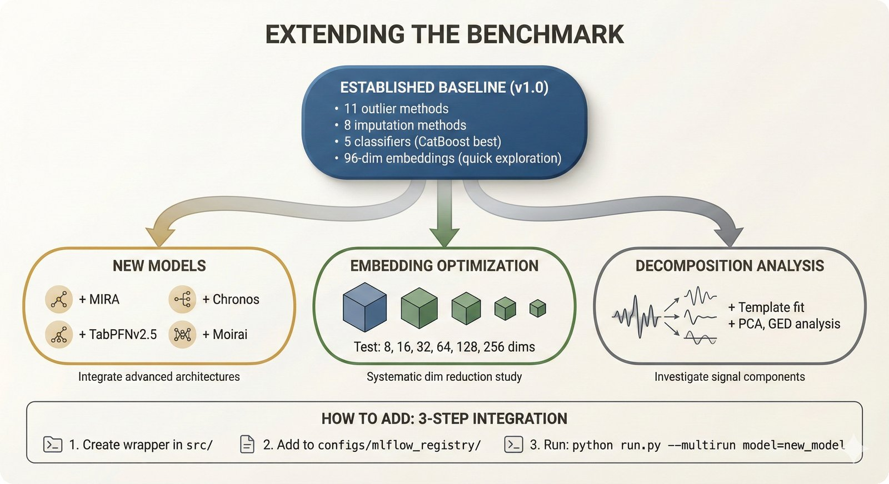
</p>

- New foundation models as they emerge (e.g., Chronos, TimesFM)
- Embedding dimension experiments (64, 128, 256, 512)
- Signal decomposition approaches for PLR analysis
- End-to-end probabilistic PLR reconstruction

---

## License

[MIT](LICENSE)
