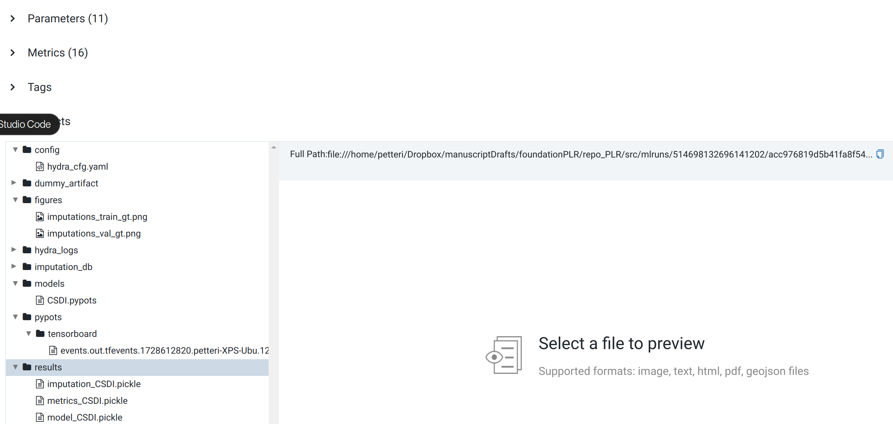
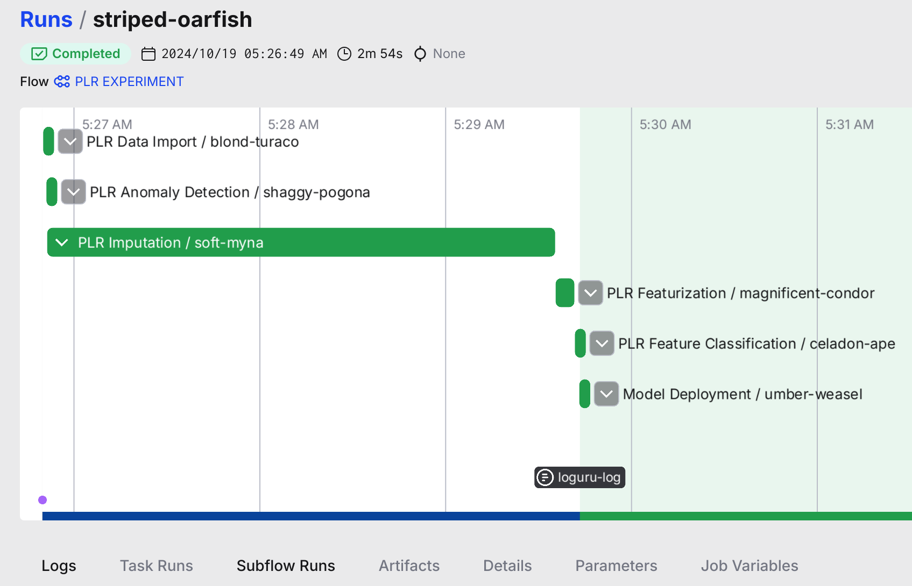

# "Foundation PLR"

Testing repo for imputing data for unimodal biosignal time series with missing data (e.g. PLR with blinks) using the "frontier time series" foundation models.

## To get started

### Virtual environment

Install [`uv`](https://astral.sh/blog/uv)  ("faster Poetry") to your system:

```bash
pip install uv
```

Create virtual environment with [`uv`](https://astral.sh/blog/uv) (when being on repo root `repo_PLR` as environment is defined by [`pyproject.toml`](pyproject.toml) and [`uv.lock`](uv_OLD.lock)):

```bash
uv venv --python 3.11
uv sync
```

### Start the [`prefect`](https://www.datacamp.com/tutorial/airflow-vs-prefect-deciding-which-is-right-for-your-data-workflow) server

```bash
prefect server start
```

### Reproduce the experiment

Run [`model_imputation.py`](src/pipeline_PLR.py) (which will use the default Hydra config stored in [`defaults.yaml`](configs/defaults.yaml)):


## Examine the Experiment Results on MLflow Tracking UI

Set-up the MLflow tracking server (also in [`services.yaml`](configs/SERVICES/services.yaml)):

```bash
export MLFLOW_TRACKING_URI='file:////home/petteri/Dropbox/mlruns'
```

You can launch the "dashboard (["Tracking UI"](https://mlflow.org/docs/latest/tracking.html#explore-runs-and-results)) with (from where your `mlruns` directory is located):

```
mlflow ui --port 5000
```

And your UI is accessible at:

[http://127.0.0.1:5000](http://127.0.0.1:5000)


with [MLflow Artifact Store](https://mlflow.org/docs/latest/tracking/artifacts-stores.html) containing the experiment outputs (will be just a local `mlruns` directory if you do not host your own MLflow server or use some managed service, e.g. [Dagshub](https://dagshub.com/product/#experiments)):



### Examine the Experiment Results on Prefect UI

For workflow run details, access the Prefect UI:

[http://127.0.0.1:4200/dashboard](http://127.0.0.1:4200/dashboard)

### Prefect Flow: 6 Subflows



Separation of computation tasks into (subflows) that are composed of "Prefect tasks". The use of Prefect flows with "MLflow as contract" design allows labor division for various people in the team with different skill sets:

#### 1) Data Import

**Professional persona: "Data engineer"**

#### 2) PLR Outlier Detection

**Professional persona: "Data scientist / signal processing expert"** Placeholder atm just passing the manually done outlier detection.

#### 3) PLR Imputation

**Professional persona: "Data scientist / signal processing expert"**

#### 4) PLR Featurization

**Professional persona: "Domain expert"** defines the time bins, and other hand-crafted features

#### 5) PLR Classification

**Professional persona: "Data scientist / Biostatistician"**

#### 6) Model Deployment

**Professional persona: "MLOps/ML engineer**"