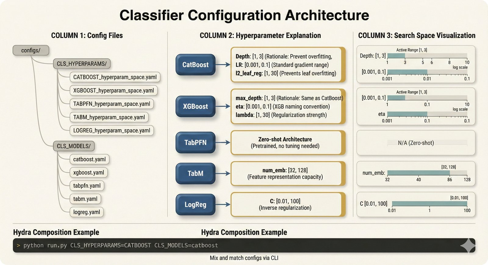

# CLS_HYPERPARAMS - Classifier Hyperparameter Search Spaces

> **Quick Visual Guide** (5-second overview)

[](../../docs/repo-figures/assets/fig-repo-51-classifier-config-architecture.jpg)

*Figure: Classifier configuration architecture showing the separation between hyperparameter search spaces and fixed model parameters. See also [Classifier Paradigms (fig-repo-52)](../../docs/repo-figures/assets/fig-repo-52-classifier-paradigms.jpg) for conceptual understanding of Linear → Tree → FM evolution. [Hydra docs →](https://hydra.cc/)*

## Purpose

Defines the hyperparameter search space for each classifier used in the classification pipeline. These configs specify which parameters to tune and their valid ranges for HPO (Hyperparameter Optimization).

## Files

| File | Classifier | HPO Method |
|------|-----------|------------|
| `CATBOOST_hyperparam_space.yaml` | CatBoost | Optuna |
| `XGBOOST_hyperparam_space.yaml` | XGBoost | Hyperopt |
| `LogisticRegression_hyperparam_space.yaml` | Logistic Regression | Grid Search |
| `TabPFN_hyperparam_space.yaml` | TabPFN | Grid Search |
| `TabM_hyperparam_space.yaml` | TabM | Grid Search |

## Key Parameters Explained

### CatBoost

| Parameter | Range | What It Controls |
|-----------|-------|------------------|
| `depth` | [1, 3] | Maximum tree depth. Shallow trees (1-3) prevent overfitting on small datasets |
| `lr` (learning_rate) | [0.001, 0.1] | Step size for gradient descent. Lower = more robust, slower |
| `l2_leaf_reg` | [1, 30] | L2 regularization on leaf values. Higher = more regularization |
| `colsample_bylevel` | [0.05, 1.0] | Feature sampling ratio per tree level |
| `min_data_in_leaf` | [1, 100] | Minimum samples in leaf node |

**Why these ranges?** For biomedical datasets (N=208), aggressive regularization prevents overfitting. Shallow depth [1,3] keeps models interpretable and stable.

### XGBoost

| Parameter | Range | What It Controls |
|-----------|-------|------------------|
| `max_depth` | [1, 2] | Maximum tree depth (boosted stumps) |
| `eta` | [0, 1] | Learning rate |
| `gamma` | [0, 1] | Minimum loss reduction for split |
| `reg_lambda` | [0, 1] | L2 regularization |
| `n_estimators` | [10, 1000] | Number of boosting rounds |
| `colsample_bytree` | [0.5, 1] | Feature sampling per tree |
| `subsample` | [0.5, 1] | Sample ratio for training |
| `min_child_weight` | [1, 10] | Minimum sum of instance weight in child |

### Logistic Regression

| Parameter | Values | What It Controls |
|-----------|--------|------------------|
| `penalty` | l1, l2 | Regularization type (Lasso vs Ridge) |
| `C` | [0.001, ..., 100] | Inverse regularization strength (smaller = stronger) |
| `solver` | liblinear | Optimization algorithm (good for small datasets) |

### TabPFN

TabPFN is a transformer-based model pre-trained on synthetic tabular data. It requires minimal hyperparameter tuning.

| Parameter | Values | Notes |
|-----------|--------|-------|
| `param1` | [1, 2, 3] | Placeholder - TabPFN has few tunable params |

### TabM

| Parameter | Range | What It Controls |
|-----------|-------|------------------|
| `d_block` | [32, 64] | Block dimensionality |
| `d_embedding` | [8, 16] | Embedding dimension |
| `k` | [8, 16] | Number of attention heads |
| `dropout` | [0.1] | Dropout rate (fixed) |
| `lr` | [0.02] | Learning rate (fixed) |
| `weight_decay` | [0.003] | Weight decay (fixed) |

**Note**: TabM only runs on ground truth preprocessing (`run_only_on_ground_truth: True`).

## HPO Methods

| Method | Package | Used By |
|--------|---------|---------|
| **Optuna** | `optuna` | CatBoost |
| **Hyperopt** | `hyperopt` | XGBoost |
| **Grid Search** | `sklearn` | LogReg, TabPFN, TabM |

### Search Space Definition Syntax

**Optuna (CatBoost)**:
```yaml
SEARCH_SPACE:
  OPTUNA:
    depth:
      - 1  # min
      - 3  # max
```

**Hyperopt (XGBoost)**:
```yaml
SEARCH_SPACE:
  HYPEROPT:
    max_depth:
      hp_func: 'choice'  # or 'uniform', 'loguniform'
      min: 1
      max: 2
      step: 1
      type: 'int'
```

**Grid (LogReg)**:
```yaml
SEARCH_SPACE:
  GRID:
    C: [0.001, 0.01, 0.1, 1, 10, 100]
```

## Hydra Usage

```bash
# Load classifier-specific hyperparams
python src/classification/flow_classification.py \
    CLS_HYPERPARAMS=CATBOOST_hyperparam_space

# Override specific parameter range
python src/classification/flow_classification.py \
    CLS_HYPERPARAMS=CATBOOST_hyperparam_space \
    CLS_HYPERPARAMS.CATBOOST.SEARCH_SPACE.OPTUNA.depth=[1,5]
```

## Weighting Options

Both CatBoost and XGBoost support optional weighting schemes:

```yaml
GRID:
  grid_contains:
    - 'weights'  # Enables sample/feature/class weighting
```

This creates 2³ = 8 combinations (all on/off combos of 3 weight types).

## See Also

- Related configs: `../CLS_MODELS/` (fixed model parameters)
- Code: `src/classification/flow_classification.py`
- External docs:
  - [CatBoost docs](https://catboost.ai/docs/concepts/python-reference_parameters-list.html)
  - [XGBoost params](https://xgboost.readthedocs.io/en/latest/parameter.html)
  - [TabPFN paper (Hollmann 2023 ICLR)](https://arxiv.org/abs/2207.01848)

---

**Note**: Performance comparisons are documented in the manuscript, not this repository.
