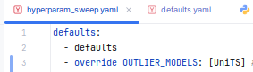
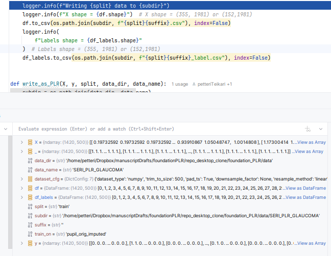
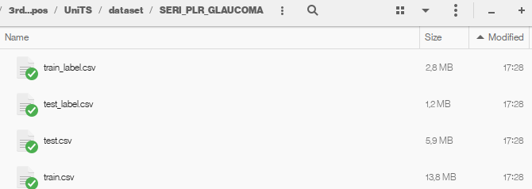
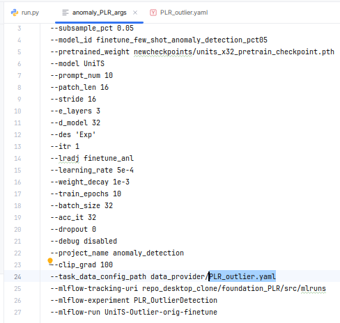
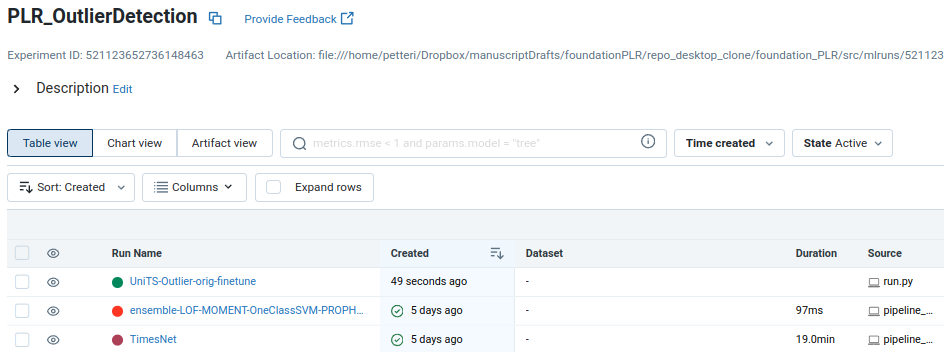

## UniTS

### To get the data (if changed)

Run the "normal training script"

which will use [`write_as_numpy_for_vanilla_dataloader()`] function to write data for UniTS training

You will 2 files per split:

### To train

Pull the slightly modified UniTS
https://github.com/petteriTeikari/UniTS

And place the data files to the `UniTS/dataset/SERI_PLR_GLAUCOMA` dir

`data_provider` dir contains the `.yaml` files needed

Command-line arguments are given in `anomaly_PLR_args`

Gets then logged to MLflow along with other runs (Note! the different source)

