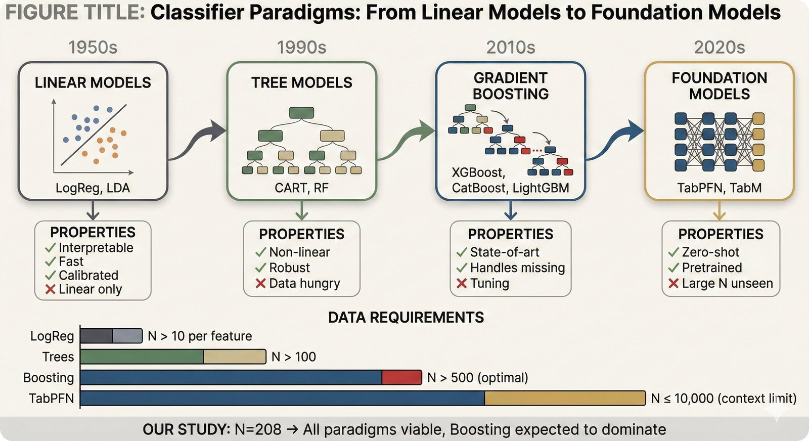
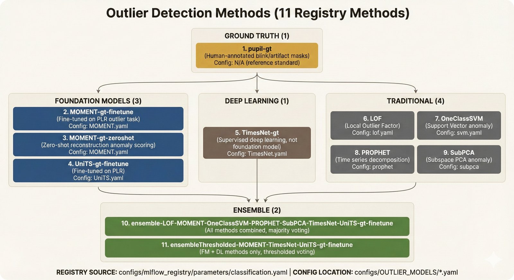
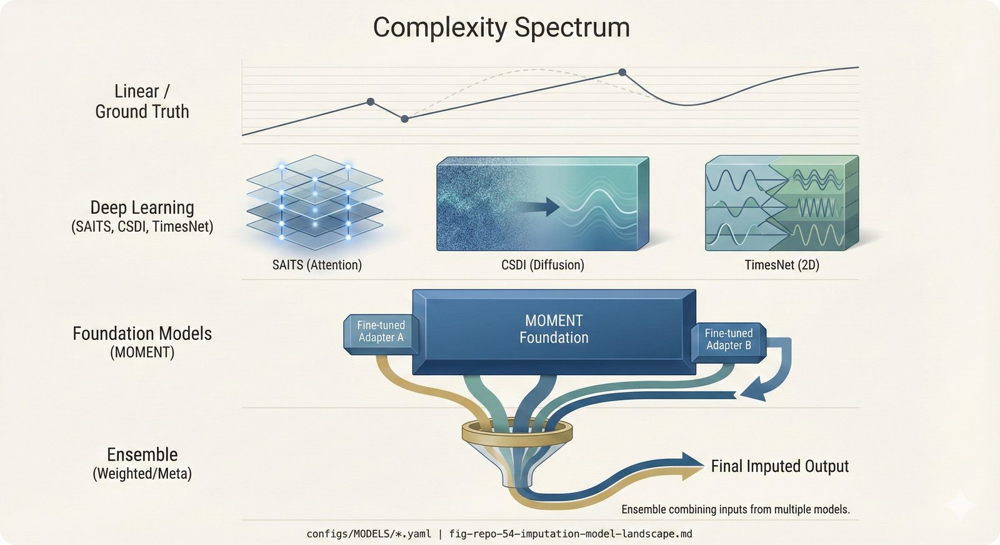
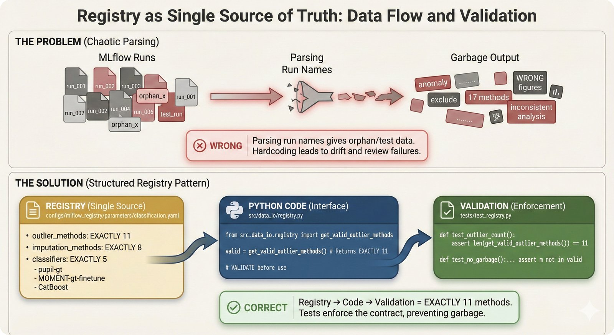
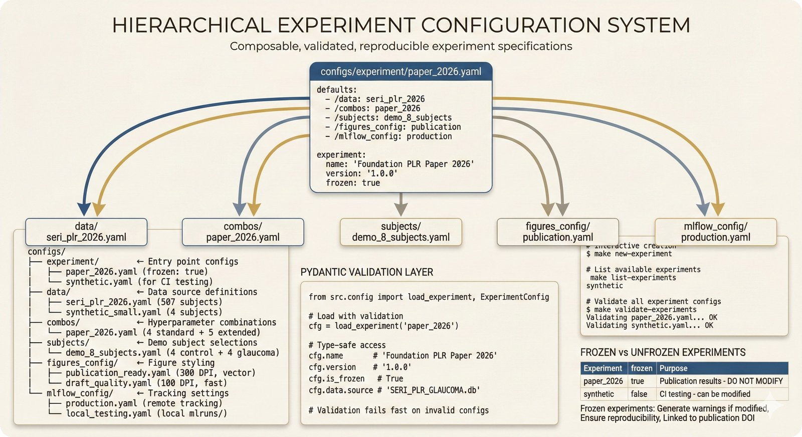
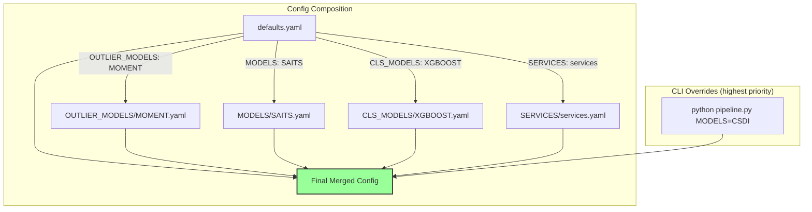

# Configuration (`configs/`)

All configuration uses [Hydra](https://hydra.cc/) for hierarchical YAML-based configuration.

---

## Visual Guide: How Hydra Works

<details>
<summary><b>Click to expand visual explanation</b></summary>

### The Big Picture


**Hydra Configuration System**

Hydra composes your final configuration from multiple YAML files. This means:
- **Base values** in `defaults.yaml`
- **Domain-specific** settings in subdirectories
- **Runtime overrides** from command line

No more hardcoding values in scripts!

*Learn more: [Hydra Documentation](https://hydra.cc/)*

---

### Why Configuration Over Hardcoding?


**The Problem with Hardcoding**

```python
# BAD - hardcoded
n_bootstrap = 1000  # Where is this documented? How to change?

# GOOD - from config
n_bootstrap = cfg.CLS_EVALUATION.BOOTSTRAP.n_iterations
# Documented in YAML, override via CLI, tracked in git
```

---

### Standard Hyperparameter Combinations


**Standard Combinations**

All figures use these four combinations from `VISUALIZATION/plot_hyperparam_combos.yaml`:

| ID | Outlier | Imputation | Why Included |
|----|---------|------------|--------------|
| `ground_truth` | pupil-gt | pupil-gt | Baseline (human expert) |
| `best_ensemble` | Ensemble | CSDI | Best automated |
| `best_single_fm` | MOMENT-gt-finetune | SAITS | Best single FM |
| `traditional` | LOF | SAITS | Traditional methods |

</details>

---

## Infographic Index

Quick visual guides for understanding each config directory:

| Infographic | Config Directories | What You'll Learn |
|-------------|-------------------|-------------------|
| [](../docs/repo-figures/assets/fig-repo-51-classifier-config-architecture.jpg) | `CLS_HYPERPARAMS/`, `CLS_MODELS/` | Two-tier classifier configuration: HPO search spaces + fixed model parameters |
| [](../docs/repo-figures/assets/fig-repo-52-classifier-paradigms.jpg) | (Conceptual) | Classifier evolution: Linear → Tree Ensemble → Foundation Models |
| [](../docs/repo-figures/assets/fig-repo-53-outlier-detection-methods.jpg) | `OUTLIER_MODELS/` | The 11 registry-defined outlier detection methods by category |
| [](../docs/repo-figures/assets/fig-repo-54-imputation-model-landscape.jpg) | `MODELS/` | The 8 imputation methods from simple to foundation models |
| [](../docs/repo-figures/assets/fig-repo-55-registry-single-source-of-truth.jpg) | `mlflow_registry/` | Registry pattern: why it exists, data flow, validation |
| [](../docs/repo-figures/assets/fig-repo-56-experiment-config-hierarchy.jpg) | `experiment/`, `combos/` | Hydra hierarchical composition for experiments |
| [](../docs/repo-figures/assets/fig-repo-43-experiment-config-system.jpg) | `experiment/` | Pydantic validation + Make commands for experiments |

---

## Quick Start

```bash
# Default run
python src/pipeline_PLR.py

# Custom config
python src/pipeline_PLR.py --config-name=hyperparam_sweep

# Override parameters
python src/pipeline_PLR.py PREFECT.PROCESS_FLOWS.CLASSIFICATION=true
```

## Configuration Files

| File | Purpose |
|------|---------|
| `defaults.yaml` | Main configuration file |
| `debug_run.yaml` | Debug configuration with minimal data |
| `hyperparam_sweep.yaml` | Hyperparameter search configuration |
| `synthetic_run.yaml` | Synthetic data experiment configuration |
| `data_isolation.yaml` | Synthetic/production isolation settings |

## Directory Structure

```
configs/
├── defaults.yaml              # Main config (imports others via defaults)
├── debug_run.yaml             # Debug mode
├── hyperparam_sweep.yaml      # Hyperparameter search
│
├── OUTLIER_MODELS/            # Outlier detection method configs
│   └── MOMENT.yaml, LOF.yaml, etc.
│
├── MODELS/                    # Imputation model configs
│   └── SAITS.yaml, CSDI.yaml, MOMENT.yaml, etc.
│
├── CLS_MODELS/                # Classifier configs
│   └── XGBOOST.yaml, CatBoost.yaml, etc.
│
├── CLS_HYPERPARAMS/           # Classifier hyperparameter spaces
│   └── XGBOOST_hyperparam_space.yaml, etc.
│
├── CLS_TS_MODELS/             # Time series classifier configs
│   └── MOMENT.yaml
│
├── PLR_FEATURIZATION/         # Feature extraction configs
│   └── featuresSimple.yaml
│
├── PLR_EMBEDDING/             # Embedding configs
│   └── MOMENT.yaml
│
├── SERVICES/                  # Service configs (MLflow, Prefect)
│   └── services.yaml
│
├── VISUALIZATION/             # Figure generation configs
│   └── plot_config.yaml
│
├── mlflow_registry/           # MLflow experiment metadata
│   └── experiments.yaml
│
├── data_isolation.yaml        # Synthetic/production isolation config
├── synthetic_run.yaml         # Synthetic experiment config
│
└── schema/                    # Data schemas
    └── *.yaml
```

## Synthetic Data Isolation

The `data_isolation.yaml` file defines the 4-gate isolation architecture:

```yaml
# Gate 0: Detection triggers
detection:
  env_var: "FOUNDATION_PLR_SYNTHETIC"
  config_keys:
    - "EXPERIMENT.is_synthetic"
    - "EXPERIMENT.experiment_prefix"

# Gate 1: MLflow isolation
mlflow:
  run_prefix: "__SYNTHETIC_"
  experiment_prefix: "synth_"

# Gate 2: Extraction rejection
extraction:
  rejection_criteria:
    - run_name_prefix: "__SYNTHETIC_"
    - experiment_name_prefix: "synth_"
    - tag: "is_synthetic=true"

# Gate 3: Output routing
outputs:
  synthetic_db_dir: "outputs/synthetic/"
  synthetic_figures_dir: "figures/synthetic/"
```

To run synthetic experiments:

```bash
# Use the synthetic config
python src/pipeline_PLR.py --config-name=synthetic_run

# Or set environment variable
FOUNDATION_PLR_SYNTHETIC=1 python src/pipeline_PLR.py
```

See [README.md](../README.md#synthetic-data-isolation) for full architecture documentation.

## Key Configuration Sections

### defaults.yaml

```yaml
VERSION: 0.1
NAME: 'impPLR'

defaults:
  - _self_
  - PLR_FEATURIZATION: featuresSimple
  - OUTLIER_MODELS: MOMENT
  - MODELS: SAITS
  - CLS_MODELS: XGBOOST
  - CLS_HYPERPARAMS: XGBOOST_hyperparam_space
  - PLR_EMBEDDING: MOMENT
  - CLS_TS_MODELS: MOMENT
  - SERVICES: services

EXPERIMENT:
  train_on: 'pupil_gt'
  debug: False
  hyperparam_search: False
  alpha_CI: 0.95

DATA:
  import_from_DuckDB: True
  filename_DuckDB: 'SERI_PLR_GLAUCOMA.db'
  PLR_length: 1981

PREFECT:
  PROCESS_FLOWS:
    OUTLIER_DETECTION: true
    IMPUTATION: true
    FEATURIZATION: true
    CLASSIFICATION: true
    SUMMARIZATION: false
    DEPLOYMENT: false
```

### Critical Parameters

| Parameter | Path | Default | Description |
|-----------|------|---------|-------------|
| Disease prevalence | `CLS_EVALUATION.glaucoma_params.prevalence` | 0.0354 | Tham 2014 estimate |
| Bootstrap iterations | `CLS_EVALUATION.BOOTSTRAP.n_iterations` | 1000 | For CI estimation |
| Confidence level | `EXPERIMENT.alpha_CI` | 0.95 | For statistical tests |
| Target sensitivity | `CLS_EVALUATION.glaucoma_params.tpAUC_sensitivity` | 0.862 | Clinical threshold |
| Target specificity | `CLS_EVALUATION.glaucoma_params.tpAUC_specificity` | 0.821 | Clinical threshold |

## Hydra Composition

Hydra composes the final config from multiple files:



**Composition Order** (later overrides earlier):
1. `defaults.yaml` base values
2. Included config files (OUTLIER_MODELS/, MODELS/, etc.)
3. Command-line overrides (highest priority)

```yaml
# In defaults.yaml
defaults:
  - OUTLIER_MODELS: MOMENT    # Loads configs/OUTLIER_MODELS/MOMENT.yaml
  - MODELS: SAITS             # Loads configs/MODELS/SAITS.yaml
  - CLS_MODELS: XGBOOST       # Loads configs/CLS_MODELS/XGBOOST.yaml
```

## Override Examples

```bash
# Use different outlier model
python src/pipeline_PLR.py OUTLIER_MODELS=LOF

# Use different imputation model
python src/pipeline_PLR.py MODELS=CSDI

# Enable debug mode
python src/pipeline_PLR.py EXPERIMENT.debug=True

# Change bootstrap iterations
python src/pipeline_PLR.py CLS_EVALUATION.BOOTSTRAP.n_iterations=500

# Multiple overrides
python src/pipeline_PLR.py EXPERIMENT.debug=True MODELS=CSDI CLS_MODELS=CatBoost
```

## Visualization Config

Visualization settings are in `VISUALIZATION/plot_config.yaml`:

```yaml
dpi: 100
figsize: [10, 6]
style: 'seaborn-v0_8-whitegrid'
```

## Adding New Configurations

1. **New outlier method**: Create `configs/OUTLIER_MODELS/MyMethod.yaml`
2. **New imputation method**: Create `configs/MODELS/MyMethod.yaml`
3. **New classifier**: Create `configs/CLS_MODELS/MyClassifier.yaml`

See [CONTRIBUTING.md](../CONTRIBUTING.md) for detailed instructions.
