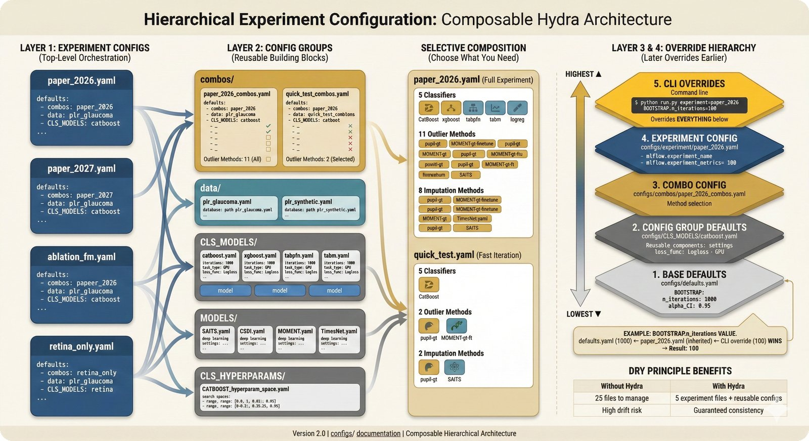

# Combos - Method Combination Configurations

> **Quick Visual Guide** (5-second overview)

[](../../docs/repo-figures/assets/fig-repo-56-experiment-config-hierarchy.jpg)

*Figure: Combos are one of 5 sub-config categories that experiments compose. They define validated (outlier × imputation × classifier) combinations. [Hydra composition docs →](https://hydra.cc/docs/advanced/defaults_list/)*

## Purpose

Defines pre-selected combinations of (outlier method × imputation method × classifier) for consistent visualization and analysis across the manuscript.

## Files

| File | Description |
|------|-------------|
| `paper_2026.yaml` | Standard combos for the paper |
| `debug_minimal.yaml` | Minimal combos for testing |

## Standard 4 Combos (Main Figures)

These 4 combinations appear in all main figures:

| ID | Outlier | Imputation | Classifier | AUROC |
|----|---------|------------|------------|-------|
| `ground_truth` | pupil-gt | pupil-gt | CatBoost | 0.9110 |
| `best_ensemble` | ensemble-LOF-... | CSDI | CatBoost | 0.9130 |
| `best_single_fm` | MOMENT-gt-finetune | SAITS | CatBoost | 0.9099 |
| `traditional` | LOF | SAITS | TabPFN | 0.8599 |

### Why These 4?

1. **Ground Truth**: Human-annotated baseline - establishes upper bound
2. **Best Ensemble**: Best automated performance - shows automation can match humans
3. **Best Single FM**: Best single foundation model - no ensemble complexity
4. **Traditional**: Classic methods - establishes lower bound

## Extended 5 Combos (Supplementary)

Additional combinations for supplementary figures:

| ID | Outlier | Imputation | Classifier | AUROC |
|----|---------|------------|------------|-------|
| `moment_full` | MOMENT-gt-finetune | MOMENT-finetune | CatBoost | 0.8986 |
| `lof_moment` | LOF | MOMENT-zeroshot | CatBoost | 0.8830 |
| `timesnet_full` | TimesNet-gt | TimesNet | CatBoost | 0.8970 |
| `units_pipeline` | UniTS-gt-finetune | SAITS | CatBoost | 0.9068 |
| `simple_baseline` | OneClassSVM | MOMENT-zeroshot | CatBoost | 0.8824 |

## Visualization Constraints

From `visualization:` section in YAML:

```yaml
visualization:
  max_main_curves: 4           # Maximum curves in main figures
  max_supplementary_curves: 8  # Maximum curves in supplementary
  require_ground_truth: true   # Ground truth must be included
```

**Rules**:
- Main figures: MAX 4 curves (standard combos)
- Supplementary: MAX 8 curves (standard + extended)
- Ground truth: REQUIRED in all comparison figures

## Naming Convention

Combo IDs follow the pattern: `{descriptive_purpose}`

| ID Pattern | Meaning |
|------------|---------|
| `ground_truth` | Human-annotated baseline |
| `best_*` | Best-performing variant of type |
| `traditional` | Classical/baseline methods |
| `*_full` | Same method for outlier and imputation |

## Usage in Code

### Python

```python
import yaml
from pathlib import Path

combos_file = Path("configs/combos/paper_2026.yaml")
with open(combos_file) as f:
    combos = yaml.safe_load(f)

# Get standard combos
for name, combo in combos["combos"]["standard"].items():
    print(f"{name}: {combo['auroc']}")
```

### Hydra

```bash
# Use paper combos
python src/pipeline_PLR.py +experiment=paper_2026

# Combos are loaded via experiment config defaults:
# defaults:
#   - /combos: paper_2026
```

## Creating New Combo Sets

1. Copy existing file:
   ```bash
   cp paper_2026.yaml paper_2027.yaml
   ```

2. Update combos section with new combinations

3. Reference in experiment config:
   ```yaml
   defaults:
     - /combos: paper_2027
   ```

## Debug Combos

`debug_minimal.yaml` contains minimal combos for CI/testing:

```yaml
combos:
  standard:
    ground_truth:
      outlier_method: "pupil-gt"
      imputation_method: "pupil-gt"
      classifier: "CatBoost"
```

Use for fast iteration without running all combos.

## See Also

- Experiment config: `../experiment/README.md`
- Visualization config: `../VISUALIZATION/plot_hyperparam_combos.yaml`
- Registry (valid methods): `../mlflow_registry/parameters/classification.yaml`
- Standard combos reference: `.claude/CLAUDE.md`

---

**Note**: AUROC values are from MLflow experiments. Do not modify without re-running experiments.
