# API Architecture Reference

> **Complete UML/Mermaid documentation for all Foundation PLR modules**

This document provides comprehensive visual documentation of the codebase architecture, class hierarchies, and data flows.

## Table of Contents

1. [Pipeline Overview](#pipeline-overview)
2. [Module Dependency Graph](#module-dependency-graph)
3. [Class Hierarchies](#class-hierarchies)
4. [Sequence Diagrams](#sequence-diagrams)
5. [Data Flow Diagrams](#data-flow-diagrams)
6. [API Reference by Module](#api-reference-by-module)

---

## Pipeline Overview

### High-Level Architecture

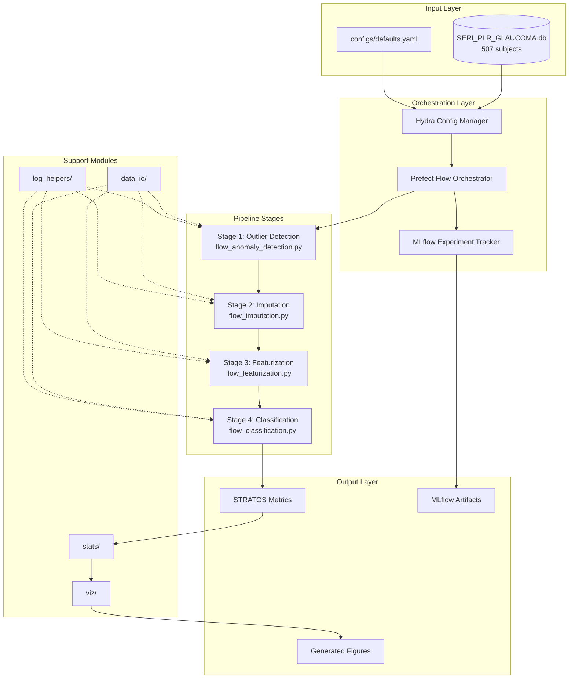

### Error Propagation Model

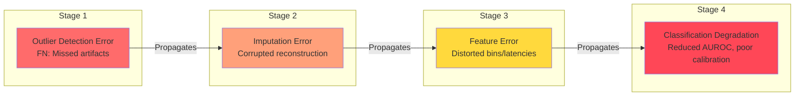

---

## Module Dependency Graph

### Core Module Dependencies

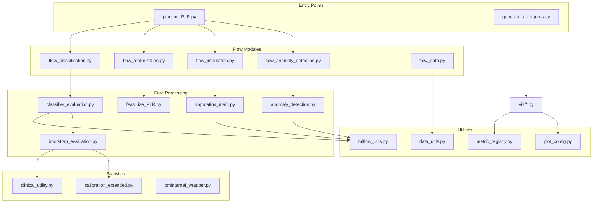

### Detailed Module Map

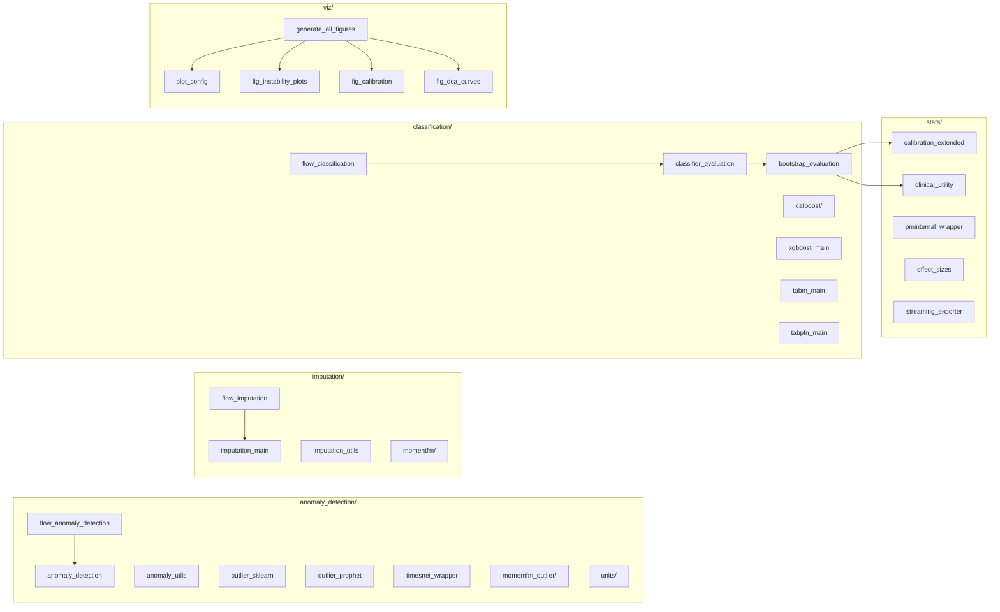

---

## Class Hierarchies

### Outlier Detection Classes

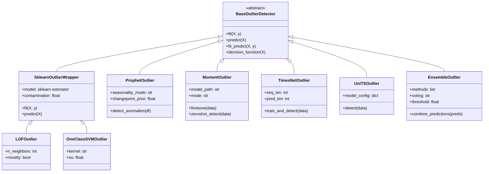

### Imputation Classes

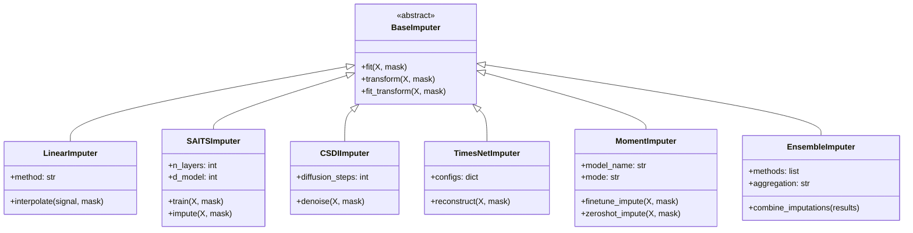

### Classification Classes

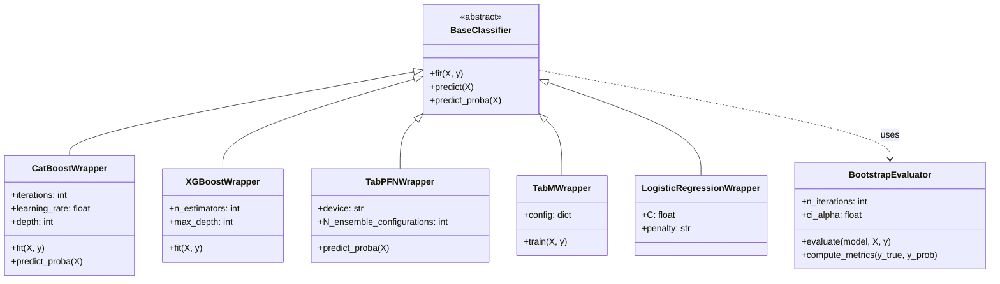

### Stats Module Classes

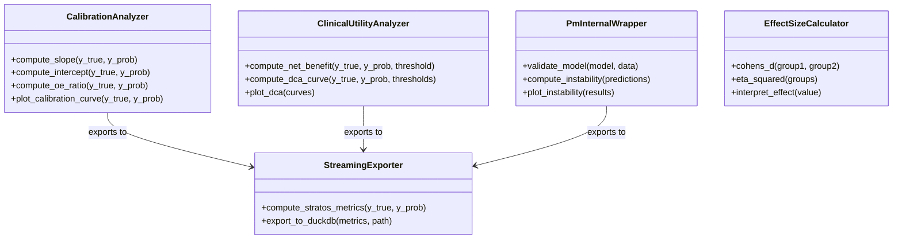

---

## Sequence Diagrams

### Full Pipeline Execution

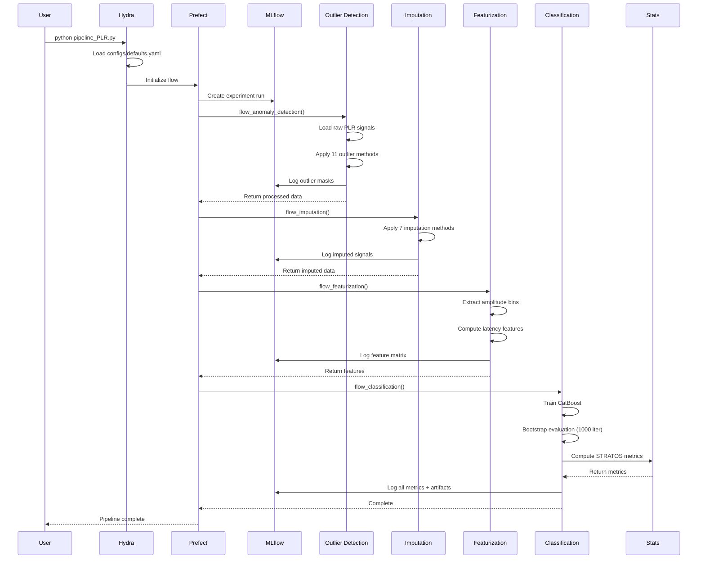

### Bootstrap Evaluation Flow

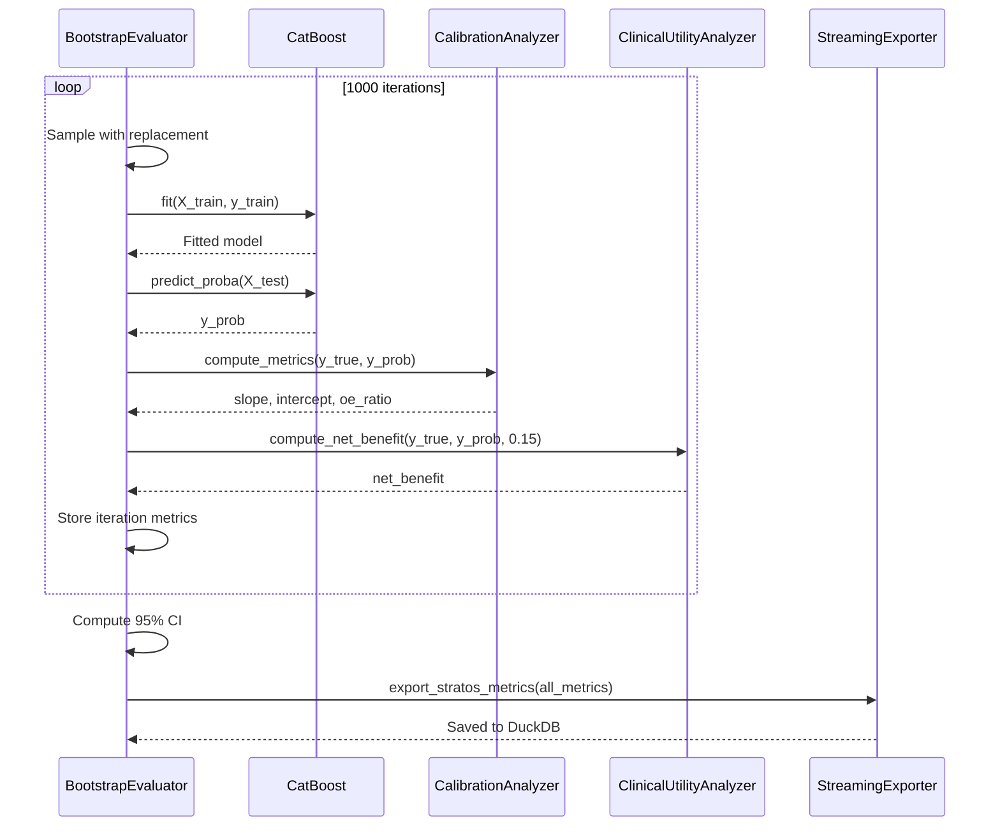

### Figure Generation Flow

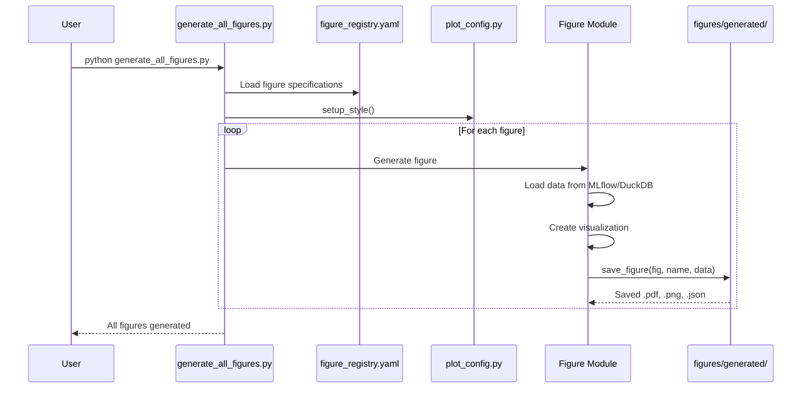

---

## Data Flow Diagrams

### Data Transformation Pipeline

```mermaid
graph TD
    subgraph "Raw Data"
        RAW[Raw PLR Signal<br/>shape: (N, T)]
        MASK_GT[Ground Truth Mask<br/>shape: (N, T)]
    end

    subgraph "Outlier Detection Output"
        MASK_PRED[Predicted Outlier Mask<br/>shape: (N, T)]
        OUTLIER_METRICS[Outlier Metrics<br/>F1, Precision, Recall]
    end

    subgraph "Imputation Output"
        IMPUTED[Imputed Signal<br/>shape: (N, T)]
        IMP_METRICS[Imputation Metrics<br/>MAE, RMSE]
    end

    subgraph "Feature Extraction Output"
        BINS[Amplitude Bins<br/>shape: (N, n_bins)]
        LATENCY[Latency Features<br/>shape: (N, 1)]
        FEATURES[Feature Matrix<br/>shape: (N, n_features)]
    end

    subgraph "Classification Output"
        Y_PROB[Predictions<br/>shape: (N,)]
        STRATOS[STRATOS Metrics<br/>Dict]
    end

    RAW --> MASK_PRED
    MASK_GT -.-> OUTLIER_METRICS
    MASK_PRED --> OUTLIER_METRICS

    RAW --> IMPUTED
    MASK_PRED --> IMPUTED

    IMPUTED --> BINS
    IMPUTED --> LATENCY
    BINS --> FEATURES
    LATENCY --> FEATURES

    FEATURES --> Y_PROB
    Y_PROB --> STRATOS
```

### MLflow Artifact Structure

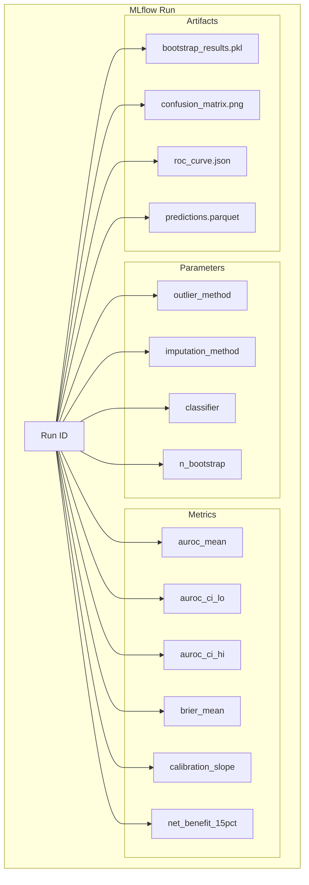

---

## API Reference by Module

### src/anomaly_detection/

| File | Key Functions | Purpose |
|------|--------------|---------|
| `flow_anomaly_detection.py` | `flow_anomaly_detection(cfg)` | Orchestrates all outlier methods |
| `anomaly_detection.py` | `detect_outliers(signal, method)` | Main detection interface |
| `anomaly_utils.py` | `apply_mask()`, `evaluate_detection()` | Utility functions |
| `outlier_sklearn.py` | `run_lof()`, `run_ocsvm()` | sklearn-based methods |
| `outlier_prophet.py` | `prophet_anomaly_detection()` | Facebook Prophet |
| `timesnet_wrapper.py` | `train_timesnet()`, `detect_timesnet()` | TimesNet wrapper |

### src/imputation/

| File | Key Functions | Purpose |
|------|--------------|---------|
| `flow_imputation.py` | `flow_imputation(cfg)` | Orchestrates all imputation methods |
| `imputation_main.py` | `impute_signal(signal, mask, method)` | Main imputation interface |
| `imputation_utils.py` | `linear_interpolate()`, `evaluate_imputation()` | Utility functions |
| `momentfm/moment_imputation.py` | `moment_impute()` | MOMENT foundation model |

### src/classification/

| File | Key Functions | Purpose |
|------|--------------|---------|
| `flow_classification.py` | `flow_classification(cfg)` | Orchestrates classification |
| `classifier_evaluation.py` | `evaluate_classifier()` | Single classifier evaluation |
| `bootstrap_evaluation.py` | `bootstrap_evaluate()`, `compute_ci()` | Bootstrap confidence intervals |
| `catboost/catboost_main.py` | `train_catboost()`, `predict_catboost()` | CatBoost training |
| `stats_metric_utils.py` | `compute_auroc()`, `compute_brier()` | Metric computation |

### src/stats/

| File | Key Functions | Purpose |
|------|--------------|---------|
| `calibration_extended.py` | `calibration_slope()`, `calibration_intercept()`, `oe_ratio()` | STRATOS calibration |
| `clinical_utility.py` | `net_benefit()`, `decision_curve()` | Clinical utility metrics |
| `pminternal_wrapper.py` | `validate_model()`, `instability_plot()` | R pminternal integration |
| `effect_sizes.py` | `cohens_d()`, `eta_squared()` | Effect size calculations |
| `streaming_exporter.py` | `export_stratos_metrics()` | DuckDB export |

### src/viz/

| File | Key Functions | Purpose |
|------|--------------|---------|
| `generate_all_figures.py` | `main()` | Entry point for all figures |
| `plot_config.py` | `setup_style()`, `COLORS`, `save_figure()` | Plot configuration |
| `metric_registry.py` | `MetricRegistry.get()` | Metric definitions |
| `fig_instability_plots.py` | `plot_riley_instability()`, `plot_kompa_uncertainty()` | Instability figures |
| `fig_calibration.py` | `plot_calibration_curve()` | Calibration plots |
| `fig_dca_curves.py` | `plot_dca()` | Decision curve analysis |

### src/data_io/

| File | Key Functions | Purpose |
|------|--------------|---------|
| `flow_data.py` | `flow_import_data(cfg)` | Data loading flow |
| `data_utils.py` | `load_plr_database()`, `export_to_duckdb()` | Database operations |
| `define_sources_for_flow.py` | `get_data_sources()` | Data source configuration |

### src/log_helpers/

| File | Key Functions | Purpose |
|------|--------------|---------|
| `mlflow_utils.py` | `init_mlflow()`, `log_metrics()`, `log_artifact()` | MLflow integration |
| `mlflow_artifacts.py` | `save_bootstrap_results()`, `load_bootstrap_results()` | Artifact management |
| `log_naming_uris_and_dirs.py` | `get_artifact_path()`, `get_run_name()` | Naming conventions |

---

## Configuration Reference

### Hydra Config Structure

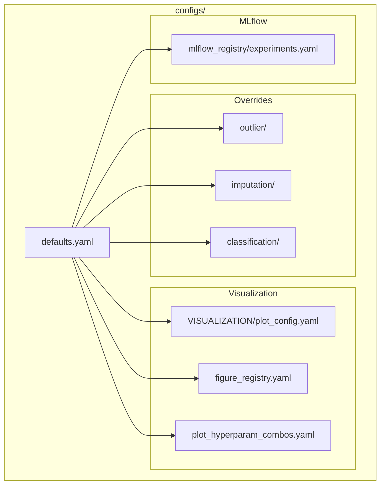

### Key Configuration Values

| Path | Type | Description |
|------|------|-------------|
| `CLS_EVALUATION.glaucoma_params.prevalence` | float | Disease prevalence (0.0354) |
| `CLS_EVALUATION.BOOTSTRAP.n_iterations` | int | Bootstrap iterations (1000) |
| `CLS_EVALUATION.BOOTSTRAP.alpha_CI` | float | Confidence level (0.95) |
| `VISUALIZATION.dpi` | int | Figure DPI (100) |
| `VISUALIZATION.figure_sizes.paper` | tuple | Paper figure size |

---

## Cross-References

- [ARCHITECTURE.md](https://github.com/petteriTeikari/foundation_PLR/blob/main/ARCHITECTURE.md) - High-level overview
- [KNOWLEDGE_GRAPH.md](KNOWLEDGE_GRAPH.md) - Entity relationships
- [CLAUDE.md](https://github.com/petteriTeikari/foundation_PLR/blob/main/CLAUDE.md) - AI assistant context
- [README.md](https://github.com/petteriTeikari/foundation_PLR/blob/main/README.md) - Getting started

---

*Generated: 2026-01-23*
*Last Updated: 2026-01-23*
