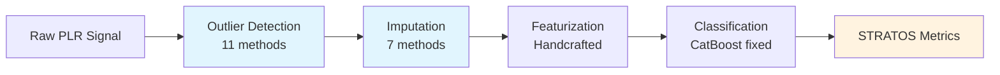

# Foundation PLR Documentation

> **Foundation Models for Pupillary Light Reflex Analysis**
>
> Evaluating how preprocessing choices affect downstream prediction quality in glaucoma screening

---

## What is Foundation PLR?

Foundation PLR is a comprehensive research framework that investigates whether generic time-series foundation models (MOMENT, UniTS, TimesNet, SAITS) can improve biosignal preprocessing compared to traditional methods in clinical applications.

!!! note "Research Focus"
    **This is NOT about comparing classifiers.** The research question is:

    > *How do preprocessing choices (outlier detection → imputation) affect ALL STRATOS-compliant downstream metrics when using handcrafted physiological features?*

## Key Findings

| Finding | Value | Interpretation |
|---------|-------|----------------|
| Best AUROC | 0.913 | With ground truth preprocessing + CatBoost |
| Preprocessing effect | η²=0.15 | Preprocessing choice matters |
| Handcrafted vs Embeddings | 0.830 vs 0.740 | **Embeddings underperform by 9pp** |
| FM for preprocessing | Competitive | Foundation models useful for outlier/imputation |

## The Pipeline



## Quick Links

<div class="grid cards" markdown>

-   :material-rocket-launch:{ .lg .middle } **Getting Started**

    ---

    Install Foundation PLR and run your first experiment

    [:octicons-arrow-right-24: Installation](getting-started/installation.md)

-   :material-book-open-variant:{ .lg .middle } **User Guide**

    ---

    Understand the pipeline stages and configuration

    [:octicons-arrow-right-24: Pipeline Overview](user-guide/pipeline-overview.md)

-   :material-api:{ .lg .middle } **API Reference**

    ---

    Auto-generated documentation from source code

    [:octicons-arrow-right-24: API Docs](api-reference/index.md)

-   :material-school:{ .lg .middle } **Tutorials**

    ---

    Step-by-step guides for common tasks

    [:octicons-arrow-right-24: Tutorials](tutorials/index.md)

</div>

## Data Provenance

**Source:** Najjar et al. 2023, Br J Ophthalmol ([DOI: 10.1136/bjophthalmol-2021-319938](https://doi.org/10.1136/bjophthalmol-2021-319938))

| Task | N Subjects | Description |
|------|------------|-------------|
| Outlier Detection | 507 | All subjects with ground truth masks |
| Imputation | 507 | All subjects with denoised signals |
| Classification | 208 | 152 control + 56 glaucoma with labels |

## Citation

If you use this code in your research, please cite:

```bibtex
@software{foundation_plr,
  title = {Foundation PLR: Foundation Models for Pupillary Light Reflex Analysis},
  year = {2026},
  url = {https://github.com/petteriTeikari/foundation_PLR}
}
```

## License

This project is licensed under the MIT License - see the [LICENSE](https://github.com/petteriTeikari/foundation_PLR/blob/main/LICENSE) file for details.
