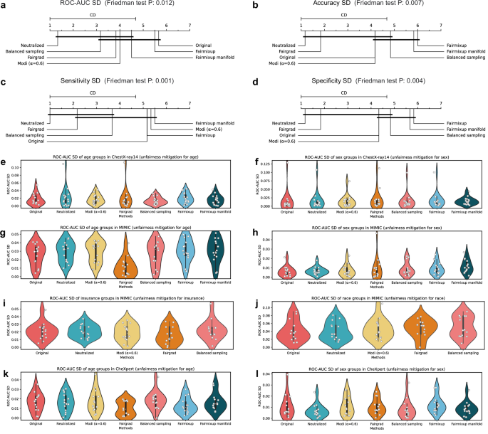

# Missing ggplot2 Figures Implementation Plan

Created: 2026-01-27
Updated: 2026-01-27
Status: Planning (pending biostatistics review)

## Overview

This document outlines the missing figures that need to be implemented in ggplot2/R to complete the manuscript visualization suite.

**Key Design Philosophy:**
- **Nature-style dense multi-panel figures** - consolidate semantically related visualizations into single figures
- **STRATOS-compliant metrics** - AUROC, AURC, scaled Brier, Net Benefit (not AUROC-only)
- **Statistical + Clinical significance** - show both p-values AND minimal clinically important differences (MCID)
- **Factorial design** - 11 outlier × 8 imputation × 5 classifier = 440 combinations (410 evaluated)

---

## 0. Factorial Design Visualization Strategy

### Our Factorial Design

From `configs/mlflow_registry/parameters/classification.yaml`:

| Factor | Levels | Categories |
|--------|--------|------------|
| Outlier Detection | 11 | Ground Truth, Foundation Model (3), Deep Learning (1), Traditional (4), Ensemble (2) |
| Imputation | 8 | Ground Truth, Foundation Model (2), Deep Learning (3), Ensemble (2) |
| Classifier | 5 | CatBoost, XGBoost, TabPFN, TabM, LogisticRegression |

**Note:** For preprocessing analysis, we FIX classifier to CatBoost and vary outlier × imputation.

### Standard Factorial Design Visualizations

Based on [Andrade 2024](https://journals.sagepub.com/doi/10.1177/02537176241237066), [Penn State STAT 502](https://online.stat.psu.edu/stat502/book/export/html/785), and factorial design literature:

| Visualization Type | Purpose | Shows |
|-------------------|---------|-------|
| **Interaction Plot** | Detect factor interactions | Non-parallel lines = interaction |
| **Main Effects Plot** | Compare factor levels | Mean outcome per level |
| **Heatmap Matrix** | Full factorial overview | Color = metric value |
| **ANOVA Decomposition** | Variance attribution | η² per factor |
| **CD Diagram** | Post-hoc comparisons | Which methods are significantly different |
| **Raincloud/Violin** | Distribution by category | Spread within groups |
| **Forest Plot** | Effect sizes with CIs | Point estimates + uncertainty |

### Showing Statistical vs Clinical Significance

**The MCID Problem** ([source](https://pmc.ncbi.nlm.nih.gov/articles/PMC11525893/)):

> "Statistical significance emphasizes the likelihood of an observed effect being non-random, while clinical significance considers whether the observed effect is meaningful enough to warrant action in clinical practice."

**Our Approach:**

1. **Statistical significance**: Friedman test → Nemenyi post-hoc → CD diagrams
2. **Clinical significance**: Define MCID thresholds for each metric

| Metric | Proposed MCID | Rationale |
|--------|---------------|-----------|
| AUROC | **±0.05 (5pp)** | Minimum detectable with N=208 at 80% power (per expert review) |
| Scaled Brier (IPA) | ±0.05 | Meaningful calibration difference |
| Net Benefit | ±10% of "treat all" NB | Fixed MCID inappropriate; use relative threshold |
| AURC | ±0.01 | Meaningful uncertainty improvement |

**Note:** Original MCID of 0.02 for AUROC is NOT statistically detectable with N=208 (152 control, 56 glaucoma). MDD at 80% power is ~0.054-0.074.

**Visualization elements for clinical significance:**
- **Shaded "equivalence zone"** on forest plots
- **Annotation of MCID threshold** on comparison plots
- **Color coding**: green (clinically better), gray (equivalent), red (clinically worse)

### CI Computation for Aggregated Models (TOP-10)

**Problem:** When aggregating TOP-10 models, each with 1000 bootstrap iterations, how do we compute the combined CI?

**Options:**

| Approach | Method | Pros | Cons |
|----------|--------|------|------|
| **A. Pool all bootstraps** | 10 × 1000 = 10,000 samples | Simple, accounts for model selection uncertainty | May overstate precision |
| **B. Hierarchical bootstrap** | Sample models, then bootstraps | Correct variance decomposition | Complex |
| **C. Average CIs** | Mean of individual 95% CIs | Intuitive | Ignores model selection uncertainty |
| **D. Outer percentiles** | min(CI_lo), max(CI_hi) across models | Conservative | Too wide |

**Recommended: Option A (Pool all bootstraps)**
- For TOP-10 models, concatenate all 10,000 bootstrap metric values
- Compute 2.5th and 97.5th percentiles
- This reflects BOTH bootstrap sampling uncertainty AND model selection uncertainty

```python
# Pseudo-code for TOP-10 AUROC CI
top10_aurocs = []
for model in top_10_models:
    top10_aurocs.extend(model.bootstrap_aurocs)  # 1000 each
ci_lo, ci_hi = np.percentile(top10_aurocs, [2.5, 97.5])
```

---

## 0.5 STRATOS-Mandated Elements (Van Calster 2024)

**Reference:** Van Calster B, et al. "Performance evaluation of predictive AI models to support medical decisions: Overview and guidance." STRATOS Initiative Topic Group 6.

### Essential Elements (MUST be in every results section)

| Element | Type | Purpose |
|---------|------|---------|
| **AUROC** | Metric | Discrimination |
| **Calibration plot** | Figure | Probability ↔ observed frequency |
| **Net Benefit + DCA** | Figure + Metric | Clinical utility |
| **Probability distributions** | Figure | Overall performance visualization |

### The 5 Performance Domains

| Domain | Key Metrics | Key Plots |
|--------|-------------|-----------|
| **Discrimination** | AUROC, sensitivity, specificity | ROC curve |
| **Calibration** | Slope, intercept, O:E ratio, ICI | Calibration plot (smoothed) |
| **Overall** | Brier, scaled Brier (IPA) | Probability distributions |
| **Classification** | Sens/Spec at threshold | Classification plot |
| **Clinical Utility** | Net Benefit | Decision Curve Analysis |

### What NOT to Report (per STRATOS)

- **AUPRC** - ignores true negatives, no clear interpretation
- **F1 score** - improper for thresholds ≠ 0.5
- **Accuracy** - improper for clinical thresholds
- **Hosmer-Lemeshow test** - outdated, misleading

### Multi-Panel Figure Consolidation Strategy

Following [Nature's multi-panel guidelines](https://research-figure-guide.nature.com/figures/building-and-exporting-figure-panels/):

> "Figures in top journals can contain a dozen or more panels. The first question is how many panels a figure should contain. The answer is generally one panel for each argument made in the text."

**Proposed Figure Consolidation:**

| Figure | Panels | STRATOS Coverage | Target |
|--------|--------|------------------|--------|
| **Fig 1: STRATOS Core** | 4 | Discrimination + Calibration + DCA + Prob Dist | Main |
| **Fig 2: Factorial Effects** | 4 | Raincloud × 4 metrics (AUROC, AURC, Brier, NB) | Main |
| **Fig 3: Method Comparison** | 3 | CD diagrams (outlier, imputation, combined) | Main |
| **Fig 4: Feature Analysis** | 4 | SHAP + VIF + Featurization gap + FM dashboard | Supp |
| **Fig 5: Uncertainty** | 3 | ROC+CI, RC, Retention curves | Supp |

### Nature-Style Layout Examples

```
┌─────────────────────────────────────────────────────────────────┐
│ Figure 1: STRATOS Core Performance Assessment                   │
├────────────────────────┬────────────────────────────────────────┤
│ (a) ROC Curves         │ (b) Calibration Plot                   │
│     + 95% CI bands     │     + LOESS smoothed                   │
│     (Discrimination)   │     + annotation box                   │
│                        │     (Calibration)                      │
├────────────────────────┼────────────────────────────────────────┤
│ (c) Decision Curve     │ (d) Probability Distributions          │
│     Analysis           │     by Outcome                         │
│     + treat-all/none   │     (Overall Performance)              │
│     (Clinical Utility) │                                        │
└────────────────────────┴────────────────────────────────────────┘

┌─────────────────────────────────────────────────────────────────┐
│ Figure 2: Preprocessing Effects Across STRATOS Metrics          │
├────────────────────────┬────────────────────────────────────────┤
│ (a) AUROC by Type      │ (b) AURC by Type                       │
│     Raincloud          │     Raincloud                          │
│     (Discrimination)   │     (Uncertainty Calibration)          │
├────────────────────────┼────────────────────────────────────────┤
│ (c) Scaled Brier (IPA) │ (d) Net Benefit @ pt=0.10              │
│     by Type            │     by Type                            │
│     Raincloud          │     Raincloud                          │
│     (Overall)          │     (Clinical Utility)                 │
└────────────────────────┴────────────────────────────────────────┘
```

---

## 0.6 Biostatistics Expert Review Findings (2026-01-27)

Three domain experts reviewed this plan. Key findings consolidated below.

### Expert 1: Factorial ANOVA Specialist

**Statistical Test Corrections:**
- **Friedman + Nemenyi** is for ONE-WAY comparisons, NOT factorial designs
- For outlier × imputation interaction, use **Aligned Rank Transform (ART)** instead
- R package: `ARTool` → `art(auroc ~ outlier * imputation, data=df)`

**CI for TOP-10 Models:**
- **DO NOT pool 10×1000 bootstraps naively** - this underestimates uncertainty
- Use **two-stage hierarchical bootstrap**:
  1. Sample models WITH replacement
  2. Sample bootstraps within selected models

**Reference:** Wobbrock et al. (2011) "The Aligned Rank Transform for Nonparametric Factorial Analyses"

### Expert 2: Clinical MCID Specialist

**CRITICAL: AUROC MCID of 0.02 is NOT DETECTABLE with N=208!**

| AUROC | MDD at 80% power |
|-------|------------------|
| 0.85 | **0.074** |
| 0.90 | **0.058** |
| 0.91 | **0.054** |

**Recommendation:** Change AUROC MCID from 0.02 to **0.05**

**Net Benefit Threshold:**
- Current: pt=0.15 (15%)
- Recommended: pt=**0.10** (10%) based on glaucoma harm/benefit ratio
- Show DCA across range 0.05-0.30

**Add TOST equivalence testing** to forest plots (R package: `TOSTER`)

### Expert 3: STRATOS Visualization Specialist

**Panel Labeling:**
- Current: (A, B, C, D) uppercase
- Nature standard: **(a, b, c, d) lowercase** with bold 8pt font

**Calibration Plot Specification:**
```
- Method: LOESS (frac=0.3) ✅ Correct
- CI: Bootstrap percentile (n=200, 95%)
- Overlay: Optional binned points (deciles) for transparency
- Scale: 0-1 on both axes, aspect ratio = 1
- Reference: Diagonal dashed line
- MANDATORY annotation box contents:
  - Calibration slope (target: 1.0)
  - Calibration intercept (target: 0.0)
  - O:E ratio (target: 1.0)
  - Brier score
  - Scaled Brier / IPA
```

**DCA Requirements (CRITICAL - was INCOMPLETE):**
```
- X-axis: Threshold probability range 0.05-0.30
  - Justified: Below 5% = always refer; above 30% = never refer in glaucoma
- Y-axis: Net Benefit (unstandardized)
- Reference lines (MANDATORY):
  - "Treat all": NB = prevalence - (1-prevalence) × t/(1-t)
  - "Treat none": NB = 0 (horizontal line at y=0)
- Model lines: One per preprocessing pipeline (4 combos)
- Annotation: Highlight threshold where model exceeds references
```

**Color Consistency Rule (MANDATORY across all panels):**
```
Same pipeline = same color in ALL figures:
- ground_truth: #2ECC71 (green)
- best_ensemble: #3498DB (blue)
- best_single_fm: #9B59B6 (purple)
- traditional: #95A5A6 (gray)
```

**STRATOS Elements Correctly EXCLUDED:**
- AUPRC (ignores TN, no clear interpretation)
- F1 score (improper for thresholds ≠ 0.5)
- pAUROC (no decision-analytic basis)

### Action Items from Expert Review

| Issue | Priority | Fix |
|-------|----------|-----|
| AUROC MCID too small | **P0** | Change from 0.02 to 0.05 |
| Use ART for interaction test | P1 | Replace Friedman with ARTool |
| Fix TOP-10 CI computation | P1 | Two-stage hierarchical bootstrap |
| Change panel labels to lowercase | P2 | (a,b,c,d) not (A,B,C,D) |
| Add DCA reference lines | P0 | Treat-all, treat-none |
| Add TOST to forest plots | P2 | Equivalence test p-values |

---

## 1. Critical Difference (CD) Diagrams

### Current State

We have a matplotlib implementation of CD diagrams but need proper R/ggplot2 versions that match our economist-style aesthetics.

The current `fig_cd_preprocessing.R` creates a rank plot fallback because `scmamp` package is not available:
```
Note: scmamp package not available, using ggplot2 rank plot instead
```

### Requirements

1. **Use existing statistical computation** - DO NOT reimplement CD diagram statistics from scratch
2. **Modify only aesthetics** - Match the "economist off-white" theme used in all other figures
3. **Standard CD diagram elements**:
   - Horizontal axis showing average ranks
   - Methods listed with their mean ranks
   - Horizontal bars (cliques) connecting methods that are NOT significantly different
   - Critical difference value shown

### R Packages for CD Diagrams

| Package | Function | Notes |
|---------|----------|-------|
| `scmamp` | `plotCD()` | Most cited, returns base R plot |
| `mlr` | `plotCritDifferences()` | Uses ggplot2, but package is heavy |
| `performanceEstimation` | `CDdiagram.Nemenyi()` | Base R graphics |
| `PMCMRplus` | Post-hoc tests | Stats only, no plotting |

**Recommended approach**: Use `scmamp::plotCD()` for statistical computation, then either:
- Option A: Extract data from scmamp and rebuild in ggplot2 with our theme
- Option B: Use scmamp's plot but post-process with our color scheme
- Option C: Use `autoplot()` method if available and customize

### Aesthetic Requirements

The standard CD diagram is very black-and-white. We need to adapt it to match our economist-style:

```r
# Our standard aesthetics (from theme_foundation_plr.R)
background: "#FBF9F3" (off-white)
text_primary: "#333333"
text_secondary: "#666666"
grid_lines: "#CCCCCC"

# Category colors for clique bars
ground_truth: "#2ECC71" (green)
foundation_model: "#3498DB" (blue)
traditional: "#E74C3C" (red)
ensemble: "#9B59B6" (purple)
```

### Key Questions

1. Can `scmamp::plotCD()` output be customized, or do we need to extract the computed data and plot ourselves?
2. Should clique bars be colored by method category (FM vs Traditional vs Ensemble)?
3. How to handle the axis inversion (lower rank = better, typically shown on left)?

### Example CD Diagram (Target Style)



**Source:** Hu, Lianting, Dantong Li, Huazhang Liu, et al. 2024. "Enhancing Fairness in AI-Enabled Medical Systems with the Attribute Neutral Framework." *Nature Communications* 15 (1): 8767. https://doi.org/10.1038/s41467-024-52930-1.

This example shows a clean, publication-ready CD diagram with:
- Clear rank axis at bottom
- Method names with numeric ranks
- Horizontal clique bars connecting non-significantly different methods
- Critical difference (CD) value shown at top
- Clean typography suitable for journal publication

Our goal is to achieve similar clarity while applying our economist off-white aesthetic.

### References

- Demšar (2006): "Statistical Comparisons of Classifiers over Multiple Data Sets" - Original CD diagram paper
- Hu et al. (2024): Nature Communications example of clean CD diagram styling
- https://rdrr.io/cran/scmamp/man/plotCD.html
- https://github.com/mlr-org/mlr/blob/master/R/plotCritDifferences.R
- https://arxiv.org/abs/1412.0436
- https://stackoverflow.com/questions/41020826/plotting-critical-differences-in-r-with-imported-data

---

## 2. Other Missing Figures

### 2.1 ROC + RC Combined Figure (2-Column)

**Priority: HIGH** - Key discrimination visualization

A 2-column figure comparing two key configurations:

| Panel | Content | CI Available? |
|-------|---------|---------------|
| Left (A) | ROC curves (TPR vs FPR) | **YES** - bootstrap bands |
| Right (B) | RC curves (Risk vs Coverage) | **NO** - single curves only |

**Models to compare:**
- **Model A**: Top-performing ensemble pipeline (`ensemble-LOF-MOMENT-...` + `CSDI` + `CatBoost`)
- **Model B**: Ground truth baseline (`pupil-gt` + `pupil-gt` + `CatBoost`)

**Layout:**
```
┌─────────────────────┬─────────────────────┐
│                     │                     │
│   ROC Curves        │   RC Curves         │
│   (TPR vs FPR)      │   (Risk vs          │
│   WITH 95% CI bands │    Coverage)        │
│                     │   NO CI (single)    │
│   ── Best Ensemble  │   ── Best Ensemble  │
│   ── Ground Truth   │   ── Ground Truth   │
│                     │                     │
│   (A)               │   (B)               │
└─────────────────────┴─────────────────────┘
```

**Why RC curves cannot have bootstrap CIs:**
Risk-Coverage is computed from the aggregated predictions across ALL bootstrap iterations together (you need the full ensemble to compute uncertainty/confidence for selective classification). It's fundamentally different from ROC which can be computed per-iteration and then aggregated.

**Data Availability:**

| Curve | Bootstrap Data? | Location | Shape |
|-------|-----------------|----------|-------|
| ROC (FPR/TPR) | **YES** | `mlruns/.../metrics/metrics_*.pickle` → `metrics_iter.test.metrics.arrays.AUROC` | `(200, 1000)` = 200 bootstrap × 1000 points |
| RC (Risk/Coverage) | **NO** | `subjectwise_stats.test.uq.arrays` | `(63,)` per subject - computed from aggregated predictions |

**ROC Interpolation method** (from `src/classification/stats_metric_utils.py`):
```python
from scipy.interpolate import interp1d
x_new = np.linspace(0, 1, n_samples)  # n_samples = 1000
# Interpolates each bootstrap iteration to 1000 fixed points on x-axis
```

**Data export needed:**
- `scripts/export_roc_bootstrap_for_r.py` - extract (200, 1000) ROC arrays, compute mean + 95% CI bands
- RC data already in `outputs/r_data/roc_rc_data.json` (single curves)

**Script:** New `fig_roc_rc_2model.R`

### 2.2 Multi-Metric Raincloud Panel (AUROC, AURC, Brier, NB)

**Priority: HIGH** - Shows preprocessing effects across ALL STRATOS domains

Extend existing `fig_raincloud_auroc.R` to a 2×2 panel figure:

```
┌────────────────────┬────────────────────┐
│ (A) AUROC          │ (B) AURC           │
│ by Pipeline Type   │ by Pipeline Type   │
│ [Discrimination]   │ [Uncertainty]      │
├────────────────────┼────────────────────┤
│ (C) Scaled Brier   │ (D) Net Benefit    │
│ by Pipeline Type   │ by Pipeline Type   │
│ [Overall]          │ [Clinical Utility] │
└────────────────────┴────────────────────┘
```

**Pipeline Types (y-axis):**
- Ground Truth (gold)
- Ensemble (blue)
- Foundation Model (cyan)
- Traditional (gray)

**Key Questions:**
1. Do FM-based pipelines show CONSISTENT advantage across ALL metrics, or only some?
2. Is the ensemble benefit statistically significant for each metric?
3. Where is the variance highest (unstable methods)?

**Data Requirements:**
- Need AURC, scaled_brier, net_benefit columns in `essential_metrics.csv`
- Current: only has `auroc`, `brier`, `net_benefit`
- Missing: `aurc`, `scaled_brier` (IPA)

**Script:** `fig_raincloud_multi_metric.R` (use `compose_figures()` for 2×2 layout)

### 2.3 Interaction Plots (Factorial Design)

**Priority: MEDIUM** - Standard factorial design visualization

Show outlier × imputation interaction effects:

```
┌────────────────────────────────────────────────────────┐
│ (A) Interaction Plot: AUROC                            │
│                                                        │
│     AUROC                                              │
│       ↑       ●──────●  pupil-gt                       │
│       │      ╱        ╲                                │
│       │     ●──────────● CSDI                          │
│       │    ╱            ╲                              │
│       │   ●──────────────●  SAITS                      │
│       └──────────────────────→                         │
│         LOF  MOMENT  Ensemble  Outlier Method          │
│                                                        │
│ Non-parallel lines = interaction effect               │
└────────────────────────────────────────────────────────┘
```

**Interpretation:**
- Parallel lines = NO interaction (main effects additive)
- Crossing lines = INTERACTION (effect depends on other factor)

**Statistical Test:** Friedman test for interaction significance

**Script:** `fig_interaction_plots.R`

### 2.4 Retention Curves (Multi-Metric)
- Python version exists in `src/viz/retained_metric.py`
- Need R/ggplot2 version for consistency
- Shows AUROC, Brier, Net Benefit vs retention fraction

### 2.5 Error Propagation Visualization
- Shows how outlier detection errors propagate through imputation to classification
- Sankey-style or flow diagram
- May need specialized package (ggalluvial, networkD3)

---

## 3. FUTURE IDEA: ggplot-image-creation Skill

**Add this idea verbatim to enforce no-hardcoding rule:**

> Create a Claude Code Skill (`/ggplot` or `/figure`) that enforces the no-hardcoding rules when generating new R/ggplot2 figures. The skill would:
>
> 1. **Automatically inject required imports**:
>    ```r
>    source("src/r/figure_system/config_loader.R")
>    source("src/r/figure_system/save_figure.R")
>    source("src/r/theme_foundation_plr.R")
>    source("src/r/color_palettes.R")
>    ```
>
> 2. **Enforce color usage from config**:
>    - Block any hardcoded hex colors like `"#FF0000"`
>    - Require `color_ref("category.name")` or `COLORS$name` syntax
>    - Validate colors exist in `configs/VISUALIZATION/figure_colors.yaml`
>
> 3. **Enforce save_figure() usage**:
>    - Block direct `ggsave()` calls
>    - Require `save_publication_figure()` from figure system
>    - Auto-generate JSON data export
>
> 4. **Template structure**:
>    ```r
>    # Figure: {name}
>    # {description}
>    # Created: {date}
>
>    # ==== SETUP (auto-injected) ====
>    source(...)
>
>    # ==== DATA ====
>    # Load from outputs/r_data/ with provenance tracking
>
>    # ==== PLOT ====
>    p <- ggplot(...) +
>      theme_foundation_plr() +
>      scale_color_pipeline()  # or appropriate palette
>
>    # ==== SAVE (auto-injected) ====
>    save_publication_figure(p, "fig_{name}", ...)
>    ```
>
> 5. **Validation before save**:
>    - Check all colors resolve to valid config references
>    - Verify theme_foundation_plr() is applied
>    - Ensure output filename matches script name (`fig_*.R` → `fig_*.png`)
>
> This would prevent the repeated cycle of:
> 1. Claude generates figure with hardcoded colors
> 2. User complains about hardcoding
> 3. Claude fixes hardcoding
> 4. Repeat for next figure
>
> Instead, the Skill would enforce correct patterns from the start.

---

## 4. Implementation Priority

### Phase 1: STRATOS Core (Main Figures)

| Priority | Figure | Effort | Notes |
|----------|--------|--------|-------|
| P0 | **Fig 1: STRATOS Core (2×2)** | Medium | ROC, Calibration, DCA, Prob Dist |
| P0 | **Fig 2: Multi-Metric Raincloud (2×2)** | Medium | AUROC, AURC, Brier, NB by type |
| P0 | **Fig 3: CD Diagrams (3 panels)** | Medium | Outlier, Imputation, Combined |

### Phase 2: Supplementary Figures

| Priority | Figure | Effort | Notes |
|----------|--------|--------|-------|
| P1 | ROC + RC with Bootstrap CIs | Low | 2-model comparison |
| P1 | Interaction Plots | Medium | Outlier × Imputation effects |
| P1 | Retention curves (R version) | Low | Port from Python |

### Phase 3: Extra Supplementary

| Priority | Figure | Effort | Notes |
|----------|--------|--------|-------|
| P2 | Error propagation flow | High | Sankey diagram |
| P2 | Feature Analysis Combined | Medium | Consolidate SHAP, VIF, etc. |

### Phase 4: Tooling

| Priority | Figure | Effort | Notes |
|----------|--------|--------|-------|
| P3 | ggplot Skill | Medium | Dev tooling improvement |

### Data Export Requirements

**CRITICAL CLARIFICATION**: These metrics ARE computed in MLflow artifacts but NOT exported to `essential_metrics.csv`. This is an **export pipeline gap**, NOT a computation gap.

| Column | In MLflow? | In essential_metrics.csv? | Fix |
|--------|------------|---------------------------|-----|
| auroc | ✅ Yes | ✅ Yes | - |
| brier | ✅ Yes | ✅ Yes | - |
| net_benefit | ✅ Yes | ❌ No (wrong!) | Add to export script |
| **aurc** | ✅ Yes (`src/stats/uncertainty_quantification.py`) | ❌ No | Add to export script |
| **scaled_brier** | ✅ Yes (IPA in metrics registry) | ❌ No | Add to export script |
| **calibration_slope** | ✅ Yes (`src/stats/calibration_extended.py`) | ❌ No | Add to export script |
| **calibration_intercept** | ✅ Yes | ❌ No | Add to export script |
| **o_e_ratio** | ✅ Yes | ❌ No | Add to export script |

**Source files where these are computed:**
- AURC: `src/stats/uncertainty_quantification.py` → `sec_classification()` function
- Scaled Brier (IPA): `src/stats/scaled_brier.py` + `src/viz/metric_registry.py`
- Calibration: `src/stats/calibration_extended.py` → `calibration_slope_intercept()`
- Net Benefit: `src/stats/clinical_utility.py` OR computed in bootstrap loop

**FIX NEEDED**: Update `src/data_io/duckdb_export.py` or `scripts/export_essential_metrics.py` to include ALL STRATOS metrics that are already computed in MLflow artifacts.

---

## 5. CD Diagram Implementation Approach

### Step 1: Install and test scmamp
```r
install.packages("scmamp")
library(scmamp)

# Test with our data
results_matrix <- # ... load from DuckDB
plotCD(results_matrix, alpha = 0.05)
```

### Step 2: Understand scmamp output structure
- What data does it compute?
- Can we extract ranks, cliques, CD value?
- Is there a data-only function (no plotting)?

### Step 3: Create ggplot2 wrapper
```r
# Pseudo-code
create_cd_diagram <- function(results_matrix, alpha = 0.05) {
  # 1. Compute statistics using scmamp internals
  cd_data <- scmamp::getNemenyiCD(results_matrix, alpha)
  ranks <- scmamp::rankMatrix(results_matrix)

  # 2. Build ggplot with our theme
  p <- ggplot() +
    # Rank axis
    # Method labels with ranks
    # Clique bars (colored by category)
    # CD annotation
    theme_foundation_plr()

  return(p)
}
```

### Step 4: Integrate with figure system
- Use `save_publication_figure()`
- Export JSON with ranks, cliques, CD value
- Match output naming: `fig_cd_*.png`

---

## Appendix: CD Diagram Visual Elements

```
                    CD = 2.5
                ├──────────┤

    Method A ──●────────────────────────── 1.5
    Method B ──●────────────────────────── 2.0
    Method C ────●──────────────────────── 3.0  ╮
    Method D ──────●────────────────────── 4.5  │ clique (not sig. different)
    Method E ────────●──────────────────── 5.0  ╯
    Method F ──────────●────────────────── 6.5

               1    2    3    4    5    6    7
                      Average Rank
```

Elements to style:
- Background: off-white (#FBF9F3)
- Axis: minimal, economist-style
- Method labels: left-aligned, colored by category
- Rank markers: filled circles, colored by category
- Clique bars: horizontal lines connecting methods, semi-transparent
- CD bracket: shown at top with value annotation
