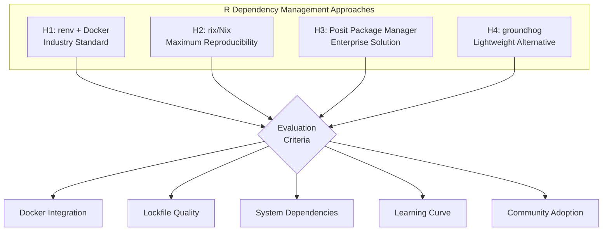
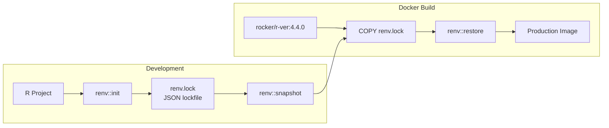
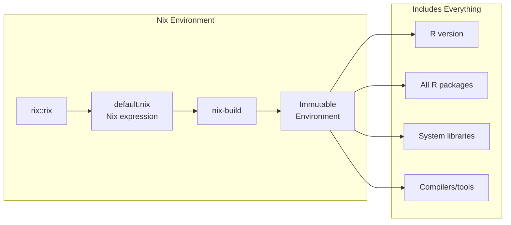
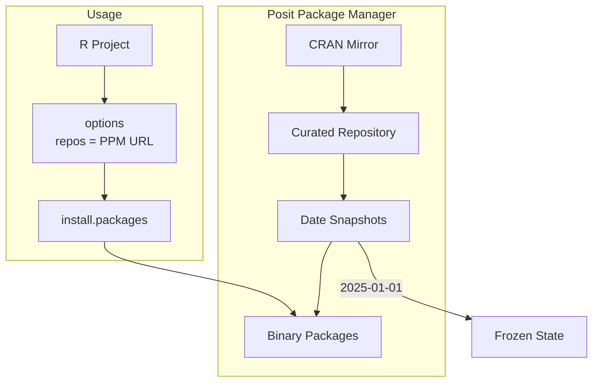
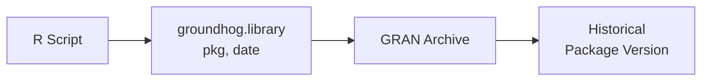
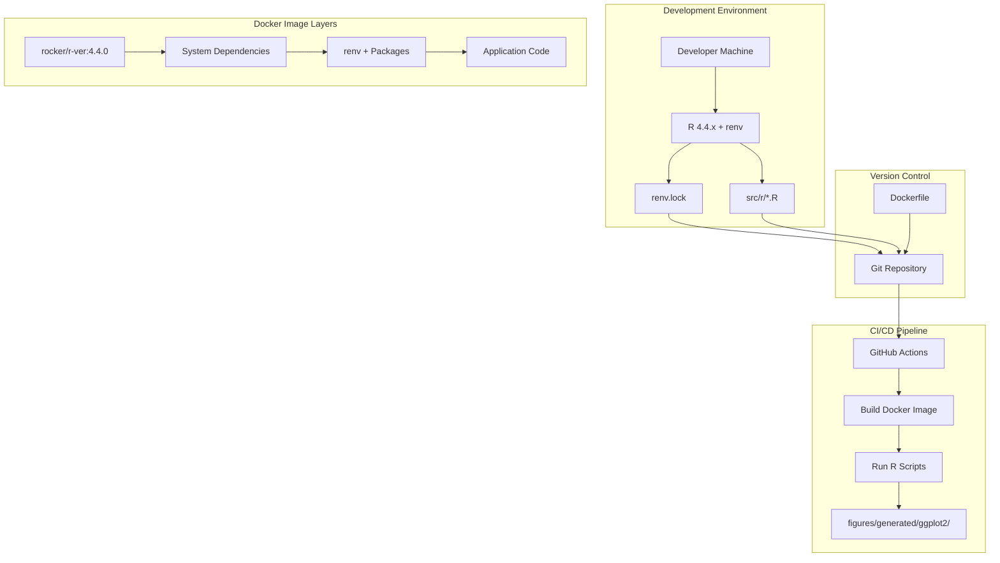
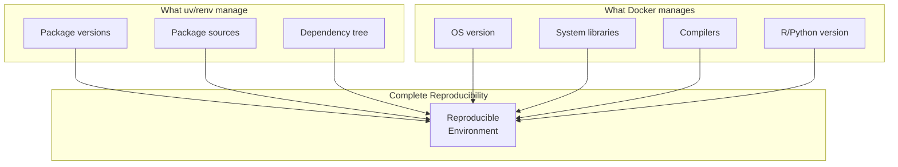
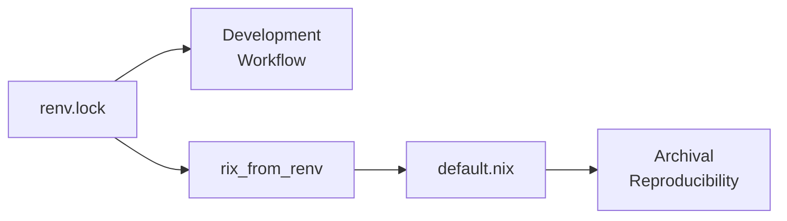

# Production-Grade R Dependency Management for Scientific Computing

## Executive Summary

This document evaluates approaches to R dependency management suitable for production environments, with emphasis on Docker containerization and long-term reproducibility. The goal is to find the R equivalent of Python's `uv` + Docker workflow—a modern, deterministic, and production-ready solution.

## User Prompt (Verbatim)

> For the renv question, let's do a mini multi-hypothesis plan how R dependencies are handled in production-grade repos. We need to be able to easily create a Docker for this repo as well, so keep that in mind. I don't want any of this normal Jupyter-type of R crap that cannot be easily productionized to anything. Think of `uv` + Docker for R instead of pip's 'requirements.txt' for R :D

---

## 1. Problem Statement

### 1.1 The R Reproducibility Challenge

Unlike Python's ecosystem which has converged on modern tools like `uv` (with deterministic lockfiles and fast resolution), R's dependency management landscape remains fragmented. Key challenges include:

1. **System dependency opacity**: Many R packages require system libraries (GDAL, PROJ, etc.) not tracked by R package managers
2. **No universal lockfile standard**: Each tool uses different formats
3. **CRAN mutability**: Package versions can be removed or replaced
4. **Cross-platform inconsistency**: Binary availability varies by OS
5. **R version coupling**: Packages often tied to specific R versions

### 1.2 Requirements for This Project

| Requirement | Priority | Rationale |
|-------------|----------|-----------|
| Deterministic builds | P0 | Scientific reproducibility |
| Docker compatibility | P0 | CI/CD and deployment |
| Fast CI builds | P1 | Developer productivity |
| Cross-platform support | P1 | macOS dev → Linux production |
| Long-term archival | P2 | 10+ year reproducibility |

---

## 2. Multi-Hypothesis Evaluation

### Hypothesis Overview



---

### Hypothesis 1: renv + Docker (Industry Standard)

**Approach**: Use `renv` for R package management combined with Rocker base images.

#### Architecture



#### Dockerfile Pattern

```dockerfile
# Multi-stage build for lean production images
FROM rocker/r-ver:4.4.0 AS builder

# Install system dependencies
RUN apt-get update && apt-get install -y \
    libcurl4-openssl-dev \
    libssl-dev \
    libxml2-dev \
    && rm -rf /var/lib/apt/lists/*

# Install renv
ENV RENV_VERSION 1.0.7
RUN R -e "install.packages('renv', repos = 'https://cloud.r-project.org')"

# Copy lockfile first (layer caching)
WORKDIR /project
COPY renv.lock renv.lock
COPY .Rprofile .Rprofile
COPY renv/activate.R renv/activate.R
COPY renv/settings.json renv/settings.json

# Restore packages
RUN R -e "renv::restore()"

# Copy application code
COPY . .

# Production stage
FROM rocker/r-ver:4.4.0 AS production
COPY --from=builder /project /project
WORKDIR /project
```

#### Strengths

- **Industry standard**: Most widely adopted in both academia and industry ([Tilburg Science Hub](https://www.tilburgsciencehub.com/topics/automation/replicability/package-management/renv/))
- **RStudio integration**: First-class support in RStudio IDE
- **JSON lockfile**: Machine-readable, diffable, and easy to audit
- **Global cache**: Reduces disk usage across projects
- **Python support**: Can track Python dependencies via reticulate ([renv Python docs](https://rstudio.github.io/renv/articles/python.html))

#### Weaknesses

- **System dependencies**: Does not track or manage system libraries
- **R version**: Does not pin R version (handled by Docker base image)
- **Learning curve**: Requires understanding of renv workflow

#### Verdict: **RECOMMENDED for most use cases**

---

### Hypothesis 2: rix/Nix (Maximum Reproducibility)

**Approach**: Use Nix package manager via the `rix` R package for complete environment specification.

#### Architecture



#### Usage Pattern

```r
# Generate Nix expression for reproducible environment
library(rix)

rix(
  r_ver = "4.4.0",
  r_pkgs = c("ggplot2", "dplyr", "tidyr"),
  system_pkgs = c("quarto"),
  git_pkgs = list(
    list(package_name = "mypackage",
         repo_url = "https://github.com/user/mypackage",
         commit = "abc123")
  ),
  ide = "rstudio",
  project_path = ".",
  overwrite = TRUE
)
```

#### Strengths

- **Complete reproducibility**: Pins R version, all packages, AND system dependencies ([R Consortium](https://r-consortium.org/posts/rix-reproducible-data-science-environments-with-nix/))
- **Temporal pinning**: Can recreate CRAN state from any historical date
- **Immutable environments**: Prevents accidental changes
- **No Docker required**: Nix provides containerization benefits without Docker
- **Polyglot support**: rixpress supports R + Python + Julia pipelines ([R-bloggers](https://www.r-bloggers.com/2025/05/building-fully-reproducible-data-science-environments-for-r-and-python-with-ease-using-nix-rix-and-rixpress-workshop/))

#### Weaknesses

- **Steep learning curve**: Nix concepts are unfamiliar to most R users
- **Limited adoption**: Smaller community than renv
- **Build times**: Initial builds can be slow (though cached subsequently)
- **macOS limitations**: Some system dependencies work better on Linux

#### Verdict: **CONSIDER for maximum reproducibility requirements**

---

### Hypothesis 3: Posit Package Manager (Enterprise)

**Approach**: Use organizational package repository with date-based snapshots.

#### Architecture



#### Usage Pattern

```r
# Configure R to use PPM snapshot
options(repos = c(CRAN = "https://packagemanager.posit.co/cran/2025-01-15"))

# Install packages from frozen snapshot
install.packages(c("ggplot2", "dplyr"))
```

#### Strengths

- **Binary packages**: Pre-compiled for major platforms, fast installation
- **Date-based snapshots**: Easy reproducibility via URL ([Posit docs](https://docs.posit.co/rspm/admin/managing-change-control/))
- **Curated repositories**: Can create production vs development repos
- **Portable Linux binaries**: Bundle system dependencies (2025 feature)

#### Weaknesses

- **Requires infrastructure**: Self-hosted or Posit Cloud subscription
- **Not a lockfile**: Still need renv for project-level tracking
- **Cost**: Enterprise pricing for full features

#### Verdict: **COMPLEMENT to renv, not replacement**

---

### Hypothesis 4: groundhog (Lightweight Alternative)

**Approach**: Date-based package loading without project-level infrastructure.

#### Architecture



#### Usage Pattern

```r
# Simple date-based loading
library(groundhog)
groundhog.library("ggplot2", "2024-01-15")
groundhog.library("dplyr", "2024-01-15")
```

#### Strengths

- **Zero setup**: No project initialization required ([groundhog docs](https://groundhogr.com/renv/))
- **Retroactive**: Can make old scripts reproducible without modification
- **Simple API**: Single function replaces `library()`
- **No learning curve**: Immediate adoption

#### Weaknesses

- **No lockfile**: Dependencies not explicitly recorded
- **Script modification**: Requires changing all `library()` calls
- **Limited ecosystem**: Fewer integrations than renv
- **Docker challenges**: Harder to optimize layer caching

#### Verdict: **USE for quick scripts, NOT for production**

---

## 3. Comparison Matrix

| Criterion | renv | rix/Nix | Posit PM | groundhog |
|-----------|------|---------|----------|-----------|
| **Lockfile quality** | ⭐⭐⭐⭐ | ⭐⭐⭐⭐⭐ | ⭐⭐ | ⭐ |
| **System deps** | ⭐⭐ | ⭐⭐⭐⭐⭐ | ⭐⭐⭐⭐ | ⭐ |
| **Docker integration** | ⭐⭐⭐⭐⭐ | ⭐⭐⭐ | ⭐⭐⭐⭐ | ⭐⭐ |
| **Learning curve** | ⭐⭐⭐⭐ | ⭐⭐ | ⭐⭐⭐ | ⭐⭐⭐⭐⭐ |
| **Community adoption** | ⭐⭐⭐⭐⭐ | ⭐⭐ | ⭐⭐⭐ | ⭐⭐⭐ |
| **CI/CD optimization** | ⭐⭐⭐⭐⭐ | ⭐⭐⭐ | ⭐⭐⭐⭐ | ⭐⭐ |
| **Long-term archival** | ⭐⭐⭐ | ⭐⭐⭐⭐⭐ | ⭐⭐⭐⭐ | ⭐⭐⭐ |

---

## 4. Recommended Architecture for foundation_PLR

Based on evaluation, we recommend **renv + Docker with Rocker base images**.

### 4.1 Architecture Diagram



### 4.2 Implementation Steps

#### Step 1: Initialize renv

```r
# In R console at project root
renv::init()

# Install required packages
install.packages(c(
  "ggplot2", "dplyr", "tidyr", "readr",  # tidyverse core
  "scales", "patchwork", "ggtext",        # plotting extensions
  "pminternal"                             # STRATOS compliance
))

# Create lockfile
renv::snapshot()
```

#### Step 2: Create Dockerfile

```dockerfile
# Dockerfile for R visualization
FROM rocker/r-ver:4.4.0

LABEL maintainer="Foundation PLR Team"
LABEL description="R environment for ggplot2 figure generation"

# System dependencies for R packages
RUN apt-get update && apt-get install -y --no-install-recommends \
    libcurl4-openssl-dev \
    libssl-dev \
    libxml2-dev \
    libfontconfig1-dev \
    libfreetype6-dev \
    libpng-dev \
    libtiff5-dev \
    libjpeg-dev \
    && rm -rf /var/lib/apt/lists/*

# Install renv
ENV RENV_VERSION=1.0.7
RUN R -e "install.packages('renv', repos = 'https://cloud.r-project.org')"

# Set working directory
WORKDIR /project

# Copy renv files first for layer caching
COPY renv.lock renv.lock
COPY .Rprofile .Rprofile
COPY renv/activate.R renv/activate.R
COPY renv/settings.json renv/settings.json

# Restore packages (cached unless renv.lock changes)
RUN R -e "renv::restore()"

# Copy R source code
COPY src/r/ src/r/

# Copy configs needed by R scripts
COPY configs/ configs/

# Output directory
RUN mkdir -p figures/generated/ggplot2

# Default command
CMD ["Rscript", "src/r/figures/generate_all.R"]
```

#### Step 3: Makefile Integration

```makefile
# R figure generation targets
R_IMAGE := foundation-plr-r:latest
R_FIGURES := src/r/figures

.PHONY: r-docker-build r-figures-docker

r-docker-build:
	docker build -t $(R_IMAGE) -f Dockerfile.r .

r-figures-docker: r-docker-build
	docker run --rm \
		-v $(PWD)/figures/generated/ggplot2:/project/figures/generated/ggplot2 \
		-v $(PWD)/outputs/r_data:/project/outputs/r_data:ro \
		$(R_IMAGE)
```

### 4.3 CI/CD Integration

```yaml
# .github/workflows/r-figures.yml
name: Generate R Figures

on:
  push:
    paths:
      - 'src/r/**'
      - 'renv.lock'
      - 'Dockerfile.r'

jobs:
  build-r-figures:
    runs-on: ubuntu-latest

    steps:
      - uses: actions/checkout@v4

      - name: Set up Docker Buildx
        uses: docker/setup-buildx-action@v3

      - name: Build R Docker image
        uses: docker/build-push-action@v5
        with:
          context: .
          file: Dockerfile.r
          push: false
          load: true
          tags: foundation-plr-r:ci
          cache-from: type=gha
          cache-to: type=gha,mode=max

      - name: Generate figures
        run: |
          docker run --rm \
            -v ${{ github.workspace }}/figures/generated/ggplot2:/project/figures/generated/ggplot2 \
            foundation-plr-r:ci

      - name: Upload figures
        uses: actions/upload-artifact@v4
        with:
          name: ggplot2-figures
          path: figures/generated/ggplot2/
```

---

## 5. Comparison with Python's uv

The user asked for "uv + Docker for R". Here's how renv compares:

| Feature | Python uv | R renv |
|---------|-----------|--------|
| **Lockfile** | `uv.lock` (deterministic) | `renv.lock` (JSON) |
| **Speed** | 10-100x faster than pip | ~2x faster than install.packages |
| **Resolution** | SAT solver | Iterative resolution |
| **Cache** | Global, content-addressed | Global, path-based |
| **Docker pattern** | Copy lockfile → install | Copy lockfile → restore |
| **System deps** | Not managed | Not managed |

### Key Insight

Both `uv` and `renv` solve the same problem (deterministic package installation) but neither manages system dependencies. This is why Docker is essential—it provides the system-level reproducibility that language-specific tools cannot.



---

## 6. Future Considerations

### 6.1 rix/Nix as Long-Term Solution

For projects requiring 10+ year reproducibility (common in scientific research), consider migrating to Nix:

```r
# Generate Nix expression from existing renv.lock
library(rix)

rix_from_renv(
  renv_lock_path = "renv.lock",
  project_path = ".",
  r_ver = "4.4.0"
)
```

### 6.2 Hybrid Approach

For maximum flexibility, maintain both:

1. **renv.lock**: For day-to-day development
2. **default.nix**: For archival and complete reproducibility



---

## 7. Decision Matrix

| If your priority is... | Use... | Because... |
|------------------------|--------|------------|
| Industry compatibility | renv + Docker | Widest adoption, best tooling |
| Maximum reproducibility | rix/Nix | Pins everything including system deps |
| Enterprise deployment | Posit PM + renv | Binary packages, curated repos |
| Quick prototyping | groundhog | Zero setup, immediate use |
| This project | **renv + Docker** | Balances reproducibility with practicality |

---

## 8. References

### Core Documentation
- [renv Docker Integration](https://rstudio.github.io/renv/articles/docker.html)
- [Rocker Project Reproducibility](https://rocker-project.org/use/reproducibility.html)
- [rix Documentation](https://docs.ropensci.org/rix/)
- [Posit Package Manager](https://docs.posit.co/rspm/admin/managing-change-control/)

### Tutorials and Guides
- [Automating Computational Reproducibility with renv, Docker, and GitHub Actions](https://haines-lab.com/post/2022-01-23-automating-computational-reproducibility-with-r-using-renv-docker-and-github-actions/) - Haines Lab
- [Renv with Docker: How to Dockerize a Shiny Application](https://www.appsilon.com/post/renv-with-docker) - Appsilon
- [Top 10 Docker Best Practices for R Developers 2025](https://collabnix.com/10-essential-docker-best-practices-for-r-developers-in-2025/) - Collabnix
- [An Introduction to Docker for R Users](https://colinfay.me/docker-r-reproducibility/) - Colin Fay

### Academic and Community Resources
- [The Open Science Manual: Rocker Chapter](https://arca-dpss.github.io/manual-open-science/rocker-chapter.html)
- [R Consortium: Nix and rix](https://r-consortium.org/posts/reproducibility-without-containers-bruno-rodrigues-introduces-nix-and-the-rix-r-package/)
- [Tilburg Science Hub: Package Management for R](https://www.tilburgsciencehub.com/topics/automation/replicability/package-management/renv/)
- [groundhog: Comparing with renv](https://groundhogr.com/renv/)

### Comparison Resources
- [packrat vs renv](https://rstudio.github.io/renv/articles/packrat.html)
- [Dependency Management in R](https://lmu-osc.github.io/introduction-to-renv/dependencies_in_r.html)
- [Reproducible Environments for R and Python](https://occasionaldivergences.com/posts/rep-env/)

---

## 9. Action Items for foundation_PLR

- [ ] Initialize renv in project root: `renv::init()`
- [ ] Install required R packages and snapshot: `renv::snapshot()`
- [ ] Create `Dockerfile.r` based on template above
- [ ] Add renv files to git: `renv.lock`, `.Rprofile`, `renv/activate.R`, `renv/settings.json`
- [ ] Add `renv/library/` to `.gitignore`
- [ ] Update Makefile with Docker-based R targets
- [ ] Test reproducibility: fresh clone → `docker build` → verify figures match

---

*Document created: 2026-01-25*
*Last updated: 2026-01-25*
