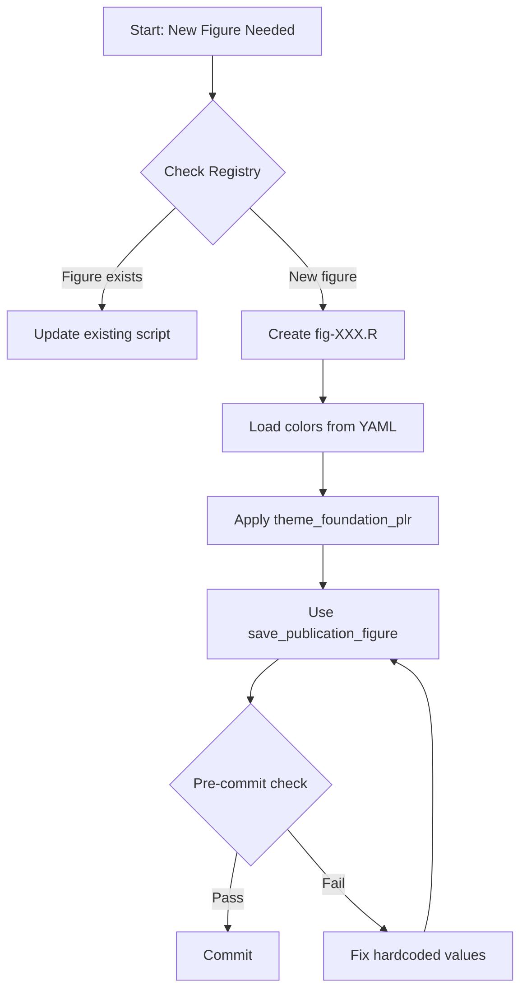

# Repository Housekeeping & Documentation Update Plan

**Status:** 🟡 PLANNING
**Created:** 2026-01-31
**Last Updated:** 2026-01-31
**Related Issue:** https://github.com/petteriTeikari/foundation_PLR/issues/4
**Reviewer Iterations:** 2 (CONVERGED - ready for execution)

---

## User Prompt (Verbatim)

> You could plan to /home/petteri/Dropbox/github-personal/foundation-PLR/foundation_PLR/docs/planning/repo-housekeeping-update on what should we doing for the documentation update. How do docstrings work for R? Remember this pending task when we are done with the work for the repo and we are ready to submit this paper: https://github.com/petteriTeikari/foundation_PLR/issues/4. What updates should we since our last housekeeping documentation task? How up-to-date is our repository in terms of documenting all the contents? I think the R figure creation code is documented very badly? We should document in great detail how the figure factory, theme management and the whole hard-code ban in practice works! How is it policed and how should a developer (and a LLM) create new figures so that they pass the tests and comply with repo guidelines. Do we have enough Mermaid graphs over the "README.md system". Does major LLMs understand well how to continue working with this repo? CLAUDE.md / auto-context / guardrails, do we need separate AGENTS.md for OpenAI Codex? What is our GEO strategy so that Claude, OpenAI, Gemini will find this repository if someone is interested in working for TSFM and PLR? How about making our repo Codepilot ready? e.g. https://github.com/pierceboggan/primer. And how about if we plan an infographics suite to be generated with Nano Banana Pro to explain the repo visually with the figures created to assets and dispersed all over the README.md files, at various technical levels, from ELI5 to advanced concepts in the repo? Starting from the general pipeline description, how are Prefect blocks decoupled, where are the config .yaml coming, what do the tests do and how should you write test-compliant code. What is precommit checking? and then explain basic SWE concepts to biostatistician, researchers, clinicians as they most likely have not heard of MLflow, Hydra, Prefect, Docker, `uv`, `ruff`, duckdb, pytest, playwright, R env, etc. Research scientists do not typically think too much of production-grade code, reproducability or SWE things, so these concepts would be fruitful to be introduced to them. And your average PI works with Excel in ophthalmology and has never coded so you should adjust your targeted user personas with this knowledge. Also you don't want to dumb down the message too much for people reading this who already know the basic concepts, so offer also more advanced infographics and try to highlight also the room for improvement, what could be added, what experiments could we design using this codebase! Remember that this codebase is meant to be only a seed that is flexible allowing further exploration of TSFM in PLR and in other other ophthalmic time series (well strictly speaking this is domain-agnostic per se which could be mentioned). For example we mention in the .tex files that the embedding requires another study as this embedding of 96 was a quick'n'dirty exploration and we should more systematically examines if we would get at 8 features decent performance with some dimensionality reduction technique? And then the ongoing decomposition exploration is a quick fishing expedition that could be expanded if you are into decomposition and exploring further. And then obviously one could simply add MIRA, TabFPNv2.5, etc. what ever new cool methods are published so you have everything in one place and can have larger factorial design studies (you can obviously drop some methods, and that is what the Hydra-based YAML config system is there, easy configuration of new experiments). Plan all these topics and what figure plans could we generate.

---

## 1. DOCUMENTATION AUDIT

### 1.1 Current State Assessment

| Area | Status | Quality | Priority | Notes (Round 1 Review) |
|------|--------|---------|----------|------------------------|
| **Root README.md** | Exists | 🟡 Basic | HIGH | Needs keyword optimization |
| **ARCHITECTURE.md** | Exists | 🟢 Good | MEDIUM | ⚠️ Says 15 methods (should be 11) |
| **CLAUDE.md** | Exists | 🟢 Detailed | MEDIUM | Well-structured |
| **R Figure Code** | Exists | 🟡 Has roxygen2 | **CRITICAL** | Docs exist but not rendered |
| **Python Docstrings** | Partial | 🟡 Inconsistent | HIGH | |
| **Config System** | Exists (166 lines) | 🟡 Needs diagrams | HIGH | `configs/README.md` exists |
| **Prefect Blocks** | Minimal | 🔴 Missing | HIGH | Target: `docs/user-guide/prefect-blocks.md` |
| **Test Documentation** | Exists (209 lines) | 🟢 Comprehensive | LOW | `tests/README.md` already good |
| **MLflow Concepts** | Minimal | 🔴 Missing | MEDIUM | |
| **docs/api-reference/** | Exists (12 files) | 🟡 Needs audit | HIGH | Already has stats, classification docs |
| **docs/getting-started/** | Exists (4 files) | 🟡 Needs update | MEDIUM | |
| **docs/tutorials/** | Exists (3 files) | 🟡 Needs update | MEDIUM | |

### 1.0 CRITICAL DATA CONSISTENCY ISSUE

**🔴 Method count inconsistency across documentation:**

| Source | Outlier Methods Count | Status |
|--------|----------------------|--------|
| Registry (TRUTH) | **11** | ✅ Correct |
| ARCHITECTURE.md | 15 | ❌ WRONG |
| figure_registry.yaml | 17 | ❌ WRONG |
| CLAUDE.md | 11 | ✅ Correct |

**This MUST be fixed in Phase 1 before any other documentation work.**

### 1.2 Documentation Debt Items

1. **R Figure Factory** - Zero documentation on:
   - How `save_publication_figure()` works
   - How `theme_foundation_plr()` inherits from YAML
   - How color resolution (`resolve_color()`) works
   - Pre-commit enforcement mechanism

2. **LLM Agent Onboarding** - Missing:
   - How auto-context rules load
   - When to use which skill/command
   - How to extend the system

3. **Research Scientist Concepts** - Need ELI5 for:
   - What is MLflow and why? (Excel analogy)
   - What is Hydra? (Smart config files)
   - What is DuckDB? (SQLite for analytics)
   - What is `uv`? (Fast pip replacement)

---

## 2. R FIGURE FACTORY DOCUMENTATION

### 2.0 Round 1 Finding: Documentation Exists But Needs Rendering

**Key insight**: `src/r/figure_system/save_figure.R` already has 455 lines with roxygen2-style comments.
The gap is **discoverability**, not documentation creation. Need to either:
1. Render docs via pkgdown
2. Generate manual README from roxygen2 comments
3. Add inline examples that are visible without R tooling

### 2.1 What Needs Documenting/Rendering

```
src/r/
├── figure_system/
│   ├── config_loader.R      ← Load colors/dimensions from YAML
│   ├── save_figure.R        ← Has roxygen2 (455 lines) - RENDER NEEDED
│   └── README.md            ← MISSING - needs creation (auto-gen from roxygen2?)
├── theme_foundation_plr.R   ← Custom ggplot2 theme
├── figures/                 ← Individual figure scripts (41 R files total)
└── README.md                ← MISSING - needs creation
```

### 2.2 R Docstrings (roxygen2 Format)

R uses roxygen2 for documentation. Example:

```r
#' Save a publication-ready figure
#'
#' @description
#' Saves a ggplot figure to PDF and PNG with standardized dimensions,
#' using colors and fonts from the project YAML configuration.
#'
#' @param plot A ggplot2 object
#' @param name Character string for the output filename (without extension)
#' @param width Numeric, width in inches (default from config)
#' @param height Numeric, height in inches (default from config)
#'
#' @return Invisible path to the saved figure
#'
#' @examples
#' p <- ggplot(mtcars, aes(mpg, wt)) + geom_point()
#' save_publication_figure(p, "fig_test")
#'
#' @export
save_publication_figure <- function(plot, name, width = NULL, height = NULL) {
  # Implementation
}
```

### 2.3 Hard-Code Ban Enforcement

| Check | Mechanism | Consequence |
|-------|-----------|-------------|
| Hex colors in R | `scripts/check_r_hardcoding.py` | Pre-commit FAIL |
| `ggsave()` usage | Pre-commit grep | WARN → FAIL |
| Direct dimensions | Pre-commit regex | WARN |
| Missing `theme_foundation_plr()` | Test suite | pytest FAIL |

### 2.4 Documentation Deliverables

- [ ] `src/r/README.md` - R figure system overview
- [ ] `src/r/figure_system/README.md` - Detailed API docs
- [ ] Mermaid diagram: Figure generation flow
- [ ] Example figure script with full comments

---

## 3. LLM COMPATIBILITY (Multi-Agent Support)

### 3.1 Current Agent Support

| Agent | Config File | Status |
|-------|-------------|--------|
| **Claude Code** | `CLAUDE.md` + `.claude/` | 🟢 Production |
| **OpenAI Codex** | None | 🔴 Missing |
| **GitHub Copilot** | `.github/copilot-instructions.md` | 🔴 Missing |
| **Cursor** | `.cursor/` | 🔴 Missing |
| **Gemini** | None | 🔴 Missing |

### 3.2 AGENTS.md Proposal

Create a universal `AGENTS.md` that works across LLM agents:

```markdown
# AGENTS.md - Universal LLM Agent Instructions

## Quick Start
1. Read `CLAUDE.md` for detailed rules (Claude-specific but principles apply)
2. Use registry for method names: `configs/mlflow_registry/`
3. Run `pytest tests/` before committing

## Critical Rules (ALL AGENTS)
- NEVER hardcode colors - use `COLORS` dict / `resolve_color()`
- NEVER use ggsave() - use `save_publication_figure()`
- ALWAYS validate against registry - 11 outlier methods, period
- FIX bugs at SOURCE - extraction layer, not visualization

## Agent-Specific Notes
- **Claude Code**: Full rules in CLAUDE.md + .claude/rules/
- **Codex/Copilot**: Focus on docstrings and type hints
- **Cursor**: Use .cursor/ settings (TODO: create)
```

### 3.3 Codepilot Integration

Based on https://github.com/pierceboggan/primer pattern:

```
.github/
├── copilot-instructions.md    ← General instructions
└── prompts/
    ├── create-figure.md       ← How to create figures
    ├── add-classifier.md      ← How to add new classifiers
    └── run-experiments.md     ← How to configure experiments
```

---

## 4. GEO/SEO STRATEGY

### 4.1 Discoverability Goals

Make repo findable when someone searches for:
- "TSFM time series foundation model pupil"
- "PLR pupillary light reflex machine learning"
- "glaucoma screening biosignal preprocessing"
- "MOMENT TimesNet UniTS clinical"

### 4.2 SEO Actions

| Action | Location | Keywords |
|--------|----------|----------|
| Update README title | Root | "Time Series Foundation Models for Pupillary Light Reflex" |
| Add GitHub topics | Repo settings | See explicit list below |
| Create Wiki | GitHub Wiki | Searchable concept explanations |
| Add `CITATION.cff` | Root | For academic citation tracking (**Phase 1 - pre-submission**) |
| Structured README | Root | H1-H3 with keyword-rich headings |

### 4.2.1 Explicit GitHub Topics List (Copy-Paste Ready)

```
time-series, foundation-models, pupillometry, glaucoma, biosignal,
machine-learning, preprocessing, catboost, hydra, prefect, mlflow,
stratos, clinical-ml, ophthalmology, moment, timesnet, units
```

### 4.2.2 CITATION.cff Content Template

```yaml
cff-version: 1.2.0
message: "If you use this software, please cite it as below."
type: software
title: "Foundation Models for Pupillary Light Reflex Preprocessing"
authors:
  - family-names: [Author]
    given-names: [Name]
    orcid: "https://orcid.org/XXXX-XXXX-XXXX-XXXX"
repository-code: "https://github.com/petteriTeikari/foundation_PLR"
keywords:
  - time-series
  - foundation-models
  - pupillometry
  - glaucoma-screening
license: MIT
```

### 4.3 Keyword-Rich Descriptions

**Repo Description (160 chars):**
> Evaluate time series foundation models (MOMENT, UniTS, TimesNet) for pupillary light reflex preprocessing in glaucoma screening. Hydra configs, MLflow tracking.

**README.md H1:**
```markdown
# Foundation Models for Pupillary Light Reflex (PLR) Preprocessing

**Benchmark comparing MOMENT, UniTS, TimesNet, and traditional methods for outlier detection and imputation in clinical biosignal preprocessing.**
```

---

## 5. INFOGRAPHICS SUITE PLAN

### 5.1 User Personas & Complexity Levels

| Persona | Technical Level | What They Need |
|---------|-----------------|----------------|
| **Ophthalmology PI** | None (Excel user) | What this does, why it matters |
| **Biostatistician** | R, stats | How to run experiments, interpret results |
| **Research Scientist** | Python basics | How to extend, add methods |
| **ML Engineer** | Full stack | Architecture, deployment, optimization |
| **LLM Agent** | N/A | Structured rules, examples |

### 5.2 Infographic Catalog

| Figure ID | Title | Persona | Location |
|-----------|-------|---------|----------|
| **repo-01** | "What Does This Repo Do?" | PI/All | Root README |
| **repo-02** | "The Preprocessing Pipeline" | All | Root README |
| **repo-03** | "Why Foundation Models?" | PI/Stats | README |
| **repo-04** | "MLflow = Smart Lab Notebook" | PI/Stats | docs/ |
| **repo-05** | "Hydra = Flexible Config" | Stats/Sci | docs/ |
| **repo-06** | "How to Add a New Classifier" | Sci/ML | CONTRIBUTING |
| **repo-07** | "How to Create a Figure" | All | src/r/README |
| **repo-08** | "Pre-commit = Quality Gates" | Sci/ML | CONTRIBUTING |
| **repo-09** | "Test-Driven Development" | Sci/ML | docs/ |
| **repo-10** | "Prefect Orchestration Flow" | ML | docs/ |
| **repo-11** | "STRATOS Metrics Explained" | Stats | docs/ |
| **repo-12** | "Future Experiments" | All | README |

### 5.3 Infographic Tool Strategy (Round 1 Addition)

| Tool | Best For | Availability | Backup |
|------|----------|--------------|--------|
| **Nano Banana Pro** | Polished infographics | Commercial | Excalidraw |
| **Mermaid** | Flow diagrams, architecture | Free, GitHub-native | D2 |
| **R/ggplot2** | Data-driven figures | Free | matplotlib |
| **Excalidraw** | Hand-drawn style | Free | Figma |
| **D2** | Technical diagrams | Free | PlantUML |

**Contingency**: If Nano Banana Pro unavailable, use Mermaid for flows + Excalidraw for concept illustrations.

### 5.4 Example Figure Plan: "What Does This Repo Do?"

See: `docs/repo-figures/fig-repo-01-what-this-repo-does.md`

---

## 6. USER PERSONA DOCUMENTATION

### 6.1 Concept Mapping for Non-SWE Audiences

| SWE Concept | For Ophthalmology PI | For Biostatistician |
|-------------|----------------------|---------------------|
| **Git** | "Track changes like Word" | "Version control for code" |
| **MLflow** | "Smart lab notebook that remembers every experiment" | "Experiment tracking database" |
| **Hydra** | "Settings file you can change without coding" | "YAML config management" |
| **DuckDB** | "Excel on steroids" | "In-process analytical database" |
| **pytest** | "Automated checking" | "Statistical test suite for code" |
| **Pre-commit** | "Spell-checker for code" | "Automated quality gates" |
| **Docker** | "Ship the whole lab" | "Reproducible compute environment" |
| **uv** | "Fast package installer" | "pip but 100x faster" |

### 6.2 Progressive Disclosure Strategy

**Level 1 (ELI5):** Single-paragraph description + one infographic
**Level 2 (Details):** How to use, common commands
**Level 3 (Extend):** How to modify, API details
**Level 4 (Contribute):** Architecture, design decisions

---

## 7. FUTURE EXTENSIONS & EXPERIMENTS

### 7.1 Documented in Manuscript (Awaiting Implementation)

| Extension | Mentioned In | Status | Effort |
|-----------|--------------|--------|--------|
| **Embedding Optimization** | methods.tex, discussion.tex | NOT STARTED | Medium |
| **Dimensionality Reduction** | discussion.tex | NOT STARTED | Low |
| **Decomposition → Classification** | This repo (ongoing) | IN PROGRESS | High |

### 7.2 Method Additions (Easy via Hydra)

| Method | Type | Paper | Effort |
|--------|------|-------|--------|
| **MIRA** | Imputation FM | 2024 | Low |
| **TabPFNv2.5** | Classifier | 2025 | Low |
| **Chronos** | Time Series FM | Amazon 2024 | Medium |
| **Moirai** | Time Series FM | Salesforce 2024 | Medium |

### 7.3 Experimental Design Ideas

1. **Embedding Size Optimization**: Systematically test 8, 16, 32, 64, 96, 128, 256 embedding dims
2. **Cross-Domain Transfer**: Test models pretrained on ECG/PPG
3. **Multi-Task Learning**: Joint outlier detection + imputation
4. **Uncertainty-Aware Pipeline**: Propagate uncertainty through all stages

---

## 8. FIGURE PLANS FOR docs/repo-figures/

### 8.1 Directory Structure

```
docs/repo-figures/
├── STYLE-GUIDE.md              ← Adapted from manuscript
├── CONTENT-TEMPLATE.md         ← Adapted from manuscript
├── figure-plans/
│   ├── fig-repo-01-what-this-repo-does.md
│   ├── fig-repo-02-preprocessing-pipeline.md
│   ├── fig-repo-03-foundation-models-why.md
│   ├── fig-repo-04-mlflow-concept.md
│   ├── fig-repo-05-hydra-config-system.md
│   ├── fig-repo-06-add-new-classifier.md
│   ├── fig-repo-07-create-figure-workflow.md
│   ├── fig-repo-08-precommit-quality-gates.md
│   ├── fig-repo-09-tdd-workflow.md
│   ├── fig-repo-10-prefect-orchestration.md
│   ├── fig-repo-11-stratos-metrics.md
│   └── fig-repo-12-future-experiments.md
└── generated/
    └── (output PNGs)
```

### 8.2 Immediate Priorities (First 3 Figures)

1. **fig-repo-01**: "What Does This Repo Do?" - Hero image for README
2. **fig-repo-02**: "Preprocessing Pipeline" - Core concept
3. **fig-repo-07**: "How to Create a Figure" - Critical for contributors

---

## 9. MERMAID DIAGRAM INVENTORY

### 9.1 Current Mermaid Diagrams

| Location | Diagram | Status |
|----------|---------|--------|
| ARCHITECTURE.md | Pipeline overview | ✅ Exists |
| .claude/CLAUDE.md | Extraction flow | ✅ Exists |
| src/r/README.md | Figure workflow | ❌ Missing |
| configs/README.md | Config hierarchy | ❌ Missing |
| tests/README.md | Test categories | ❌ Missing |

### 9.2 Needed Mermaid Diagrams



---

## 10. ACTION ITEMS (Updated Round 1)

### 10.0 Phase 0: BLOCKING - Data Consistency Fix

**MUST complete before any documentation work:**

- [ ] Fix method count in `ARCHITECTURE.md` (15 → 11)
- [ ] Fix method count in `configs/VISUALIZATION/figure_registry.yaml` (17 → 11)
- [ ] Verify all documentation references 11 outlier methods
- [ ] Run validation: `python -c "from src.data_io.registry import get_valid_outlier_methods; print(len(get_valid_outlier_methods()))"`

### 10.1 Phase 1: Critical (Before Paper Submission)

**High Impact, Low Effort (do first):**
- [ ] Create `CITATION.cff` (5 min, high SEO impact)
- [ ] Update GitHub topics (5 min, high SEO impact)

**Documentation Rendering:**
- [ ] Render `src/r/figure_system/save_figure.R` roxygen2 to README
- [ ] Create `src/r/README.md` with figure factory overview
- [ ] Audit `docs/api-reference/*.md` (12 files) for completeness

**Architecture Updates:**
- [ ] Add Mermaid diagrams to `ARCHITECTURE.md`
- [ ] Add Hydra composition diagram to `configs/README.md`
- [ ] Specify Prefect docs location: `docs/user-guide/prefect-blocks.md`

### 10.2 Phase 2: Documentation (Post-Submission)

- [ ] Create full `AGENTS.md` for multi-LLM support
- [ ] Create infographics suite (Nano Banana Pro or alternatives)
- [ ] Write concept explainers for non-SWE personas
- [ ] Add figure plans for all 12 repo infographics
- [ ] Update `docs/getting-started/` (4 files)
- [ ] Update `docs/tutorials/` (3 files)

### 10.3 Phase 3: Extensions (Future Work)

- [ ] Document embedding optimization experiments
- [ ] Add MIRA, TabPFNv2.5 to classifier options
- [ ] Create "How to Extend" guide

### 10.4 Success Metrics (Round 1 Addition)

| Metric | Target | Validation |
|--------|--------|------------|
| R functions with roxygen2 | 100% | `grep -L "@param" src/r/**/*.R` returns 0 |
| Method count consistency | 11 everywhere | `grep -r "outlier method" \| grep -v "11"` returns 0 |
| API reference coverage | 100% modules | Check `docs/api-reference/` vs `src/` |
| GitHub topics | 12+ topics | Manual check in repo settings |

---

## REVIEWER ITERATIONS

### Round 1 ✅ COMPLETED

**Reviewer Agent ID:** a58411a
**Date:** 2026-01-31

**Key Findings:**
1. ✅ Documentation audit had inaccuracies - corrected status of tests/README.md and configs/README.md
2. ✅ R figure docs exist (roxygen2) but need rendering, not writing
3. 🔴 CRITICAL: Method count inconsistency (11 vs 15 vs 17) - added Phase 0 blocker
4. ✅ Added explicit GitHub topics list
5. ✅ Added CITATION.cff template
6. ✅ Added infographic tool contingency plan
7. ✅ Added success metrics for validation
8. ✅ Prioritized CITATION.cff and GitHub topics to Phase 1

**Changes Made:**
- Added Section 1.0 for critical data consistency issue
- Updated Section 1.1 with corrected status and new columns
- Added Section 2.0 for roxygen2 rendering insight
- Added Section 4.2.1 with explicit GitHub topics
- Added Section 4.2.2 with CITATION.cff template
- Added Section 5.3 for infographic tool strategy
- Restructured Phase 1/2/3 with Phase 0 blocker
- Added Section 10.4 for success metrics

### Round 2 ✅ CONVERGED

**Reviewer Agent ID:** ae02ebb
**Date:** 2026-01-31
**Status:** CONVERGED - Ready for execution

**Verification Results:**
| Feedback Item | Status |
|---------------|--------|
| Documentation audit corrected | ✅ |
| R figure roxygen2 insight | ✅ |
| Method count Phase 0 blocker | ✅ |
| GitHub topics explicit list | ✅ |
| CITATION.cff template | ✅ |
| Infographic tool contingency | ✅ |
| Success metrics defined | ✅ |

**Minor Issues (non-blocking):**
- `figure_registry.yaml` also says "6 classifier" (should be 5) - covered by Phase 0
- `docs/repo-figures/` directory to be created in Phase 2

**Conclusion:** Plan is comprehensive, correctly prioritized, actionable, and measurable.
Execute Phase 0 first to fix data consistency issues.

---

## APPENDIX: Reference Links

- **Codepilot Example**: https://github.com/pierceboggan/primer
- **roxygen2 Docs**: https://roxygen2.r-lib.org/
- **GitHub Topics**: https://github.com/topics
- **CITATION.cff**: https://citation-file-format.github.io/
