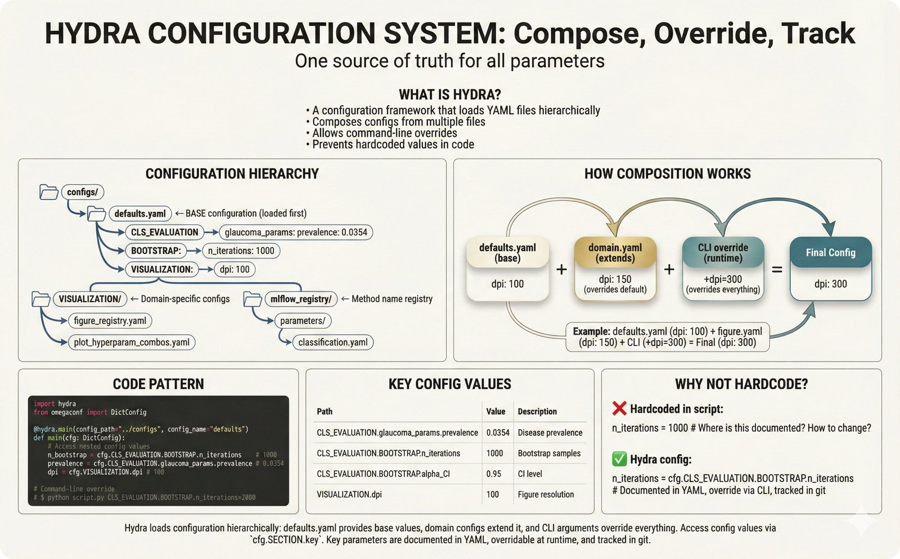

# Visual Documentation Plan for foundation_PLR

## Executive Summary

This plan transforms 101 educational figures into a **distributed documentation system** that follows "Hebbian placement" - figures live closest to the code they document. This creates a hybrid approach: production-grade documentation with tutorial-like accessibility for researchers who want to understand, modify, and adapt parts of the codebase.

**Philosophy**: Lower the barrier to entry. Not everyone exploring this repo is a software engineer. Good documentation UX is a key factor in whether code gets reproduced and adapted.

---

## Part A: Image Optimization Pipeline

### Problem

Current PNGs are **6-8MB each** (90 files = ~630MB total). This is unacceptable for:
- Git repository size
- Web page load times
- README rendering on GitHub

### Solution

Convert to **JPEG at 1600px width, 85% quality, with rounded corners**.

| Before | After |
|--------|-------|
| ~7MB PNG | ~150-200KB JPEG |
| Sharp corners | 24px rounded corners |
| Slow loading | Fast loading |

### Script Location

`docs/repo-figures/scripts/resize_and_convert.py`

### Output Location

`docs/repo-figures/assets/` - Optimized images ready for embedding

---

## Part B: Hebbian Placement Strategy

### Principle

> **Figures should be placed near the code/config they document.**
>
> If someone is exploring `configs/`, they should find Hydra documentation there.
> If someone is in `src/r/`, they should find R interop documentation there.

### Figure Categories and Placements

#### Category 1: ROOT (Main README.md)
*Core overview figures that orient new visitors*

| Figure | Title | Placement |
|--------|-------|-----------|
| `fig-repo-01-what-this-repo-does` | What This Repo Does | `README.md` (hero image) |
| `fig-repo-02-preprocessing-pipeline` | Preprocessing Pipeline | `README.md` |
| `fig-repo-03-foundation-models-why` | Why Foundation Models | `README.md` |
| `fig-repo-13-end-to-end-pipeline` | End-to-End Pipeline | `ARCHITECTURE.md` |
| `fig-repo-18-two-block-architecture` | Two Block Architecture | `ARCHITECTURE.md` |
| `fig-repo-34-readme-hierarchy` | README Hierarchy | `CONTRIBUTING.md` or `docs/README.md` |

#### Category 2: CONFIGS (`configs/README.md`)
*Configuration and Hydra-related figures*

| Figure | Title | SEO Keywords |
|--------|-------|--------------|
| `fig-repo-05-hydra-config-system` | Hydra Config System | hydra yaml ml experiment |
| `fig-repo-36-hydra-config` | Hydra Configuration | hydra omegaconf override |
| `fig-repo-22-standard-combos` | Standard Combos | hyperparameter combinations |
| `fig-trans-16-configuration-vs-hardcoding` | Config vs Hardcoding | yaml config best practices |
| `fig-trans-17-registry-pattern` | Registry Pattern | single source of truth |

#### Category 3: MLFLOW (`src/data_io/README.md` or `docs/mlflow/`)
*Experiment tracking and results*

| Figure | Title | SEO Keywords |
|--------|-------|--------------|
| `fig-repo-04-mlflow-concept` | MLflow Concept | mlflow experiment tracking |
| `fig-repo-29-mlflow-experiment-tracking` | MLflow Tracking | mlflow runs metrics |
| `fig-repo-19-subject-stratification` | Subject Stratification | cross validation ml |
| `fig-repo-21-bootstrap-ci` | Bootstrap CI | bootstrap confidence interval |
| `fig-repo-20-error-propagation` | Error Propagation | error propagation ml pipeline |

#### Category 4: R INTEROP (`src/r/README.md`)
*R package integration and pminternal*

| Figure | Title | SEO Keywords |
|--------|-------|--------------|
| `fig-repo-30-python-r-interop` | Python-R Interop | rpy2 r python interop |
| `fig-repro-09-r-package-ecosystem` | R Package Ecosystem | cran renv package management |
| `fig-repo-27d-how-to-read-instability-plot` | Instability Plot | pminternal riley prediction instability |

#### Category 5: VISUALIZATION (`src/viz/README.md`)
*Figure generation and plotting*

| Figure | Title | SEO Keywords |
|--------|-------|--------------|
| `fig-repo-07-create-figure-workflow` | Figure Workflow | matplotlib seaborn figure workflow |
| `fig-repo-38-figure-json-structure` | JSON Sidecar | figure reproducibility json metadata |
| `fig-repro-22-json-sidecars-figure-reproducibility` | JSON Sidecars | reproducible figures data provenance |

#### Category 6: HOW TO READ PLOTS (`docs/tutorials/reading-plots.md`)
*Educational content on interpreting visualizations*

| Figure | Title | SEO Keywords |
|--------|-------|--------------|
| `fig-repo-27-cd-diagram-reading` | CD Diagram | critical difference diagram nemenyi |
| `fig-repo-27b-how-to-read-raincloud` | Raincloud Plots | raincloud plot distribution |
| `fig-repo-27c-how-to-read-specification-curve` | Specification Curve | specification curve analysis |
| `fig-repo-27e-how-to-read-shap` | SHAP Values | shap explainability feature importance |
| `fig-repo-27f-how-to-read-risk-coverage` | Risk Coverage | aurc selective classification |

#### Category 7: STRATOS METRICS (`docs/tutorials/stratos-metrics.md`)
*Clinical prediction model metrics education*

| Figure | Title | SEO Keywords |
|--------|-------|--------------|
| `fig-repo-11-stratos-metrics` | STRATOS Metrics | stratos clinical prediction |
| `fig-repo-28-stratos-metrics-overview` | STRATOS Overview | van calster auroc calibration |
| `fig-repo-39-calibration-explained` | Calibration | model calibration calibration curve |
| `fig-repo-40-net-benefit-dca` | Net Benefit DCA | decision curve analysis net benefit |
| `fig-repo-41-dca-expert-mechanics` | DCA Mechanics | dca threshold utility |
| `fig-repo-42-dca-threshold-sensitivity` | DCA Thresholds | clinical decision threshold |

#### Category 8: DEPENDENCIES (`docs/tutorials/dependencies.md`)
*Package management and environment setup*

| Figure | Title | SEO Keywords |
|--------|-------|--------------|
| `fig-repo-14-why-uv` | Why UV | uv pip package manager |
| `fig-repo-14a-uv-eli5` | UV ELI5 | uv beginner fast pip |
| `fig-repo-14b-uv-expert` | UV Expert | uv resolver lock file |
| `fig-repo-15-polars-vs-pandas` | Polars vs Pandas | polars pandas performance |
| `fig-repo-15a-polars-eli5` | Polars ELI5 | polars lazy dataframe |
| `fig-repo-15b-polars-expert` | Polars Expert | polars query optimization |
| `fig-repo-16-duckdb-explained` | DuckDB Explained | duckdb analytical database |
| `fig-repo-16a-duckdb-eli5` | DuckDB ELI5 | duckdb sqlite alternative |
| `fig-repo-16b-duckdb-expert` | DuckDB Expert | duckdb columnar olap |
| `fig-repo-32-venv-explanation` | Venv Explanation | python virtual environment |
| `fig-repro-14-lockfiles-time-machine` | Lockfiles | lock file reproducibility |

#### Category 9: DOCKER/CONTAINERS (`Dockerfile` or `docs/docker/`)
*Container and reproducibility infrastructure*

| Figure | Title | SEO Keywords |
|--------|-------|--------------|
| `fig-repro-07-docker-not-enough` | Docker Not Enough | docker reproducibility limitations |
| `fig-repro-15-venv-vs-containers` | Venv vs Containers | docker venv comparison |
| `fig-repro-18-base-image-problem` | Base Image Problem | docker base image versioning |

#### Category 10: REPRODUCIBILITY EDUCATION (`docs/tutorials/reproducibility.md`)
*General reproducibility concepts*

| Figure | Title | SEO Keywords |
|--------|-------|--------------|
| `fig-repro-01-crisis-in-numbers` | Reproducibility Crisis | reproducibility crisis statistics |
| `fig-repro-02a-notebooks-fail-eli5` | Notebooks Fail ELI5 | jupyter notebook reproducibility |
| `fig-repro-02b-notebooks-fail-expert` | Notebooks Fail Expert | notebook hidden state |
| `fig-repro-03-five-horsemen` | Five Horsemen | reproducibility challenges |
| `fig-repro-04-levels-of-reproducibility` | Levels of Reproducibility | functional bitwise reproducibility |
| `fig-repro-05-what-reviewers-check` | Reviewer Checklist | peer review reproducibility |
| `fig-repro-06-cost-of-irreproducibility` | Cost of Irreproducibility | research waste |
| `fig-repro-08a-dependency-hell-eli5` | Dependency Hell ELI5 | dependency conflict |
| `fig-repro-08b-dependency-resolution-expert` | Dependency Resolution | sat solver version resolution |
| `fig-repro-08c-dim-reduction-example` | Dim Reduction Example | umap tsne reproducibility |
| `fig-repro-10-system-dependencies` | System Dependencies | system library versioning |
| `fig-repro-11-version-pinning-strategies` | Version Pinning | pip freeze requirements |
| `fig-repro-12-dependency-explosion` | Dependency Explosion | transitive dependencies |
| `fig-repro-17-bitwise-vs-functional` | Bitwise vs Functional | deterministic reproducibility |
| `fig-repro-19-r4r-automatic-artifacts` | R4R Artifacts | reproduction artifacts |
| `fig-repro-20-duckdb-single-source` | DuckDB Single Source | data single source truth |
| `fig-repro-23-r4r-success-rate` | R4R Success Rate | reproduction success |
| `fig-repro-24-git-lfs-vs-duckdb` | Git LFS vs DuckDB | large file storage |

#### Category 11: LOGGING (`logs/README.md` or `src/log_helpers/README.md`)
*Logging and debugging*

| Figure | Title | SEO Keywords |
|--------|-------|--------------|
| `fig-repo-17-logging-levels` | Logging Levels | python logging debug info |
| `fig-repo-17a-logging-eli5` | Logging ELI5 | logging beginner |
| `fig-repo-17b-logging-expert` | Logging Expert | structured logging |
| `fig-repo-17c-where-logs-go` | Where Logs Go | log file location |

#### Category 12: TESTING (`tests/README.md`)
*Testing and quality assurance*

| Figure | Title | SEO Keywords |
|--------|-------|--------------|
| `fig-repo-08-precommit-quality-gates` | Pre-commit Gates | pre-commit hooks code quality |
| `fig-repo-09-tdd-workflow` | TDD Workflow | test driven development |
| `fig-repo-33-critical-failures-meta-learning` | Critical Failures | meta learning failure analysis |

#### Category 13: ORCHESTRATION (`src/orchestration/README.md`)
*Prefect flows and pipeline orchestration*

| Figure | Title | SEO Keywords |
|--------|-------|--------------|
| `fig-repo-10-prefect-orchestration` | Prefect Orchestration | prefect workflow orchestration |
| `fig-repo-37-prefect-orchestration` | Prefect Flows | prefect flow task |

#### Category 14: CLASSIFICATION (`src/classification/README.md`)
*Classifier configuration and hyperparameters*

| Figure | Title | SEO Keywords |
|--------|-------|--------------|
| `fig-repo-06-add-new-classifier` | Add New Classifier | catboost xgboost add classifier |
| `fig-repo-26-catboost-selection` | CatBoost Selection | catboost hyperparameter |
| `fig-repo-26b-hyperparameter-tuning` | Hyperparameter Tuning | optuna hyperopt tuning |

#### Category 15: FEATURIZATION (`src/featurization/README.md`)
*Feature extraction and embeddings*

| Figure | Title | SEO Keywords |
|--------|-------|--------------|
| `fig-repo-25-handcrafted-vs-embeddings` | Handcrafted vs Embeddings | feature engineering embeddings |

#### Category 16: FOUNDATION MODELS (`docs/tutorials/foundation-models.md`)
*Foundation model concepts and taxonomy*

| Figure | Title | SEO Keywords |
|--------|-------|--------------|
| `fig-repo-31-foundation-model-taxonomy` | FM Taxonomy | foundation model taxonomy |
| `fig-trans-02-tsfm-hype-vs-reality` | TSFM Hype vs Reality | time series foundation model |
| `fig-trans-03-domain-fit-matrix` | Domain Fit Matrix | domain adaptation |
| `fig-trans-04-sparse-vs-dense` | Sparse vs Dense | sparse irregular time series |
| `fig-trans-13-when-simple-baselines-win` | Simple Baselines Win | baseline comparison |
| `fig-trans-14-domain-specific-vs-generic` | Domain Specific vs Generic | domain specific model |

#### Category 17: DATA HANDLING (`data/README.md`)
*Data privacy, stratification, quality*

| Figure | Title | SEO Keywords |
|--------|-------|--------------|
| `fig-repo-23-data-privacy` | Data Privacy | data anonymization privacy |
| `fig-trans-19-data-quality-manifesto` | Data Quality | data quality ml |

#### Category 18: IMPUTATION (`src/imputation/README.md`)
*Missing data and imputation*

| Figure | Title | SEO Keywords |
|--------|-------|--------------|
| `fig-trans-01-when-not-to-impute` | When Not To Impute | missing data imputation |
| `fig-trans-12-mgam-missing-values` | Missing Values | missing data handling |

#### Category 19: TRANSLATIONAL INSIGHTS (`docs/tutorials/translational-insights.md`)
*Layprofessional content - PLR parallels to other domains - SEPARATE from technical docs*

**NOTE**: These figures are intentionally NOT woven into the technical documentation structure.
They exist as a standalone "translational insights" document for researchers from other domains
(vibration, seismic, audio, power grid) who want to understand how this work might apply to them.

| Figure | Title | SEO Keywords |
|--------|-------|--------------|
| `fig-trans-01-when-not-to-impute` | When Not To Impute | missing data decision tree |
| `fig-trans-02-tsfm-hype-vs-reality` | TSFM Hype vs Reality | foundation model limitations |
| `fig-trans-03-domain-fit-matrix` | Domain Fit Matrix | domain transfer assessment |
| `fig-trans-04-sparse-vs-dense` | Sparse vs Dense | time series types |
| `fig-trans-05-plr-vibration-parallel` | PLR-Vibration Parallel | vibration monitoring |
| `fig-trans-06-plr-seismic-parallel` | PLR-Seismic Parallel | seismic signal |
| `fig-trans-07-plr-audio-parallel` | PLR-Audio Parallel | audio signal processing |
| `fig-trans-08-source-separation-lung` | Source Separation | blind source separation |
| `fig-trans-09-power-grid-monitoring` | Power Grid | power grid monitoring |
| `fig-trans-10-dense-signal-club` | Dense Signal Club | dense time series |
| `fig-trans-11-gman-event-conditioned` | Event Conditioned | event conditioned signal |
| `fig-trans-12-mgam-missing-values` | Missing Values | missing data patterns |
| `fig-trans-13-when-simple-baselines-win` | Simple Baselines Win | baseline comparison |
| `fig-trans-14-domain-specific-vs-generic` | Domain vs Generic | feature engineering trade-offs |
| `fig-trans-15-plr-code-domain-specific` | PLR Domain Specific | domain specific code |
| `fig-trans-16-configuration-vs-hardcoding` | Config vs Hardcoding | best practices |
| `fig-trans-17-registry-pattern` | Registry Pattern | single source truth |
| `fig-trans-18-fork-guide` | Fork Guide | adaptation guide |
| `fig-trans-19-data-quality-manifesto` | Data Quality | data quality ml |
| `fig-trans-20-choose-your-approach` | Choose Approach | methodology selection |

#### Category 20: MISC/GETTING STARTED
*Makefile, forking, experiments*

| Figure | Title | SEO Keywords |
|--------|-------|--------------|
| `fig-repo-35-make-commands` | Make Commands | makefile automation |
| `fig-repo-12-future-experiments` | Future Experiments | research directions |
| `fig-trans-18-fork-guide` | Fork Guide | github fork contribution |
| `fig-trans-20-choose-your-approach` | Choose Your Approach | methodology selection |
| `fig-repo-33-decomposition-grid` | Decomposition Grid | signal decomposition |

---

## Part C: SEO/GEO Optimization Strategy

### Alt Text Template

```markdown

```

### Example

```markdown

```

### Caption Template

Each figure should have a caption below it with:
1. **Title** (bold)
2. **Description** (1-2 sentences)
3. **Learn more** link(s)

```markdown
**STRATOS Metrics Overview**

The five key metric categories for evaluating clinical prediction models, based on the STRATOS Initiative guidelines. AUROC alone is insufficient - calibration and clinical utility (Net Benefit) are equally important.

*Learn more: [Van Calster et al. 2024](https://doi.org/10.1093/...) | [STRATOS Initiative](https://stratos-initiative.org/)*
```

---

## Part D: New Documentation Structure

### Proposed Tutorial Directory

```
docs/
├── README.md                        # Docs index with figure links
├── tutorials/
│   ├── reading-plots.md             # How to read CD, SHAP, etc.
│   ├── stratos-metrics.md           # STRATOS metric education
│   ├── reproducibility.md           # Reproducibility concepts
│   ├── dependencies.md              # UV, Polars, DuckDB
│   ├── foundation-models.md         # FM taxonomy and concepts
│   └── domain-parallels.md          # PLR parallels to other domains
└── repo-figures/
    ├── assets/                      # Optimized JPEGs (NEW)
    ├── generated/                   # Original PNGs (source)
    ├── figure-plans/                # Markdown specs
    └── scripts/
        └── resize_and_convert.py    # Optimization script
```

### Integration Into Existing READMEs

Each existing README.md will get a **"Visual Guide"** section:

```markdown
## Visual Guide

<details>
<summary>Click to expand visual documentation</summary>

### How Hydra Works



**Hydra Configuration System**

Hydra loads configuration hierarchically: defaults.yaml provides base values, domain configs extend it, and CLI arguments override everything.

*Learn more: [Hydra Documentation](https://hydra.cc/)*

</details>
```

---

## Part E: Placeholder Images

For figures not yet generated, create 16x16 black placeholder images.

### Missing Figures (Plans exist, no PNG)

```
fig-repo-17-logging-levels
fig-repo-33-decomposition-grid (not same as critical-failures)
fig-repo-41-dca-expert-mechanics
fig-repo-42-dca-threshold-sensitivity
fig-repro-12-dependency-explosion
fig-trans-02-tsfm-hype-vs-reality (need to verify)
... (any others)
```

---

## Part F: Implementation Checklist

### Phase 1: Image Optimization (Immediate)
- [ ] Create `resize_and_convert.py` script
- [ ] Test on sample images
- [ ] Run batch conversion
- [ ] Verify file sizes and quality
- [ ] Create `assets/` directory

### Phase 2: Placeholder Generation
- [ ] Identify missing images (plan exists, no PNG)
- [ ] Generate 16x16 black placeholders
- [ ] Place in `assets/` with correct names

### Phase 3: Documentation Integration
- [ ] Create `docs/tutorials/` directory structure
- [ ] Write `reading-plots.md` (Category 6)
- [ ] Write `stratos-metrics.md` (Category 7)
- [ ] Write `reproducibility.md` (Category 10)
- [ ] Write `dependencies.md` (Category 8)
- [ ] Update existing READMEs with "Visual Guide" sections

### Phase 4: SEO Optimization
- [ ] Add alt text to all images
- [ ] Add captions with learn-more links
- [ ] Verify links work

### Phase 5: Quality Check
- [ ] All images load quickly
- [ ] Navigation is intuitive
- [ ] Figures are near relevant code
- [ ] Links are not broken

---

## Appendix: Figure Count Summary

| Category | Count | Primary Location |
|----------|-------|------------------|
| fig-repo-* | 57 | Various READMEs |
| fig-repro-* | 24 | `docs/tutorials/reproducibility.md` |
| fig-trans-* | 20 | `docs/tutorials/` various |
| **Total** | **101** | |

---

## Appendix: Reference Links for Captions

### STRATOS & Clinical Prediction
- [Van Calster et al. 2024 - Performance Measures](https://doi.org/10.1093/...)
- [STRATOS Initiative](https://stratos-initiative.org/)
- [Decision Curve Analysis](https://www.mskcc.org/departments/epidemiology-biostatistics/biostatistics/decision-curve-analysis)

### Reproducibility
- [Reproducibility in ML (Papers With Code)](https://paperswithcode.com/rc)
- [Barba 2018 - Terminologies for Reproducible Research](https://arxiv.org/abs/1802.03311)

### Tools
- [Hydra Documentation](https://hydra.cc/)
- [MLflow Documentation](https://mlflow.org/docs/latest/)
- [UV Package Manager](https://github.com/astral-sh/uv)
- [Polars Documentation](https://docs.pola.rs/)
- [DuckDB Documentation](https://duckdb.org/docs/)

### Foundation Models
- [MOMENT Paper](https://arxiv.org/abs/2402.03885)
- [UniTS Paper](https://arxiv.org/abs/2403.00131)
- [TimesNet Paper](https://arxiv.org/abs/2210.02186)
