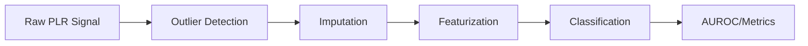

# Repository Documentation Plan - Foundation PLR

## Overview

This plan implements a **hierarchical progressive disclosure** documentation system for the foundation_PLR repository, modeled after the [dpp-agents](https://github.com/...) documentation pattern.

**Goals:**
1. Enable both humans (peer reviewers) and AI assistants (Claude Code, Gemini, Codex) to navigate the codebase
2. Ensure production-grade quality for journal submission
3. Provide 100% docstring coverage for all public functions and classes

**Current State (2026-01-22):**
- Docstring coverage: **63%** (target: 100%)
- Module-level READMEs: **2/12** directories covered
- Architecture documentation: **Missing**

**User Decisions (2026-01-22):**
- **Docstring style:** NumPy style (Parameters/Returns/Raises with dashes)
- **Vendored code:** Skip (TSB_AD, pypots, nuwats, tabpfn have own docs)
- **Execution scope:** All 6 phases sequentially

---

## Phase 1: Root-Level Documentation

### Task 1.1: Create ARCHITECTURE.md
**Status:** ⬜ TODO
**File:** `/foundation_PLR/ARCHITECTURE.md`

Create system architecture document covering:
- Pipeline overview diagram (ASCII + Mermaid)
- Error propagation chain visualization
- Data flow between stages
- Key abstractions and interfaces

**Template:**
```markdown
# Foundation PLR Architecture

## System Overview
[High-level description]

## Pipeline Stages


## Error Propagation
[Explain how errors cascade through pipeline]

## Key Modules
| Stage | Module | Entry Point |
|-------|--------|-------------|
| Outlier | `src/anomaly_detection/` | `anomaly_detection.py` |
| ... | ... | ... |
```

### Task 1.2: Enhance Root README.md
**Status:** ⬜ TODO
**File:** `/foundation_PLR/README.md`

Enhance with:
- [ ] Badges (tests, license, Python version, coverage)
- [ ] Role-based quick navigation table
- [ ] 30-second summary with hero diagram
- [ ] Links to all folder-level READMEs
- [ ] Installation quickstart (link to full docs)
- [ ] How to run training/analysis
- [ ] Config system overview
- [ ] Artifact locations (DuckDB, MLflow)

**Role-Based Navigation Template:**
```markdown
## Quick Navigation - Choose Your Path

| Role | Interests | Start Here |
|------|-----------|------------|
| **Researchers/Reviewers** | Error propagation, metrics, results | [CLAUDE.md](CLAUDE.md), [docs/](docs/) |
| **Developers** | Pipeline code, tests, config | [src/README.md](src/README.md), [tests/](tests/) |
| **Publication** | Figures, manuscript, planning | [figures/](figures/), [planning/](planning/) |
| **AI Assistants** | Context, rules, combos | [.claude/](.claude/), [configs/](configs/) |
```

### Task 1.3: Create CONTRIBUTING.md
**Status:** ⬜ TODO
**File:** `/foundation_PLR/CONTRIBUTING.md`

Cover:
- How to add a new outlier detection method
- How to add a new imputation method
- How to add a new classifier
- Code style (ruff configuration)
- Test requirements (Docker-only tests)
- Pull request process

---

## Phase 2: Folder-Level READMEs

### Task 2.1: src/README.md
**Status:** ⬜ TODO
**File:** `/foundation_PLR/src/README.md`

**Structure:**
```markdown
# Source Code - Pipeline Modules

## Overview
The `src/` directory contains all pipeline stage implementations.

## Pipeline Stages

| Stage | Directory | Purpose | Tests |
|-------|-----------|---------|-------|
| Outlier Detection | `anomaly_detection/` | 11 methods (LOF, FM, ensembles) | `tests/unit/test_anomaly*.py` |
| Imputation | `imputation/` | 7 methods (linear, SAITS, CSDI) | `tests/unit/test_imputation*.py` |
| Featurization | `featurization/` | Handcrafted amplitude bins + latency | `tests/unit/test_feature*.py` |
| Classification | `classification/` | CatBoost primary, 5 total | `tests/unit/test_classif*.py` |
| Statistics | `stats/` | STRATOS metrics, bootstrap | `tests/unit/test_*.py` |
| Visualization | `viz/` | Figure generation | `tests/unit/test_viz*.py` |

## Support Modules

| Module | Purpose |
|--------|---------|
| `data_io/` | Database loading, DuckDB export |
| `log_helpers/` | MLflow tracking, logging utilities |
| `metrics/` | Performance metrics computation |
| `orchestration/` | Prefect flow orchestration |
| `preprocess/` | Data preprocessing |
| `summarization/` | Results aggregation |

## Entry Points
- Main pipeline: `orchestration/pipeline_PLR.py`
- Figure generation: `viz/generate_all_figures.py`

## Cross-References
- [Architecture](https://github.com/petteriTeikari/foundation_PLR/blob/main/ARCHITECTURE.md)
- [Test Suite](https://github.com/petteriTeikari/foundation_PLR/blob/main/tests/README.md)
- [Configuration](https://github.com/petteriTeikari/foundation_PLR/blob/main/configs/README.md)
```

### Task 2.2: configs/README.md
**Status:** ⬜ TODO
**File:** `/foundation_PLR/configs/README.md`

Cover:
- Configuration hierarchy (Hydra)
- `defaults.yaml` structure
- How to override configs
- YAML schema validation
- Standard combos reference

### Task 2.3: tests/README.md
**Status:** ⬜ TODO
**File:** `/foundation_PLR/tests/README.md`

Cover:
- Test organization (unit/integration/smoke)
- How to run tests
- Docker-only policy explanation
- Coverage requirements
- Fixture documentation

### Task 2.4: apps/visualization/README.md
**Status:** ⬜ TODO
**File:** `/foundation_PLR/apps/visualization/README.md`

Cover:
- React + TypeScript stack
- D3.js integration
- How to build/run
- Component overview
- Interactive figure generation

### Task 2.5: figures/README.md
**Status:** ⬜ TODO
**File:** `/foundation_PLR/figures/README.md`

Cover:
- Generated figures inventory
- Reproducibility JSON data
- How to regenerate figures
- Figure naming convention
- Manuscript mapping

### Task 2.6: notebooks/README.md
**Status:** ⬜ TODO
**File:** `/foundation_PLR/notebooks/README.md`

Cover:
- Tutorial index
- Running notebooks
- Prerequisites
- Links to related docs

### Task 2.7: docs/README.md
**Status:** ⬜ TODO
**File:** `/foundation_PLR/docs/README.md`

Cover:
- Documentation index
- STRATOS compliance docs
- API reference (future)
- This plan

### Task 2.8: scripts/README.md
**Status:** ⬜ TODO
**File:** `/foundation_PLR/scripts/README.md`

Cover:
- Setup script usage
- Figure generation
- Data extraction scripts
- Compliance checking

### Task 2.9: assets/README.md
**Status:** ⬜ TODO
**File:** `/foundation_PLR/assets/README.md`

Cover:
- Image inventory
- Usage in documentation
- Screenshot capture guidelines

### Task 2.10: planning/README.md
**Status:** ⬜ TODO
**File:** `/foundation_PLR/planning/README.md`

Cover:
- Planning document index
- Meta-learnings and failures
- Active development plans

### Task 2.11: outputs/README.md
**Status:** ⬜ TODO
**File:** `/foundation_PLR/outputs/README.md`

Cover:
- Output artifact inventory
- Database locations
- Regeneration instructions

---

## Phase 3: Module-Level READMEs (src/ subdirectories)

### Task 3.1: src/anomaly_detection/README.md
**Status:** ⬜ TODO

Cover:
- 11 outlier detection methods
- Foundation models (MOMENT, UniTS, TimesNet)
- Traditional methods (LOF, OneClassSVM, PROPHET)
- Ensemble methods
- How to add new method

### Task 3.2: src/imputation/README.md
**Status:** ⬜ TODO

Cover:
- 7 imputation methods
- Deep learning (SAITS, CSDI, TimesNet)
- Foundation model (MOMENT)
- Traditional (linear)
- Integration with PyPOTS/NuwaTS

### Task 3.3: src/featurization/README.md
**Status:** ⬜ TODO

Cover:
- Handcrafted features
- Amplitude bins computation
- Latency features
- Feature extraction pipeline

### Task 3.4: src/classification/README.md
**Status:** ⬜ TODO

Cover:
- CatBoost (primary)
- XGBoost, TabPFN, TabM, LogisticRegression
- Bootstrap evaluation
- Why CatBoost is fixed (research question)

### Task 3.5: src/stats/README.md
**Status:** ⬜ TODO

Cover:
- STRATOS-compliant metrics
- Bootstrap confidence intervals
- Calibration analysis
- Clinical utility (DCA)
- Model instability (Riley 2023)

### Task 3.6: src/viz/README.md
**Status:** ⬜ TODO

Cover:
- Figure generation pipeline
- Plot configuration
- Instability plots (Riley 2023, Kompa 2021)
- Calibration plots
- DCA curves

### Task 3.7: src/data_io/README.md
**Status:** ⬜ TODO

Cover:
- Database loading
- DuckDB export
- STRATOS metrics streaming

### Task 3.8: src/log_helpers/README.md
**Status:** ⬜ TODO

Cover:
- MLflow integration
- Hydra configuration
- Logging setup
- Artifact management

---

## Phase 4: Docstring Coverage

### Task 4.1: Audit current docstring coverage
**Status:** ⬜ TODO

Run docstring coverage analysis:
```bash
# Use interrogate or pydocstyle
interrogate -v src/
```

Target: 100% coverage for:
- All public functions
- All public classes
- All public methods

### Task 4.2: Add docstrings to src/anomaly_detection/
**Status:** ⬜ TODO
**Current coverage:** ~50%
**Target:** 100%

Priority files:
- [ ] anomaly_detection.py
- [ ] anomaly_utils.py
- [ ] outlier_sklearn.py
- [ ] outlier_prophet.py
- [ ] timesnet_wrapper.py

### Task 4.3: Add docstrings to src/classification/
**Status:** ⬜ TODO
**Current coverage:** ~30%
**Target:** 100%

Priority files:
- [ ] bootstrap_evaluation.py
- [ ] classifier_evaluation.py
- [ ] classifier_utils.py
- [ ] stats_metric_utils.py
- [ ] train_classifier.py

### Task 4.4: Add docstrings to src/featurization/
**Status:** ⬜ TODO
**Current coverage:** ~40%
**Target:** 100%

Priority files:
- [ ] feature_utils.py
- [ ] featurizer_PLR_subject.py
- [ ] featurize_PLR.py

### Task 4.5: Add docstrings to src/imputation/
**Status:** ⬜ TODO
**Current coverage:** ~45%
**Target:** 100%

Priority files:
- [ ] imputation_main.py
- [ ] imputation_utils.py
- [ ] impute_with_models.py
- [ ] flow_imputation.py

### Task 4.6: Add docstrings to src/stats/
**Status:** ⬜ TODO
**Current coverage:** Unknown (new module)
**Target:** 100%

All files need docstrings (recently added).

### Task 4.7: Add docstrings to src/viz/
**Status:** ⬜ TODO
**Current coverage:** Moderate
**Target:** 100%

Priority files:
- [ ] fig_instability_plots.py
- [ ] generate_instability_figures.py
- [ ] plot_config.py

### Task 4.8: Add docstrings to src/data_io/
**Status:** ⬜ TODO
**Target:** 100%

### Task 4.9: Add docstrings to src/log_helpers/
**Status:** ⬜ TODO
**Current coverage:** ~45%
**Target:** 100%

---

## Phase 5: .claude/ Enhancement

### Task 5.1: Create .claude/README.md (comprehensive)
**Status:** ⬜ TODO
**File:** `/foundation_PLR/.claude/README.md`

Expand current documentation to include:
- Complete file inventory
- How AI assistants should use each file
- Domain loading strategy
- Update procedures

### Task 5.2: Update domains for completeness
**Status:** ⬜ TODO

Ensure all domains cover:
- [ ] mlflow-experiments.md - verified experiment IDs and combos
- [ ] visualization.md - all figure scripts
- [ ] Add: testing.md - test strategy and fixtures
- [ ] Add: configuration.md - Hydra config system

### Task 5.3: Create SYNTHESIS.md knowledge graph
**Status:** ⬜ TODO
**File:** `/foundation_PLR/.claude/SYNTHESIS.md`

Create knowledge graph connecting:
- Research question to code locations
- Metrics to implementation files
- Figures to generation scripts
- Combos to MLflow runs

---

## Phase 6: Quality Assurance

### Task 6.1: Run docstring linter
**Status:** ⬜ TODO

```bash
# Install and run interrogate
pip install interrogate
interrogate -v --fail-under 100 src/
```

### Task 6.2: Validate all internal links
**Status:** ⬜ TODO

Check that all markdown links resolve correctly.

### Task 6.3: Review with fresh eyes
**Status:** ⬜ TODO

Have someone unfamiliar with the project navigate using only documentation.

---

## Progress Tracking

### Phase Progress

| Phase | Tasks | Completed | Progress |
|-------|-------|-----------|----------|
| Phase 1: Root-Level | 3 | 3 | 100% ✅ |
| Phase 2: Folder READMEs | 11 | 11 | 100% ✅ |
| Phase 3: Module READMEs | 8 | 8 | 100% ✅ |
| Phase 4: Docstrings | 9 | 0 | 🔄 IN PROGRESS (8 agents running) |
| Phase 5: .claude Enhancement | 3 | 3 | 100% ✅ |
| Phase 6: Quality Assurance | 3 | 0 | 0% |
| **TOTAL** | **37** | **25** | **68%** |

**New Documentation Added (2026-01-23):**
- `docs/API_ARCHITECTURE.md` - Complete UML/Mermaid documentation
- `.claude/KNOWLEDGE_GRAPH.md` - Graph RAG knowledge base
- Updated `README.md` with comprehensive documentation index

### Crash Recovery

If implementation is interrupted:
1. Check this file for last completed task
2. Update status markers (⬜ TODO → ✅ DONE)
3. Resume from next incomplete task
4. Update progress table

### Execution Order

**Recommended execution sequence for crash resistance:**

1. **Phase 1** (Root-Level) - Do first, establishes navigation structure
2. **Phase 2** (Folder READMEs) - Creates all index points
3. **Phase 5** (.claude Enhancement) - Updates AI context system
4. **Phase 3** (Module READMEs) - Deep documentation
5. **Phase 4** (Docstrings) - Can be done incrementally
6. **Phase 6** (QA) - Final validation

### Estimated Effort

| Phase | Estimated Tasks | Lines to Write |
|-------|-----------------|----------------|
| Phase 1 | 3 files | ~500 lines |
| Phase 2 | 11 files | ~1,100 lines |
| Phase 3 | 8 files | ~800 lines |
| Phase 4 | ~300 functions | ~3,000 lines docstrings |
| Phase 5 | 3 files | ~300 lines |
| Phase 6 | Validation | N/A |

---

## Templates

### Folder README Template

```markdown
# [Folder Name]

> **Purpose**: [One-line description]

## Contents

| Item | Description | When to Use |
|------|-------------|-------------|
| `file1.py` | [Description] | [Use case] |
| `subdir/` | [Description] | [Use case] |

## Quick Start

```bash
# Example usage
python -m foundation_PLR.[module]
```

## Cross-References

- [Related folder](https://github.com/petteriTeikari/foundation_PLR/tree/main/related/)
- [Parent documentation](https://github.com/petteriTeikari/foundation_PLR/blob/main/README.md)

## Files

### `file1.py`
[Brief description of purpose and key functions]

### `subdir/`
[Brief description, link to subdir README if exists]
```

### Docstring Template (NumPy Style)

```python
def function_name(param1: str, param2: int) -> Dict[str, Any]:
    """Short description of function purpose.

    Longer description if needed, explaining the algorithm,
    edge cases, or important implementation details.

    Parameters
    ----------
    param1 : str
        Description of param1.
    param2 : int
        Description of param2.

    Returns
    -------
    Dict[str, Any]
        Description of return value.

    Raises
    ------
    ValueError
        When param2 is negative.

    Examples
    --------
    >>> function_name("test", 42)
    {'result': 'success'}

    See Also
    --------
    other_function : Related function description.

    Notes
    -----
    Implementation details, cross-references, or caveats.
    """
```

### Class Docstring Template (NumPy Style)

```python
class ClassName:
    """Short description of class purpose.

    Longer description explaining the class's role in the system,
    when to use it, and any important behavior.

    Parameters
    ----------
    param1 : str
        Description of constructor parameter.
    param2 : int, optional
        Description with default value (default: 10).

    Attributes
    ----------
    attr1 : str
        Description of public attribute.
    attr2 : int
        Description of public attribute.

    Examples
    --------
    >>> obj = ClassName("test", param2=5)
    >>> obj.method()
    'result'

    See Also
    --------
    RelatedClass : Description of relationship.
    """
```

---

## Validation Checklist

Before marking documentation complete:

- [ ] All folder READMEs link to parent and children
- [ ] Root README has working badges
- [ ] All internal markdown links resolve
- [ ] `interrogate` reports 100% coverage
- [ ] A new developer can understand the repo in 30 minutes
- [ ] Claude Code can navigate to any module using only READMEs
- [ ] All 37 tasks marked ✅ DONE

---

*Plan created: 2026-01-22*
*Last updated: 2026-01-22*
