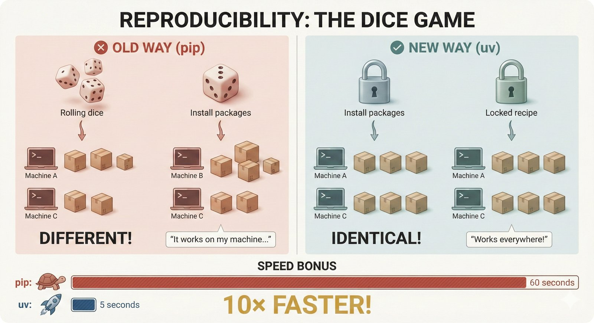
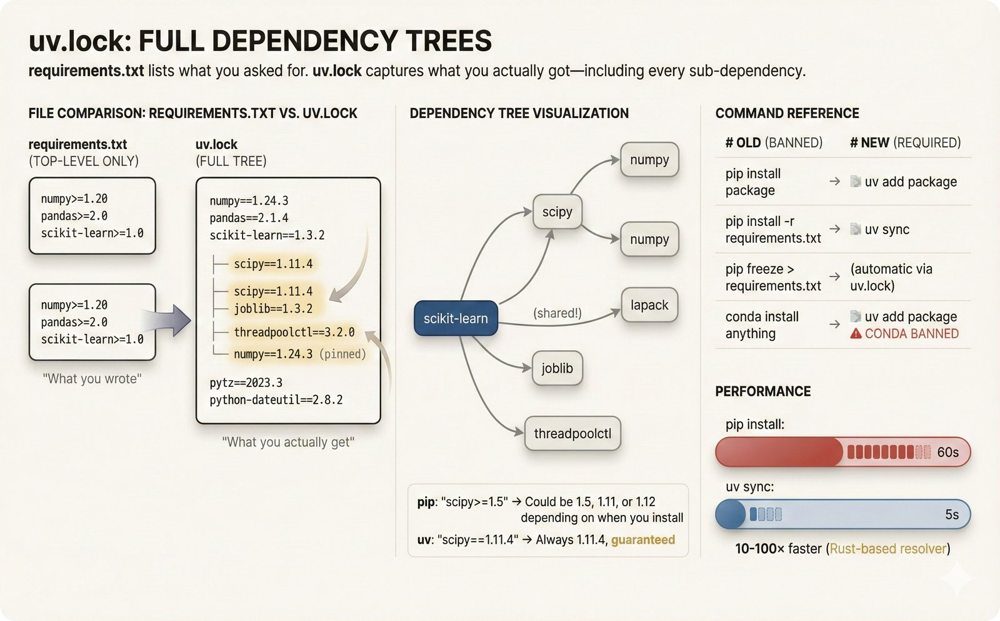
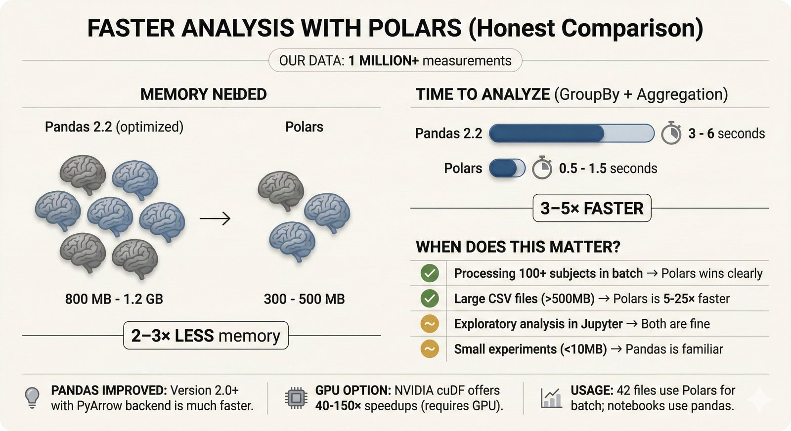
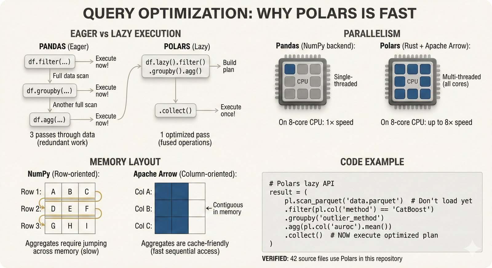
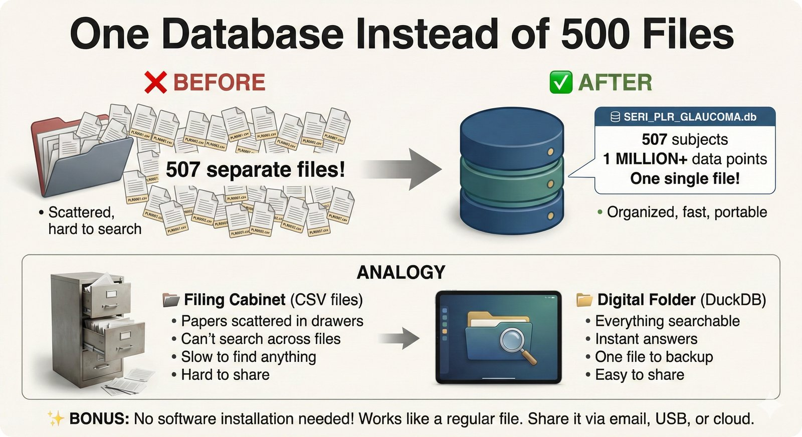
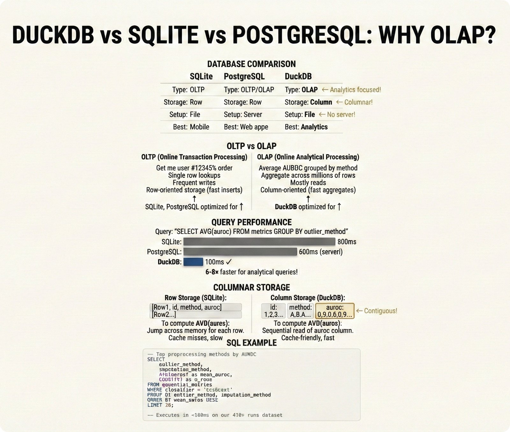
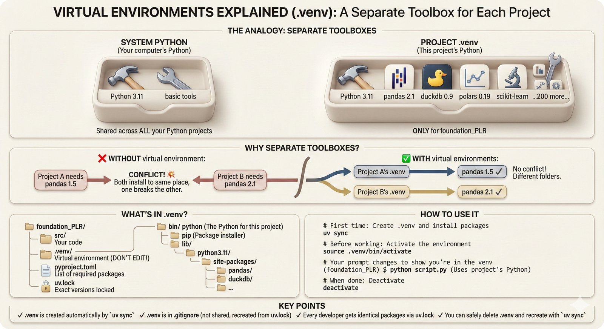

# Modern Python Tools: UV, Polars, and DuckDB

> **Start Here** | New to these tools? See the [Quick Comparison](#quick-comparison) or jump to [Getting Started](#getting-started).

> **Why we chose these tools**: This repository uses modern Python tooling that's faster and more reproducible than traditional alternatives. Here's what they are and why they matter.

---

## Quick Comparison

| Traditional | Modern (This Repo) | Why Switch? |
|-------------|-------------------|-------------|
| pip | **UV** | Dramatically faster installs, better resolution |
| pandas | **Polars** | Faster for large data, lower memory |
| SQLite / CSV files | **DuckDB** | Optimized for analytical queries |

*Speed varies by workload. UV benchmarks: [astral.sh/blog/uv](https://astral.sh/blog/uv). Polars benchmarks: [pola.rs/benchmarks](https://www.pola.rs/benchmarks.html).*

---

## UV: The Fast Package Manager

### ELI5 (Explain Like I'm 5)



**UV in Simple Terms**

Think of pip as a delivery truck that makes one trip per package. UV is a fleet of drones that delivers everything simultaneously.

### What UV Does

```bash
# Instead of pip (slow)
pip install pandas numpy scikit-learn  # Minutes...

# Use UV (fast)
uv pip install pandas numpy scikit-learn  # Seconds!
```

### Expert View



**UV Technical Details**

UV achieves its speed through:
1. **Rust implementation**: Compiled, not interpreted
2. **Parallel downloads**: Fetches packages concurrently
3. **Global cache**: Never downloads the same package twice
4. **PubGrub resolver**: Smarter dependency resolution algorithm

### Why UV Over pip?

| Feature | pip | UV |
|---------|-----|-----|
| Install speed | Slow | 10-100x faster |
| Lock file | ❌ | ✅ `uv.lock` |
| Reproducibility | Fragile | Robust |
| Cache | Per-project | Global |

### Commands You'll Use

```bash
uv pip install package      # Install a package
uv add package              # Add to pyproject.toml
uv sync                     # Install from pyproject.toml
uv pip freeze > req.txt     # Export requirements
```

*Learn more: [UV Documentation](https://github.com/astral-sh/uv)*

---

## Polars: The Fast DataFrame Library

### ELI5 (Explain Like I'm 5)



**Polars in Simple Terms**

Imagine you're making breakfast:
- **pandas**: Make toast, wait. Fry egg, wait. Pour juice, wait.
- **Polars**: Put toast in toaster, egg in pan, pour juice - all at once!

### What Polars Does

```python
# pandas (eager, one step at a time)
df = pd.read_csv("data.csv")
df = df[df["value"] > 0]
df = df.groupby("category").mean()

# Polars (lazy, plans then executes)
df = (
    pl.scan_csv("data.csv")
    .filter(pl.col("value") > 0)
    .group_by("category")
    .agg(pl.all().mean())
    .collect()  # Execute the whole plan at once
)
```

### Expert View



**Polars Technical Details**

Why Polars is faster:
1. **Lazy evaluation**: Builds a query plan, optimizes it, then executes
2. **Columnar memory**: Apache Arrow format for cache efficiency
3. **Rust backend**: No Python GIL limitations
4. **Parallel execution**: Uses all CPU cores automatically

### Why Polars Over pandas?

| Feature | pandas | Polars |
|---------|--------|--------|
| Speed | Baseline | 5-50x faster |
| Memory | High | Low |
| Lazy eval | ❌ | ✅ |
| Parallel | Limited | Full |
| Syntax | Verbose | Expressive |

### When to Use Each

| Use Case | Recommendation |
|----------|----------------|
| Quick exploration | pandas (more tutorials available) |
| Large data (>1GB) | **Polars** |
| Production pipelines | **Polars** |
| Existing pandas codebase | pandas (migration cost) |

*Learn more: [Polars User Guide](https://docs.pola.rs/)*

---

## DuckDB: The Analytical Database

### ELI5 (Explain Like I'm 5)



**DuckDB in Simple Terms**

SQLite is great for apps that read/write individual records. DuckDB is great for **analyzing entire datasets** - "What's the average? Group by this. Filter those."

### What DuckDB Does

```python
import duckdb

# Query a Parquet file directly (no loading into memory!)
result = duckdb.query("""
    SELECT
        preprocessing_method,
        AVG(auroc) as mean_auroc,
        COUNT(*) as n_experiments
    FROM 'results/*.parquet'
    GROUP BY preprocessing_method
    ORDER BY mean_auroc DESC
""").fetchdf()
```

### Expert View



**DuckDB Technical Details**

Why DuckDB is fast for analytics:
1. **Columnar storage**: Only reads columns you need
2. **Vectorized execution**: Processes data in batches
3. **Zero-copy**: Queries Parquet/CSV without loading
4. **In-process**: No server to manage

### Why DuckDB Over SQLite?

| Feature | SQLite | DuckDB |
|---------|--------|--------|
| Optimized for | Transactions (OLTP) | Analytics (OLAP) |
| Column queries | Slow | Fast |
| Aggregations | Slow | Fast |
| Parquet support | ❌ | ✅ |
| Analytics functions | Limited | Rich |

### How We Use DuckDB

```python
# All results are in DuckDB
conn = duckdb.connect("data/foundation_plr_results.db")

# Get STRATOS metrics for all preprocessing combinations
metrics = conn.execute("""
    SELECT * FROM essential_metrics
    WHERE classifier = 'CatBoost'
    ORDER BY auroc DESC
""").fetchdf()
```

*Learn more: [DuckDB Documentation](https://duckdb.org/docs/)*

---

## Why These Tools Together?

The combination provides a **modern, fast, reproducible** data science stack:

```
UV (fast installs) → Polars (fast transforms) → DuckDB (fast queries)
     ↓                      ↓                         ↓
   Seconds              5-50x faster             10-100x faster
```

### Traditional Stack Problems

```
pip install (slow) → pandas (memory hog) → SQL Server (heavy)
     ↓                      ↓                    ↓
  Minutes               OOM errors           IT overhead
```

---

## Getting Started

### Install UV

```bash
# macOS/Linux
curl -LsSf https://astral.sh/uv/install.sh | sh

# Windows
powershell -c "irm https://astral.sh/uv/install.ps1 | iex"
```

### Polars and DuckDB

```bash
uv pip install polars duckdb
```

### Verify Installation

```python
import polars as pl
import duckdb

print(f"Polars {pl.__version__}")
print(f"DuckDB {duckdb.__version__}")
```

---

## Virtual Environments



**Virtual Environments Explained**

Each project should have its own environment to avoid dependency conflicts.

```bash
# Create environment with UV
uv venv

# Activate it
source .venv/bin/activate  # Linux/macOS
.venv\Scripts\activate     # Windows

# Install packages
uv pip install -r requirements.txt
```

---

## References

### UV
- [UV GitHub](https://github.com/astral-sh/uv)
- [Why UV is the Future of Python Packaging](https://astral.sh/blog/uv)

### Polars
- [Polars User Guide](https://docs.pola.rs/)
- [Polars vs pandas Benchmark](https://www.pola.rs/benchmarks.html)

### DuckDB
- [DuckDB Documentation](https://duckdb.org/docs/)
- [Why DuckDB](https://duckdb.org/why_duckdb)

---

## See Also

- [Reproducibility Guide](reproducibility.md) - Why these tools help reproducibility
- [Lockfiles and Time Travel](reproducibility.md#lockfiles) - How lock files preserve environments
