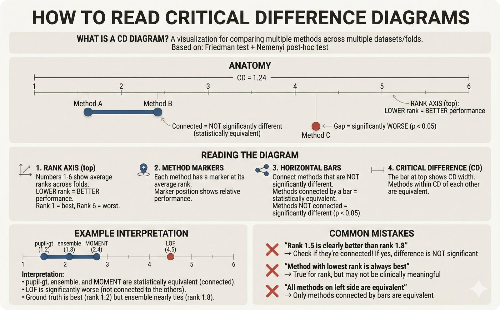
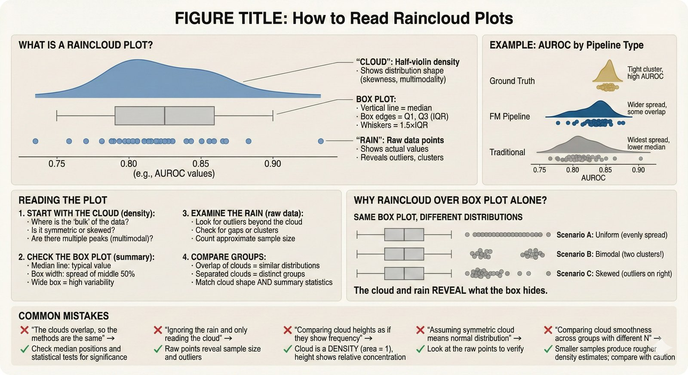
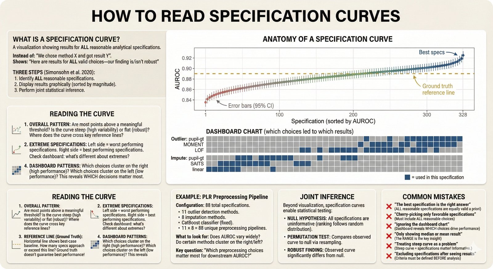
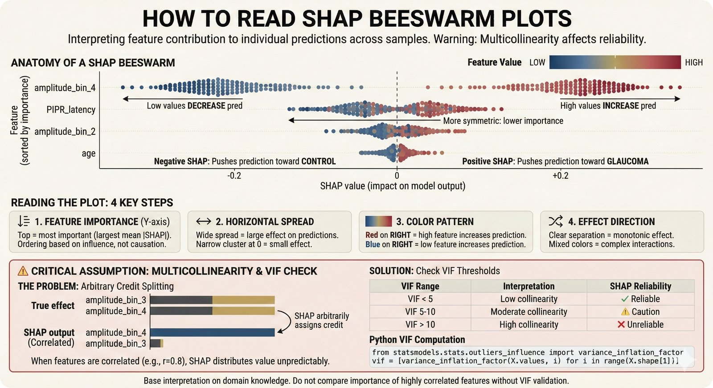
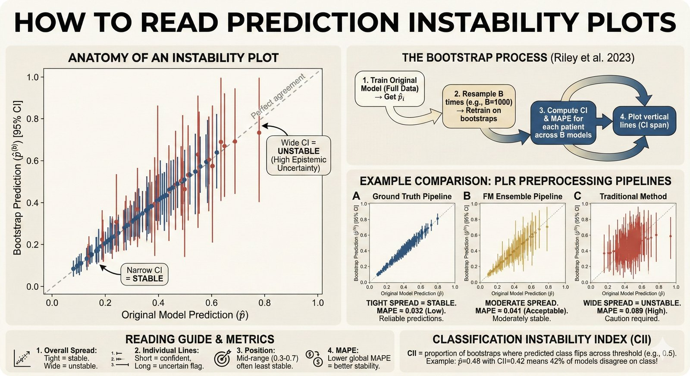
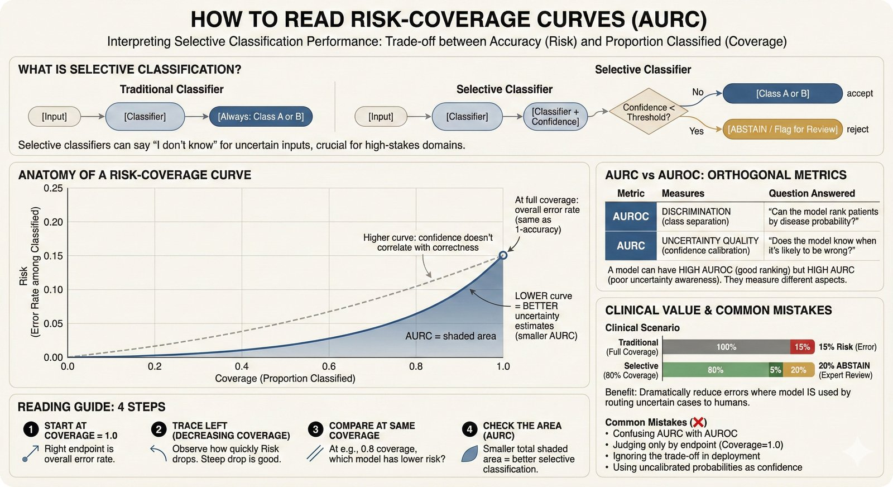
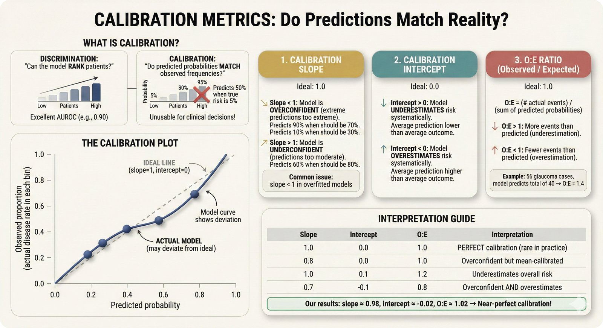
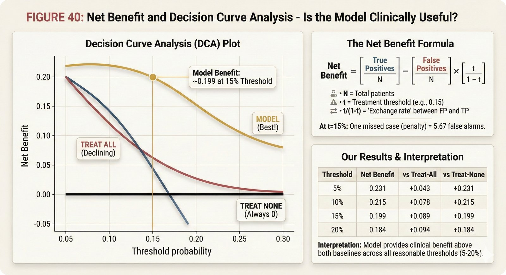

# How to Read the Plots in This Repository

> **Start Here** | Confused by a figure? Check the [30-second TL;DR](#tldr-the-30-second-version) or use the [Quick Reference](#quick-reference) table.

> **For researchers new to ML evaluation**: This guide explains how to interpret the various visualization types used in this repository. Each plot type tells a different part of the story about model performance.

**Related documentation:**
- **Metric implementation**: [`src/stats/README.md`](https://github.com/petteriTeikari/foundation_PLR/blob/main/src/stats/README.md) - How metrics are computed
- **Academic framework**: [`stratos-metrics.md`](stratos-metrics.md) - Why these metrics matter (STRATOS guidelines)
- **Figure generation**: [`src/viz/README.md`](https://github.com/petteriTeikari/foundation_PLR/blob/main/src/viz/README.md) - How plots are created

---

## TL;DR: The 30-Second Version

| You see this plot | You want to know | Look for |
|-------------------|------------------|----------|
| **CD Diagram** | Which method wins? | Lowest rank; bars connect equivalent methods |
| **Calibration Curve** | Are probabilities real? | Curve follows diagonal |
| **DCA Curve** | Is it clinically useful? | Model line above "treat all" |
| **SHAP Plot** | Why this prediction? | Top features, red/blue direction |
| **Instability Plot** | Trust this prediction? | Tight clustering around diagonal |

---

## Quick Reference

| Plot Type | What It Shows | When to Use |
|-----------|---------------|-------------|
| [CD Diagram](#critical-difference-diagrams) | Statistical ranking of methods | Comparing multiple methods |
| [Raincloud Plot](#raincloud-plots) | Distribution + individual points | Understanding variability |
| [Specification Curve](#specification-curve-analysis) | Robustness across configurations | Sensitivity analysis |
| [SHAP Values](#shap-values) | Feature importance | Model interpretation |
| [Instability Plot](#instability-plots) | Prediction reliability | Model trustworthiness |
| [Risk-Coverage](#risk-coverage-aurc) | Selective classification | When to abstain |

---

## Critical Difference Diagrams



**Critical Difference (CD) Diagram**

CD diagrams show the **statistical ranking** of multiple methods across datasets or cross-validation folds.

### How to Read It

1. **X-axis**: Average rank (lower = better)
2. **Methods**: Listed on right side
3. **Horizontal bars**: Connect methods that are **NOT significantly different** (Nemenyi test)
4. **No bar between methods**: Significant difference exists

### What to Look For

- Methods connected by a bar → statistically equivalent
- Separate bars → statistically different
- Rank 1 = best average performance

*Learn more: [Demšar 2006 - Statistical Comparisons](https://jmlr.org/papers/v7/demsar06a.html) | [Critical Difference Diagrams](https://github.com/hfawaz/cd-diagram)*

---

## Raincloud Plots



**Raincloud Plots**

Raincloud plots combine **three visualizations** in one:
- **Cloud** (top): Density/distribution shape
- **Rain** (middle): Box plot with median and quartiles
- **Drops** (bottom): Individual data points

### How to Read It

1. **Cloud shape**: Shows the full distribution (bimodal? skewed?)
2. **Box**: Median (line), IQR (box), whiskers (1.5×IQR)
3. **Points**: Each individual observation - see the raw data!

### Why Use Raincloud Over Boxplot?

Boxplots hide distribution shape. These two boxplots look identical but have very different distributions:

```
Distribution A: ████████████████  (uniform)
Distribution B: ██    ████    ██  (bimodal)
```

Raincloud plots reveal the difference.

*Learn more: [Allen et al. 2019 - Raincloud Plots](https://wellcomeopenresearch.org/articles/4-63)*

---

## Specification Curve Analysis



**Specification Curve Analysis**

Specification curves show how results **vary across different analytical choices** (preprocessing methods, hyperparameters, etc.).

### How to Read It

1. **Top panel**: Outcome (e.g., AUROC) for each specification
2. **Bottom panel**: Which choices were made for that specification
3. **Colored dots**: Highlight specific configurations
4. **Shaded region**: Confidence interval or range

### What to Look For

- **Flat curve**: Results are robust to analytical choices
- **Steep curve**: Results are sensitive to choices
- **Gaps**: Certain choices consistently perform better/worse

### Why This Matters

A single result (e.g., "AUROC = 0.91") tells you nothing about robustness. The specification curve shows "AUROC ranges from 0.82 to 0.91 depending on preprocessing choices."

*Learn more: [Simonsohn et al. 2020 - Specification Curve Analysis](https://doi.org/10.1038/s41562-020-0912-z)*

---

## SHAP Values



**SHAP (SHapley Additive exPlanations)**

SHAP values explain **how much each feature contributed** to a specific prediction.

### How to Read the Summary Plot

1. **Y-axis**: Features (sorted by importance)
2. **X-axis**: SHAP value (impact on model output)
3. **Each dot**: One prediction
4. **Color**: Feature value (red = high, blue = low)

### Interpreting Direction

- Dots on the **right** (positive SHAP) → feature **increases** prediction
- Dots on the **left** (negative SHAP) → feature **decreases** prediction
- **Color pattern**: Shows if high/low values push predictions up/down

### Example Interpretation

If red dots (high feature values) cluster on the right:
→ High values of this feature **increase** the predicted probability

*Learn more: [Lundberg & Lee 2017 - SHAP](https://arxiv.org/abs/1705.07874) | [SHAP Documentation](https://shap.readthedocs.io/)*

---

## Instability Plots



**Prediction Instability (pminternal)**

Instability plots show how **consistent** individual predictions are across bootstrap resamples.

### How to Read It

1. **X-axis**: Prediction from the original model
2. **Y-axis**: Predictions from bootstrap models (1000 resamples)
3. **Each vertical strip**: One patient's predictions across bootstraps
4. **Diagonal line**: Perfect agreement

### What to Look For

- **Tight around diagonal**: Stable, reliable predictions
- **Wide spread**: Unstable predictions (flag for review)
- **Patterns**: Do certain probability ranges have more instability?

### Clinical Implication

A patient with prediction 0.65 might have bootstrap predictions ranging from 0.4 to 0.8. That patient should probably get a "second opinion" rather than automated triage.

*Learn more: [Riley et al. 2023 - Instability in Clinical Prediction](https://doi.org/10.1186/s12916-023-03050-0) | [pminternal R package](https://github.com/grahampaulcowand/pminternal)*

---

## Risk-Coverage (AURC)



**Area Under Risk-Coverage Curve (AURC)**

Risk-coverage plots show the **trade-off between making predictions and accuracy** when the model can abstain on uncertain cases.

### How to Read It

1. **X-axis**: Coverage (fraction of samples the model makes predictions on)
2. **Y-axis**: Risk (error rate on those predictions)
3. **Curve**: Shows error at each coverage level
4. **Area under curve**: Lower = better (model's uncertainty estimates are well-calibrated)

### What to Look For

- **Steep initial drop**: Model correctly identifies its worst predictions
- **Flat tail**: Remaining predictions are reliably good
- **Compare curves**: Better uncertainty = lower AURC

### Selective Classification

The idea: "If you're not sure, don't guess." A model with good AURC can safely abstain on its uncertain predictions, improving accuracy on the cases it does predict.

*Learn more: [Geifman & El-Yaniv 2017 - Selective Classification](https://arxiv.org/abs/1705.08500)*

---

## Calibration Plots



**Calibration Curves**

Calibration plots show whether predicted probabilities **match actual outcomes**.

### How to Read It

1. **X-axis**: Predicted probability (from model)
2. **Y-axis**: Observed frequency (actual outcome rate)
3. **Diagonal line**: Perfect calibration
4. **Confidence band**: Uncertainty in calibration estimate

### Calibration Problems

| Pattern | Problem | Fix |
|---------|---------|-----|
| Above diagonal | Underconfident | Increase probabilities |
| Below diagonal | Overconfident | Decrease probabilities |
| S-shaped | Needs recalibration | Platt scaling |

### Why Calibration Matters

A model predicting "70% chance of glaucoma" should be right 70% of the time for patients with that prediction. Without calibration, probabilities are meaningless for clinical decision-making.

*Learn more: [Van Calster et al. 2024 - STRATOS](https://doi.org/10.1007/s10654-024-01168-2) | [Calibration Tutorial](https://scikit-learn.org/stable/modules/calibration.html)*

---

## Decision Curve Analysis (DCA)



**Decision Curve Analysis**

DCA shows whether using the model provides **clinical benefit** compared to default strategies.

### How to Read It

1. **X-axis**: Threshold probability (treatment decision threshold)
2. **Y-axis**: Net Benefit (clinical utility measure)
3. **Model curve**: Net benefit of using the model
4. **"Treat all" line**: Strategy of treating everyone
5. **"Treat none" line**: Strategy of treating no one (y=0)

### Decision Rules

- **Model above both baselines**: Model is useful at this threshold
- **Model below "treat all"**: Just treat everyone instead
- **Model below "treat none"**: Don't use the model at this threshold

### Clinical Threshold

The threshold reflects how you weigh false positives vs false negatives. At threshold 0.2:
- You'd treat if P(disease) > 20%
- You consider 4 unnecessary treatments acceptable to catch 1 case

*Learn more: [Vickers & Elkin 2006 - DCA](https://doi.org/10.1177/0272989X06295361) | [Decision Curve Analysis Tutorial](https://www.mskcc.org/departments/epidemiology-biostatistics/biostatistics/decision-curve-analysis)*

---

## Summary: Which Plot When?

| Question | Plot to Use |
|----------|-------------|
| "Which method is best?" | CD Diagram |
| "How variable are results?" | Raincloud Plot |
| "Are results robust?" | Specification Curve |
| "Why did the model predict this?" | SHAP Values |
| "Can I trust this prediction?" | Instability Plot |
| "When should the model abstain?" | Risk-Coverage (AURC) |
| "Are probabilities accurate?" | Calibration Plot |
| "Is the model clinically useful?" | Decision Curve Analysis |

---

## References

### Statistical Methods
- Demšar J. (2006). Statistical Comparisons of Classifiers over Multiple Data Sets. JMLR.
- Simonsohn U. et al. (2020). Specification Curve Analysis. Nature Human Behaviour.

### Model Interpretation
- Lundberg SM & Lee SI. (2017). A Unified Approach to Interpreting Model Predictions. NeurIPS.
- Riley RD et al. (2023). Stability of clinical prediction models. BMC Medicine.

### Clinical Utility
- Van Calster B. et al. (2024). Performance evaluation of predictive AI models. STRATOS Initiative.
- Vickers AJ & Elkin EB. (2006). Decision Curve Analysis. Medical Decision Making.
