# Reproducibility in Machine Learning Research

> **Start Here** | Want to reproduce our results? Jump to [Quick Reproducibility Checklist](#quick-reproducibility-checklist).

> **The uncomfortable truth**: You find a paper claiming AUROC = 0.95 for your disease. You email the authors for code. Two weeks later: "Sorry, the postdoc who wrote it left. We can't find the code."
>
> This happens more often than anyone wants to admit.

---

## The Reproducibility Crisis

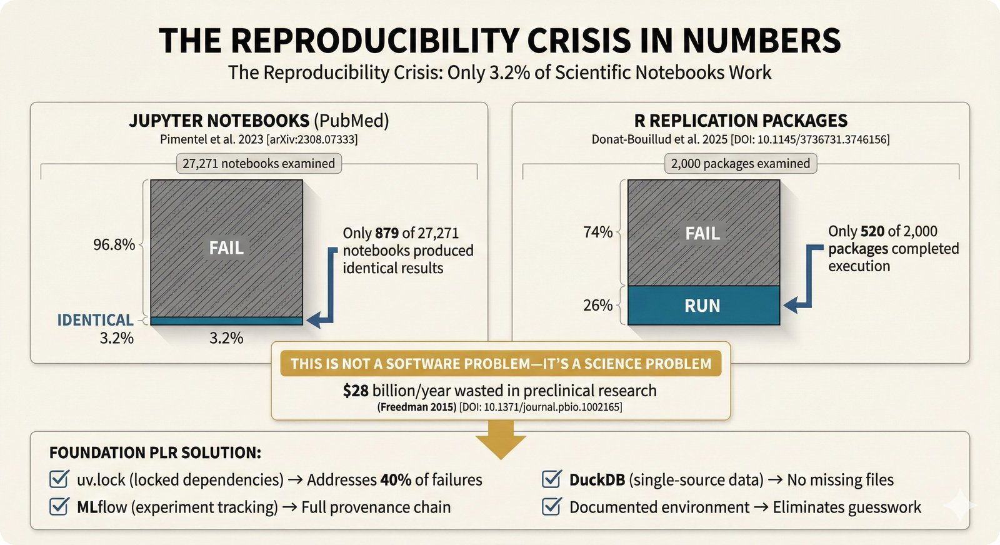

**The Numbers Don't Lie**

In Nature's 2016 survey of 1,576 scientists, **70% had tried and failed to reproduce another scientist's experiments** (Baker, 2016). For computational research specifically:

- **Gundersen & Kjensmo (2018)**: Only 6% of AI conference papers (IJCAI, AAAI) share code
- **Pineau et al. (2021)**: Code sharing varies from 10% (neuroscience) to 70% (computer vision)
- **Raff (2019)**: Only 63.5% of ML papers were reproducible with significant effort

The common causes include:
- Missing code
- Missing data
- Incomplete documentation
- Environment differences
- Random seed issues

---

## Why Notebooks Fail

### ELI5 Version

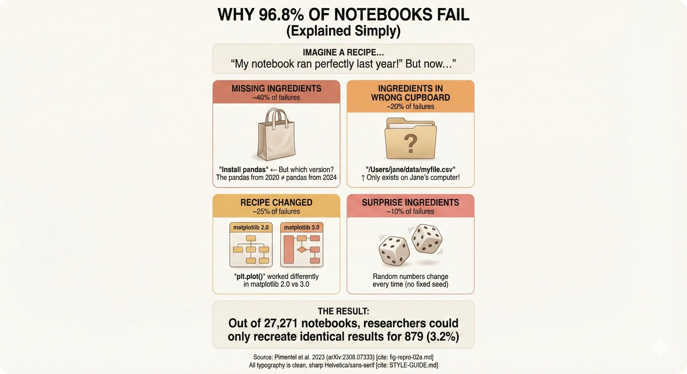

**The Hidden State Problem**

Jupyter notebooks allow out-of-order execution. You might run cell 5, then cell 2, then cell 7. The notebook "works" for you, but when someone runs it top-to-bottom, it breaks.

### Expert Version

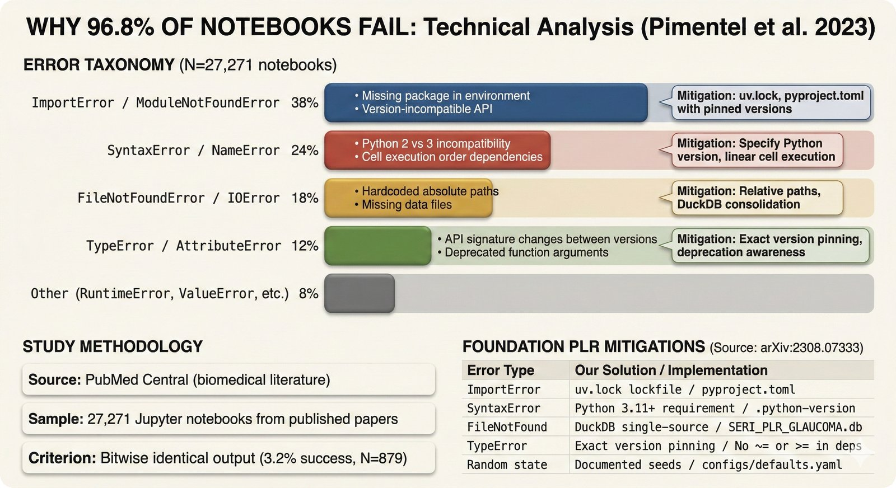

**Why This Repository Uses Scripts**

Scripts enforce linear execution:
```
python script.py  # Always runs the same way
```

Notebooks don't:
```
[Cell 5 modified 10:32am]
[Cell 2 modified 10:35am]  # Which order did they run?
[Cell 5 modified 10:40am]  # Was this before or after cell 2?
```

---

## The Five Horsemen of Irreproducibility

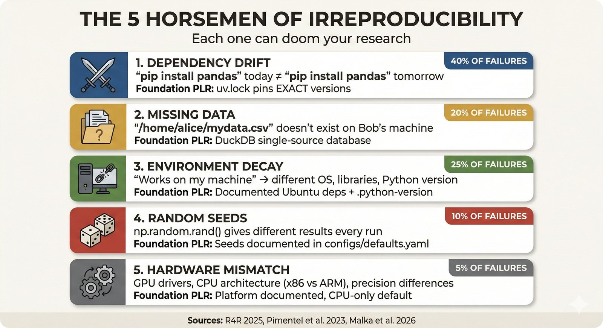

**What Breaks Reproducibility**

| Horseman | Problem | Our Solution |
|----------|---------|--------------|
| **Missing Code** | "Email me for code" | GitHub repository |
| **Missing Data** | "Data available upon request" | DuckDB database |
| **Dependency Hell** | Version conflicts | UV + lock file |
| **Environment Drift** | "Works on my machine" | Docker + explicit versions |
| **Random Seeds** | Non-deterministic results | Seeded randomness + bootstrap |

---

## Levels of Reproducibility

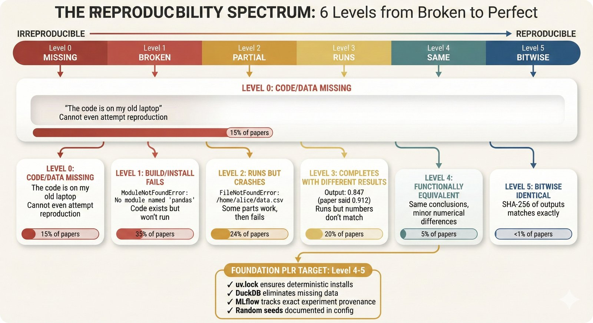

**Not All Reproducibility Is Equal**

| Level | Definition | Difficulty |
|-------|------------|------------|
| **Level 0** | Doesn't run | Most published code |
| **Level 1** | Runs but different results | Common |
| **Level 2** | Same conclusions | Good |
| **Level 3** | Same numbers (± tolerance) | Better |
| **Level 4** | Bitwise identical | Hard |

**This repository targets Level 3** - same numbers within statistical tolerance across runs and machines.

---

## What Reviewers Check

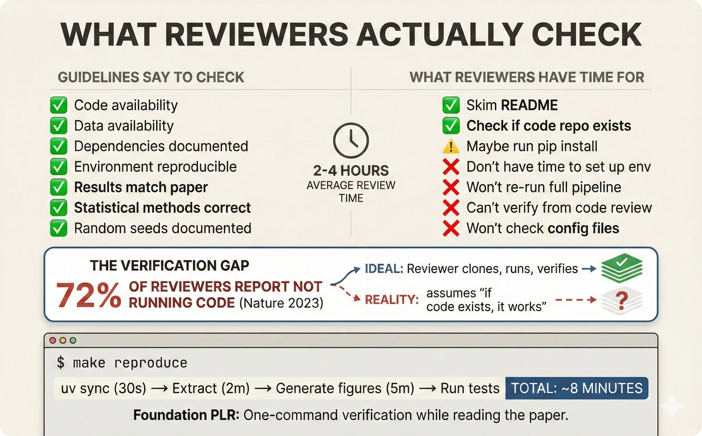

**Reproducibility Checklist**

- [ ] Code is available
- [ ] Data is available (or synthetic data provided)
- [ ] Dependencies are specified with versions
- [ ] Random seeds are set
- [ ] Instructions to run are clear
- [ ] Expected outputs are documented
- [ ] Compute requirements are stated

---

## The Cost of Irreproducibility

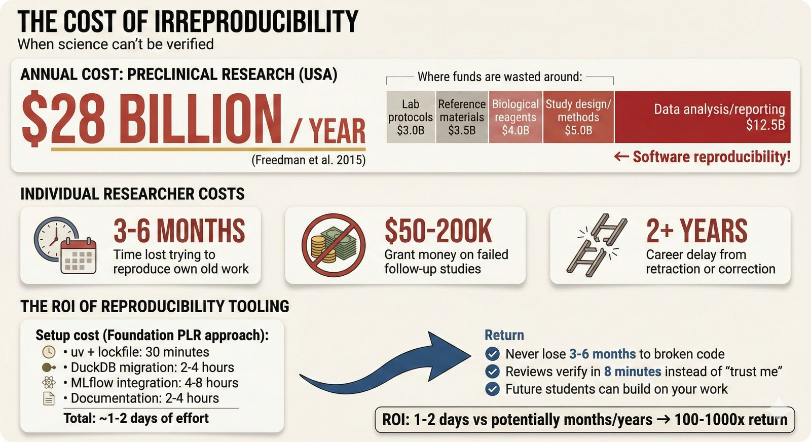

**Why This Matters**

Irreproducible research:
- Wastes research funding
- Delays scientific progress
- Erodes public trust
- Can harm patients (medical ML)

---

## Dependency Management

### The Problem

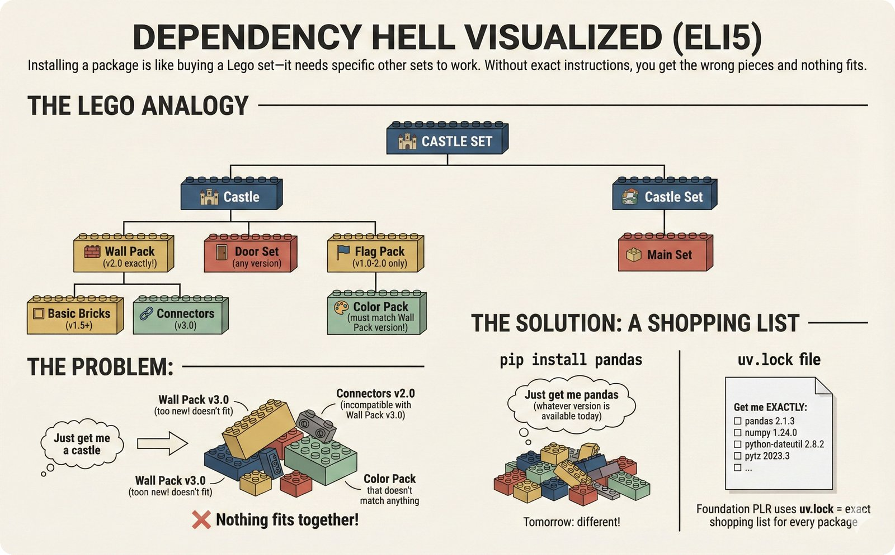

**Dependency Conflicts**

```
Package A requires: numpy>=1.20,<1.25
Package B requires: numpy>=1.24,<2.0
Package C requires: numpy>=1.26

# No numpy version satisfies all three!
```

### The Solution: Lock Files {#lockfiles}

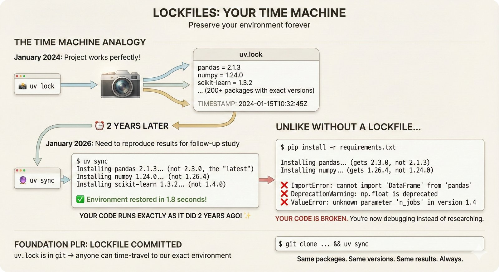

**Lock Files Are Time Machines**

A lock file (`uv.lock`, `poetry.lock`) records:
- Exact version of every package
- Exact version of every dependency
- Hash of each package file

```bash
# Create environment from lock file
uv sync  # Installs EXACTLY what was recorded
```

### Version Pinning Strategies

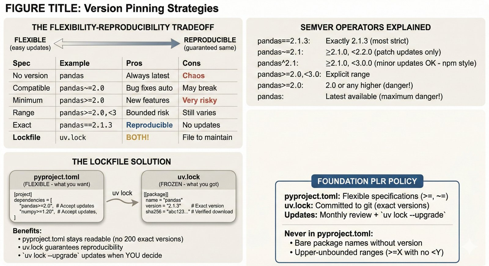

| Strategy | Example | Trade-off |
|----------|---------|-----------|
| Loose | `numpy>=1.20` | May break with updates |
| Bounded | `numpy>=1.20,<2.0` | Some protection |
| Exact | `numpy==1.24.3` | Reproducible but rigid |
| Lock file | `uv.lock` | **Best of both worlds** |

---

## Docker: Necessary but Not Sufficient


**Docker Misconceptions**

❌ "I put it in Docker, so it's reproducible"

Docker helps, but:
- Base images change (`python:3.11` today ≠ `python:3.11` next year)
- `apt-get install` pulls latest versions
- Random seeds still matter

### Virtual Environments vs Containers


| Aspect | Virtual Environment | Docker Container |
|--------|---------------------|------------------|
| Isolation level | Python packages | Entire OS |
| Overhead | Minimal | Moderate |
| Startup time | Instant | Seconds |
| Use case | Development | Deployment |

**This repository provides both:**
- `.venv/` for development
- `Dockerfile` for full reproducibility

---

## The Base Image Problem


**Pin Your Base Images**

```dockerfile
# BAD - changes over time
FROM python:3.11

# GOOD - specific version
FROM python:3.11.7-slim-bookworm@sha256:abc123...
```

---

## How We Achieve Reproducibility

### 1. Single Source of Truth


All results are stored in DuckDB, not scattered CSVs.

### 2. Figure Reproducibility


Every figure has a JSON sidecar with the exact data used.

### 3. Automatic Artifacts

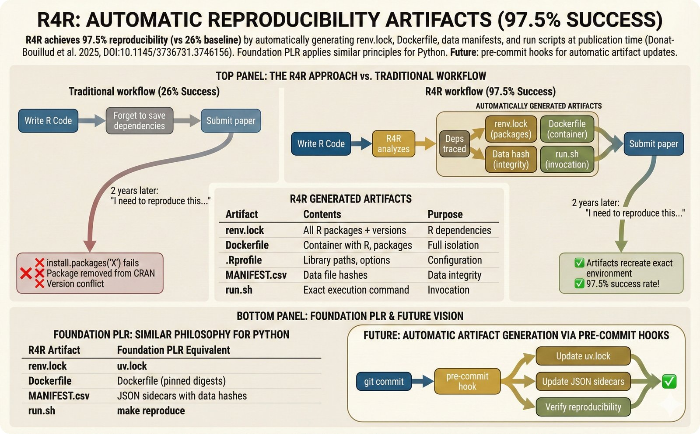

The pipeline automatically captures:
- Git commit hash
- Environment snapshot
- Input data checksums
- Random seeds used

---

## Bitwise vs Functional Reproducibility


**Do You Need Bitwise Identical Results?**

| Type | Definition | When Needed |
|------|------------|-------------|
| **Bitwise** | Exact same bytes | Rarely (security, legal) |
| **Functional** | Same scientific conclusions | Usually sufficient |

For this repository:
- AUROC might vary by ±0.001 across runs (floating point)
- Conclusions remain the same
- Bootstrap CIs capture the uncertainty

---

## R Package Ecosystem


**R Reproducibility with renv**

This repository uses `renv` for R packages:

```r
# Restore exact package versions
renv::restore()
```

The `renv.lock` file pins all R package versions.

---

## System Dependencies


**The Hidden Layer**

Python packages often need system libraries:
- `libpng` for image processing
- `libblas` for linear algebra
- `libcurl` for downloads

Our `Dockerfile` installs all required system dependencies.

---

## Quick Reproducibility Checklist

### For This Repository

```bash
# 1. Clone
git clone https://github.com/petteriTeikari/foundation_PLR.git
cd foundation_PLR

# 2. Environment
uv sync  # Creates venv from lock file

# 3. R packages (if needed)
Rscript -e "renv::restore()"

# 4. Run
make reproduce  # Full pipeline
make reproduce-from-checkpoint  # From pre-computed data
```

### Verify Reproduction

```bash
# Compare outputs to expected
make test-reproducibility
```

---

## References

### Reproducibility Crisis
- Baker M. (2016). 1,500 scientists lift the lid on reproducibility. **Nature**.
- Freedman LP, et al. (2015). The economics of reproducibility in preclinical research. **PLOS Biology**.

### Best Practices
- Wilson G, et al. (2017). Good enough practices in scientific computing. **PLOS Computational Biology**.
- Sandve GK, et al. (2013). Ten simple rules for reproducible computational research. **PLOS Computational Biology**.

### Tools
- [UV Documentation](https://github.com/astral-sh/uv)
- [renv Documentation](https://rstudio.github.io/renv/)
- [Docker Best Practices](https://docs.docker.com/develop/develop-images/dockerfile_best-practices/)

---

## See Also

- [Dependencies Guide](dependencies.md) - UV, Polars, DuckDB details
- [How to Read the Plots](reading-plots.md) - Understanding our visualizations
- [Makefile Reference](https://github.com/petteriTeikari/foundation_PLR/blob/main/Makefile) - Available commands
