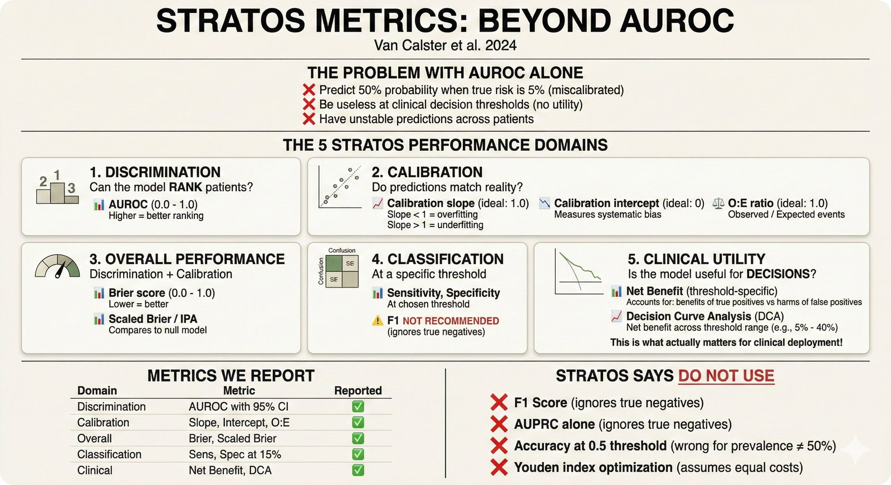

# STRATOS Metrics: Beyond AUROC

> **Start Here** | New to clinical prediction metrics? Read the [TL;DR](#the-problem-with-auroc-only-evaluation) first, then explore each category.

> **Why this matters**: AUROC alone is not enough. The STRATOS Initiative guidelines (Van Calster et al. 2024) define the metrics that clinical prediction models should report. This guide explains what each metric tells you.

**Related documentation:**
- **Implementation details**: [`src/stats/README.md`](https://github.com/petteriTeikari/foundation_PLR/blob/main/src/stats/README.md) - How to compute each metric
- **Plot interpretation**: [`reading-plots.md`](reading-plots.md) - How to read calibration curves, DCA, etc.
- **TRIPOD+AI**: Coming soon - Reporting checklist for AI prediction models

---

## The Problem with AUROC-Only Evaluation

> **Scenario**: Your model achieves AUROC = 0.92. You publish the paper. A hospital deploys it.
>
> Six months later, clinicians complain: "The model says 85% for everyone. We can't use it."
>
> **What went wrong?** The model could rank patients but gave meaningless probabilities.

Most ML papers report only AUROC. This is **insufficient** for clinical prediction models because:

1. **AUROC ignores calibration**: A model can have AUROC=0.90 but predict everyone as 99% or 1%
2. **AUROC ignores prevalence**: Performance at different thresholds matters
3. **AUROC doesn't answer clinical questions**: "Should I treat this patient?"



**STRATOS Metrics Framework**

The STRATOS Initiative defines five categories of metrics for evaluating clinical prediction models. This repository reports ALL of them, not just AUROC.

---

## The Five STRATOS Categories

### 1. Discrimination

**Question**: Can the model rank patients correctly?

| Metric | What It Measures | Good Value |
|--------|------------------|------------|
| **AUROC** | Probability that a random positive is ranked higher than a random negative | > 0.8 |
| Sensitivity | True positive rate at a threshold | Depends on use case |
| Specificity | True negative rate at a threshold | Depends on use case |

**AUROC is necessary but not sufficient.**

*Implementation: [`src/stats/classifier_metrics.py`](https://github.com/petteriTeikari/foundation_PLR/blob/main/src/stats/classifier_metrics.py) → [`src/stats/README.md#discrimination`](https://github.com/petteriTeikari/foundation_PLR/blob/main/src/stats/README.md)*

---

### 2. Calibration

**Question**: Do predicted probabilities match actual outcomes?


**Calibration: Probabilities Should Mean What They Say**

If your model predicts "70% chance of glaucoma" for 100 patients, approximately 70 should actually have glaucoma. If only 30 do, your model is **overconfident**.

| Metric | What It Measures | Good Value |
|--------|------------------|------------|
| **Calibration slope** | Spread of predictions (weak calibration) | Close to 1.0 |
| **Calibration intercept** | Average bias (calibration-in-the-large) | Close to 0.0 |
| **O:E ratio** | Observed vs Expected events | Close to 1.0 |
| ECE/ICI | Summary calibration error | Low |

### Why Calibration Matters More Than You Think

Consider two models:
- **Model A**: AUROC=0.85, well-calibrated
- **Model B**: AUROC=0.90, poorly calibrated

For clinical decision-making, **Model A is often better** because doctors can trust the probabilities. Model B might rank patients correctly but give meaningless probability estimates.

*Implementation: [`src/stats/calibration_extended.py`](https://github.com/petteriTeikari/foundation_PLR/blob/main/src/stats/calibration_extended.py) → [`src/stats/README.md#calibration`](https://github.com/petteriTeikari/foundation_PLR/blob/main/src/stats/README.md)*

---

### 3. Overall Performance

**Question**: How good are predictions in aggregate?

| Metric | What It Measures | Good Value |
|--------|------------------|------------|
| **Brier score** | Mean squared error of probabilities | Low (< 0.25) |
| **Scaled Brier (IPA)** | Improvement over null model | High (> 0) |
| Log-loss | Information-theoretic measure | Low |

**Brier score combines discrimination AND calibration** - it's a "strictly proper" scoring rule.

```
Brier = (1/N) × Σ(predicted - actual)²
```

*Implementation: [`src/stats/scaled_brier.py`](https://github.com/petteriTeikari/foundation_PLR/blob/main/src/stats/scaled_brier.py) → [`src/stats/README.md#overall-performance`](https://github.com/petteriTeikari/foundation_PLR/blob/main/src/stats/README.md)*

---

### 4. Classification Metrics

**Question**: How does the model perform at a specific threshold?

| Metric | What It Measures | STRATOS Recommendation |
|--------|------------------|------------------------|
| Sensitivity | TP / (TP + FN) | Report at clinical threshold |
| Specificity | TN / (TN + FP) | Report at clinical threshold |
| PPV/NPV | Predictive values | Report with prevalence |
| **F1 score** | Harmonic mean | **NOT RECOMMENDED** |
| **Accuracy** | (TP+TN) / N | **NOT RECOMMENDED** |

### Why F1 and Accuracy Are Problematic

**F1 score ignores true negatives** - it doesn't penalize false positives in the negative class.

**Accuracy is improper** - optimizing accuracy leads to biased predictions.

Use **Net Benefit** instead.

---

### 5. Clinical Utility

**Question**: Does using this model improve patient outcomes?


**Decision Curve Analysis (DCA)**

Net Benefit is the **only metric that directly answers clinical utility questions**.

| Metric | What It Measures |
|--------|------------------|
| **Net Benefit** | Expected benefit minus harm |
| **DCA curves** | Net Benefit across thresholds |

### Net Benefit Formula

```
Net Benefit = (TP/N) - (FP/N) × (threshold / (1-threshold))
```

The threshold reflects the **harm-to-benefit ratio**:
- At threshold 0.1: You'd accept 9 unnecessary treatments to catch 1 case
- At threshold 0.5: Equal weight to false positives and false negatives

*Implementation: [`src/stats/clinical_utility.py`](https://github.com/petteriTeikari/foundation_PLR/blob/main/src/stats/clinical_utility.py) → [`src/stats/README.md#clinical-utility`](https://github.com/petteriTeikari/foundation_PLR/blob/main/src/stats/README.md)*

---

## What We Report in This Repository

Every preprocessing comparison includes:

| Category | Metrics Reported |
|----------|-----------------|
| **Discrimination** | AUROC with 95% CI |
| **Calibration** | Slope, intercept, O:E ratio, calibration plot |
| **Overall** | Brier score, Scaled Brier (IPA) |
| **Clinical Utility** | Net Benefit at 5%, 10%, 15%, 20% thresholds; DCA curves |

### Where to Find These Metrics

All metrics are pre-computed in the DuckDB database:

```python
import duckdb
conn = duckdb.connect("data/foundation_plr_results.db")
df = conn.execute("""
    SELECT
        outlier_method, imputation_method,
        auroc, auroc_ci_lo, auroc_ci_hi,
        calibration_slope, calibration_intercept, o_e_ratio,
        brier, scaled_brier,
        net_benefit_5pct, net_benefit_10pct, net_benefit_15pct
    FROM essential_metrics
""").fetchdf()
```

---

## STRATOS Checklist

Before publishing any model comparison, verify:

- [ ] AUROC with 95% CI reported
- [ ] Calibration plot included (smoothed, with CI)
- [ ] Calibration slope reported
- [ ] O:E ratio or calibration intercept reported
- [ ] Brier score reported
- [ ] Net Benefit at clinical threshold(s) reported
- [ ] DCA curves across reasonable threshold range
- [ ] Probability distribution plot per outcome class
- [ ] **NO** F1, accuracy, or Youden-optimized thresholds

---

## Common Mistakes

### Mistake 1: Reporting Only AUROC

❌ "Our model achieved AUROC = 0.91"

✅ "Our model achieved AUROC = 0.91 (95% CI: 0.87-0.94), with calibration slope 0.98 and Net Benefit 0.15 at 10% threshold"

### Mistake 2: Using Youden Index for Threshold

❌ "Optimal threshold determined by Youden index"

✅ "Threshold set at 10% based on clinical acceptability of false positive rate"

Youden index assumes equal costs for FP and FN, which is rarely clinically appropriate.

### Mistake 3: Ignoring Calibration

A model can have perfect discrimination (AUROC=1.0) but terrible calibration (all predictions are 0.99 or 0.01). Such a model is **useless for clinical decision-making**.

---

## References

### STRATOS Guidelines
- Van Calster B, Collins GS, Vickers AJ, et al. (2024). Performance evaluation of predictive AI models to support medical decisions: Overview and guidance. **European Journal of Epidemiology**. [DOI: 10.1007/s10654-024-01168-2](https://doi.org/10.1007/s10654-024-01168-2)

### Calibration
- Van Calster B, et al. (2019). Calibration: the Achilles heel of predictive analytics. **BMC Medicine** 17:230. [DOI: 10.1186/s12916-019-1466-7](https://doi.org/10.1186/s12916-019-1466-7)

### Decision Curve Analysis
- Vickers AJ, Elkin EB. (2006). Decision Curve Analysis: A Novel Method for Evaluating Prediction Models. **Medical Decision Making** 26(6):565-574. [DOI: 10.1177/0272989X06295361](https://doi.org/10.1177/0272989X06295361)

### Model Stability
- Riley RD, et al. (2023). Stability of clinical prediction models developed using statistical or machine learning methods. **BMC Medicine** 21:245. [DOI: 10.1186/s12916-023-02961-2](https://doi.org/10.1186/s12916-023-02961-2)

### Reporting Guidelines
- Collins GS, et al. (2024). TRIPOD+AI statement: updated guidance for reporting clinical prediction models that use regression or machine learning methods. **BMJ** 385:e078378. [DOI: 10.1136/bmj-2023-078378](https://doi.org/10.1136/bmj-2023-078378)

---

## See Also

- [How to Read the Plots](reading-plots.md) - Interpreting visualizations
- [Calibration code](https://github.com/petteriTeikari/foundation_PLR/blob/main/src/stats/calibration_extended.py) - Python implementation
- [Net Benefit code](https://github.com/petteriTeikari/foundation_PLR/blob/main/src/stats/clinical_utility.py) - Python implementation
