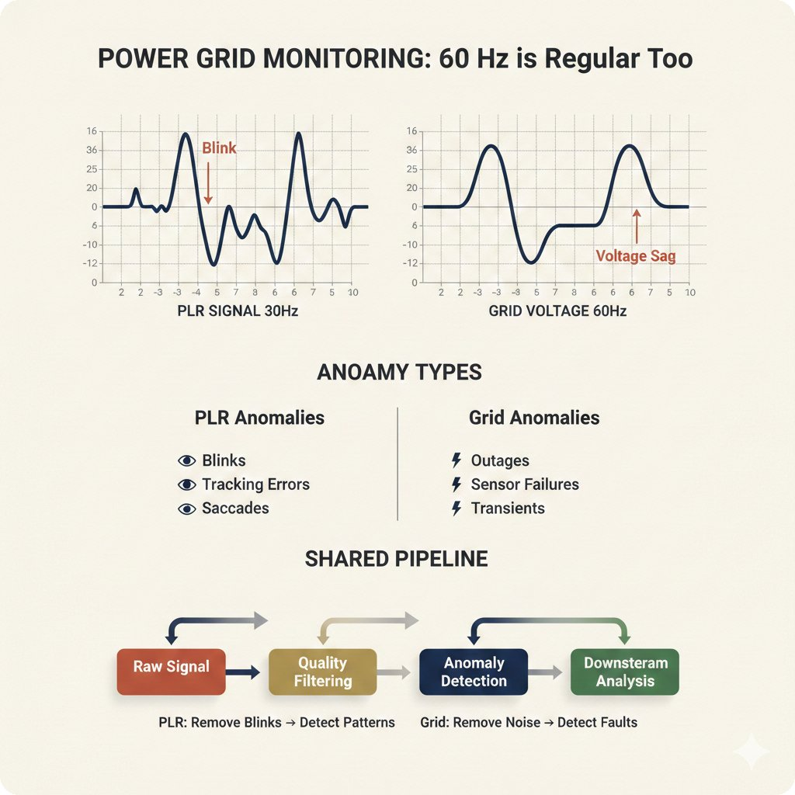

# Translational Insights: PLR Preprocessing Beyond Ophthalmology

> **For researchers in other domains**: This page explains how the preprocessing challenges solved in this repository (pupillary light reflex signals) parallel problems in vibration analysis, seismology, audio processing, power grid monitoring, and other dense signal domains.

---

## Why This Matters to You

If you work with **dense, irregularly-corrupted time series**, the techniques here may transfer to your domain:

- **Vibration monitoring** (machinery health)
- **Seismic signals** (earthquake detection)
- **Audio processing** (speech, music)
- **Power grid monitoring** (anomaly detection)
- **Lung sounds** (source separation)

The PLR signal preprocessing pipeline demonstrates patterns that generalize across these domains.

---

## The Hype vs Reality of Time Series Foundation Models


**TSFM Hype vs Reality**

Foundation models are transforming NLP and vision, but time series is different. This diagram shows the realistic assessment: FMs excel with large datasets and multi-task scenarios, but traditional feature engineering often wins for domain-specific applications with limited data.

*Learn more: [MOMENT Paper](https://arxiv.org/abs/2402.03885) | [UniTS Paper](https://arxiv.org/abs/2403.00131)*

---

## Domain Fit Matrix: When Do FMs Help?


**Domain Fit Matrix**

Not all time series are created equal. This matrix helps you assess whether foundation models are likely to help in your specific domain based on:
- Signal density (sparse vs dense)
- Sampling regularity
- Available training data
- Task complexity

---

## Sparse vs Dense Signals


**Sparse vs Dense Signals**

PLR is a **dense signal** - continuous measurements at regular intervals. This is fundamentally different from sparse event data (like network logs or transaction records). The preprocessing techniques here are designed for dense signals.

---

## Domain Parallels

### PLR ↔ Vibration Monitoring


**Parallel to Vibration Analysis**

Industrial vibration monitoring faces similar challenges:
- Artifacts from sensor issues (like blinks in PLR)
- Feature extraction from amplitude patterns
- Classification of healthy vs faulty states

*Our outlier detection → imputation → feature extraction pipeline maps directly.*

---

### PLR ↔ Seismic Signals


**Parallel to Seismology**

Seismic event detection shares our core challenge: distinguishing **true signal** (pupil response / earthquake) from **noise** (blinks / background tremors).

---

### PLR ↔ Audio Processing


**Parallel to Audio**

Audio engineers deal with:
- Transient artifacts (clicks, pops) ↔ blink artifacts
- Signal reconstruction (inpainting) ↔ imputation
- Feature extraction (MFCCs, spectrograms) ↔ amplitude bins

---

### Source Separation in Lung Sounds


**Blind Source Separation**

In lung sound analysis, you must separate heart sounds from breath sounds. Similarly, we separate the true pupil response from artifact-induced variations.

---

### Power Grid Monitoring



**Power Grid Parallels**

Smart grid monitoring requires:
- Real-time anomaly detection in dense signals
- Distinguishing equipment faults from normal load variations
- Imputing missing data from sensor dropouts

---

## The Dense Signal Club


**You're in the Dense Signal Club if you have:**
- Regular sampling (even if there are gaps)
- Continuous underlying phenomenon
- Artifact contamination from measurement issues
- Need for feature extraction before classification

Members: ECG, EEG, EMG, vibration, audio, PLR, accelerometer data...

---

## Event-Conditioned Signals


**Event-Conditioned Signals**

PLR is **event-conditioned** - the signal is a response to a light stimulus. This differs from free-running signals (like ECG) and affects:
- How we align signals across subjects
- What "normal" looks like
- Feature extraction strategies

---

## When NOT to Impute


**When Imputation is Wrong**

Imputation isn't always the answer. This decision tree helps you decide when to:
- Impute (fill in gaps)
- Delete (remove corrupted segments)
- Use model-based approaches
- Accept and model the missingness directly

---

## Handling Missing Values: The MGAM Approach


**Missing Values Strategy**

Different missing data patterns require different strategies. This figure shows how we characterize and handle various missingness patterns in PLR data.

---

## When Simple Baselines Win


**The Humble Baseline**

One of our key findings: **handcrafted features + simple imputation often beats foundation model embeddings**. This figure shows when simplicity wins:
- Small datasets (< 1000 samples)
- Domain-specific features available
- Interpretability required

*Don't assume complex = better. Test your baselines.*

---

## Domain-Specific vs Generic Approaches


**The Trade-off**

| Approach | Pros | Cons |
|----------|------|------|
| **Domain-specific features** | Interpretable, works with small data | Requires expertise, may miss patterns |
| **Generic embeddings** | No domain expertise needed, can discover new patterns | Needs large data, black box |

Our finding: For PLR with N=208 labeled subjects, **domain-specific wins by 9 percentage points**.

---

## How to Adapt This Code to Your Domain

### Step 1: Assess Domain Fit

Use the Domain Fit Matrix above to estimate whether our approach will transfer.

### Step 2: Map the Pipeline

```
Your Domain              PLR Pipeline
─────────────           ─────────────
Your artifacts    →     Blink detection (outlier methods)
Your gaps         →     Missing segments (imputation methods)
Your features     →     Amplitude bins + latency (featurization)
Your classifier   →     CatBoost (or your choice)
```

### Step 3: Fork and Modify

See `configs/` for the YAML structure. The registry pattern means you can add new methods without changing core code.

---

## Key Takeaways for Other Domains

1. **Foundation models aren't magic** - Test against domain-specific baselines
2. **Preprocessing matters** - 15% of downstream variance in our study
3. **Dense signals share patterns** - Vibration, audio, seismic, PLR all benefit from similar approaches
4. **Impute carefully** - Know when NOT to impute
5. **The pipeline is transferable** - Outlier → Impute → Feature → Classify

---

## References

### Time Series Foundation Models
- [MOMENT: A Family of Open Time-series Foundation Models](https://arxiv.org/abs/2402.03885)
- [UniTS: Building a Unified Time Series Model](https://arxiv.org/abs/2403.00131)
- [TimesNet: Temporal 2D-Variation Modeling](https://arxiv.org/abs/2210.02186)

### Domain-Specific Feature Engineering
- [Grinsztajn et al. 2022 - Why Tree-Based Models Beat Deep Learning on Tabular Data](https://arxiv.org/abs/2207.08815)
- [Christodoulou et al. 2019 - ML vs LR for Clinical Prediction](https://doi.org/10.1016/j.jclinepi.2019.02.004)

### Missing Data
- [Little & Rubin - Statistical Analysis with Missing Data](https://www.wiley.com/en-us/Statistical+Analysis+with+Missing+Data%2C+3rd+Edition-p-9780470526798)
- [Van Buuren - Flexible Imputation of Missing Data](https://stefvanbuuren.name/fimd/)
