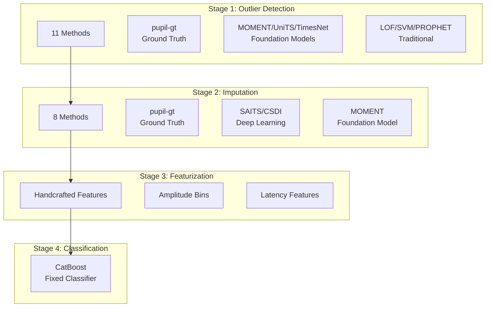

# User Guide

This guide explains the Foundation PLR pipeline architecture and how to use each component.

## Pipeline Overview

The Foundation PLR pipeline consists of four main stages:

## Sections

### Pipeline Stages

- **[Pipeline Overview](pipeline-overview.md)** - Detailed architecture explanation
- **[Outlier Detection](outlier-detection.md)** - Available methods and configuration
- **[Imputation](imputation.md)** - Signal reconstruction approaches
- **[Featurization](featurization.md)** - Feature extraction from PLR signals
- **[Classification](classification.md)** - Model training and evaluation

### Infrastructure

- **[Prefect Orchestration](prefect-orchestration.md)** - Workflow orchestration with Prefect
