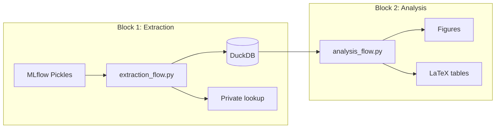

# Prefect Orchestration

Foundation PLR uses [Prefect](https://www.prefect.io/) for workflow orchestration, enabling reliable, observable pipelines.

## Overview

The pipeline is organized into two decoupled blocks:



| Block | Purpose | Can Run Independently |
|-------|---------|----------------------|
| **Extraction** | MLflow → DuckDB | Yes |
| **Analysis** | DuckDB → Figures | Yes (from checkpoint) |

## Running Flows

### Quick Start

```bash
# Full pipeline
make reproduce

# From checkpoint (skip extraction)
make reproduce-from-checkpoint

# Individual blocks
make extract
make analyze
```

### Direct Python Execution

```bash
# Extraction flow
python -m src.orchestration.flows.extraction_flow

# Analysis flow
python -m src.orchestration.flows.analysis_flow
```

### Via Prefect Server

```bash
# Start Prefect server (optional)
prefect server start

# Deploy flows
python src/create_prefect_deployment.py

# Run deployments
prefect deployment run extraction-flow/default
prefect deployment run analysis-flow/default
```

## Flow Architecture

### Extraction Flow (`extraction_flow.py`)

Extracts MLflow experiment results with privacy separation:

```python
@flow(name="extraction-flow")
def run_extraction_flow(
    mlflow_uri: str = "file:///home/petteri/mlruns",
    output_db: str = "data/public/foundation_plr_results.db",
    private_dir: str = "data/private/"
) -> Dict[str, Any]:
    """
    Outputs:
    - PUBLIC: foundation_plr_results.db (re-anonymized Hxxx/Gxxx codes)
    - PRIVATE: subject_lookup.yaml (mapping to original PLRxxxx codes)
    - PRIVATE: demo_subjects_traces.pkl (raw PLR traces)
    """
```

**Tasks:**
1. `load_mlflow_experiments()` - Find classification runs
2. `extract_bootstrap_metrics()` - Parse 542 pickle files
3. `compute_stratos_metrics()` - Calculate all STRATOS metrics
4. `create_anonymized_db()` - Write DuckDB with re-anonymization
5. `save_private_lookup()` - Store subject code mapping

### Analysis Flow (`analysis_flow.py`)

Generates all figures and artifacts from DuckDB:

```python
@flow(name="analysis-flow")
def run_analysis_flow(
    db_path: str = "data/public/foundation_plr_results.db"
) -> Dict[str, Path]:
    """
    Outputs:
    - figures/generated/*.png
    - figures/generated/data/*.json
    - outputs/latex/*.tex
    """
```

**Tasks:**
1. `validate_database()` - Check DuckDB schema
2. `generate_python_figures()` - Run `src/viz/` scripts
3. `generate_r_figures()` - Run `src/r/figures/` scripts
4. `export_latex_tables()` - Create LaTeX artifacts

## Task Decorators

Prefect tasks enable:
- **Retries**: Automatic retry on failure
- **Caching**: Skip recomputation of unchanged results
- **Logging**: Structured logs with task context

```python
from prefect import task, flow

@task(retries=3, cache_key_fn=task_input_hash)
def extract_metrics(pickle_path: Path) -> dict:
    """Extract metrics from a single pickle file."""
    with open(pickle_path, "rb") as f:
        return pickle.load(f)

@flow(name="my-flow")
def my_flow():
    results = extract_metrics.map(pickle_paths)  # Parallel execution
```

## Graceful Degradation

The flows work without Prefect installed:

```python
# In extraction_flow.py
USE_PREFECT = os.environ.get("PREFECT_DISABLED", "").lower() not in ("1", "true", "yes")

if USE_PREFECT:
    from prefect import flow, task
else:
    # No-op decorators
    def task(fn=None, **kwargs):
        return fn if fn else lambda f: f
```

Disable Prefect for testing:
```bash
PREFECT_DISABLED=1 python -m src.orchestration.flows.extraction_flow
```

## Configuration

Prefect settings are in `configs/defaults.yaml`:

```yaml
PREFECT:
  PROCESS_FLOWS:
    OUTLIER_DETECTION: true
    IMPUTATION: true
    FEATURIZATION: true
    CLASSIFICATION: true
    SUMMARIZATION: false
    DEPLOYMENT: false
```

## Monitoring

### Prefect UI

```bash
prefect server start
# Open http://localhost:4200
```

The UI shows:
- Flow run history
- Task dependencies
- Logs and artifacts
- Deployment schedules

### CLI Monitoring

```bash
# List flow runs
prefect flow-run ls

# Get run details
prefect flow-run inspect <run-id>

# View logs
prefect flow-run logs <run-id>
```

## Error Handling

### Common Issues

| Error | Cause | Solution |
|-------|-------|----------|
| `ModuleNotFoundError: prefect` | Prefect not installed | `uv pip install prefect` |
| `Database locked` | Concurrent DuckDB access | Wait or use `--force` |
| `MLflow tracking URI invalid` | Wrong path | Check `mlflow_uri` parameter |

### Recovery

```bash
# Clear Prefect cache
prefect cache clear

# Reset flow state
prefect flow-run cancel <run-id>

# Force re-extraction
make extract FORCE=1
```

## See Also

- [Pipeline Overview](pipeline-overview.md) - Full pipeline architecture
- [ARCHITECTURE.md](https://github.com/petteriTeikari/foundation_PLR/blob/main/ARCHITECTURE.md) - System design
- [Prefect Docs](https://docs.prefect.io/) - Official documentation
