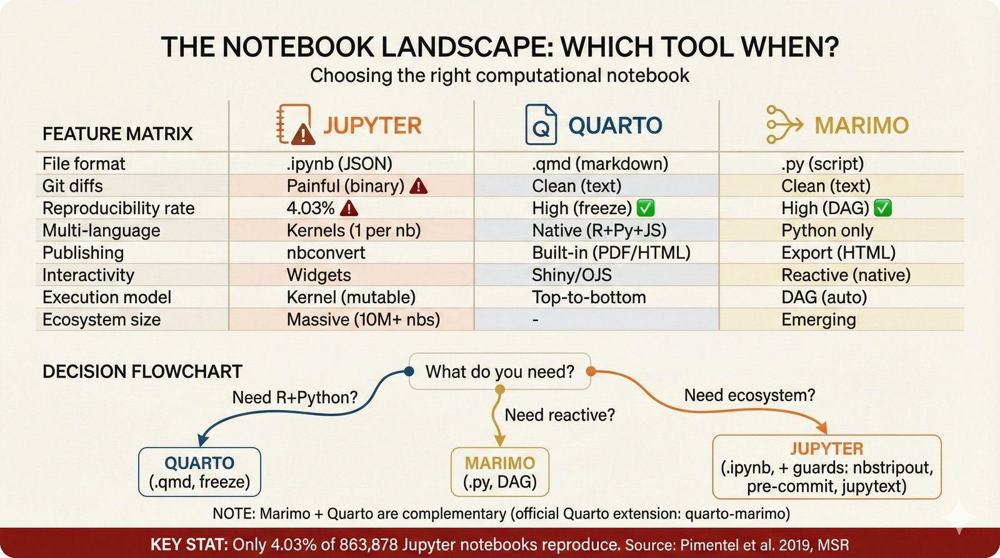
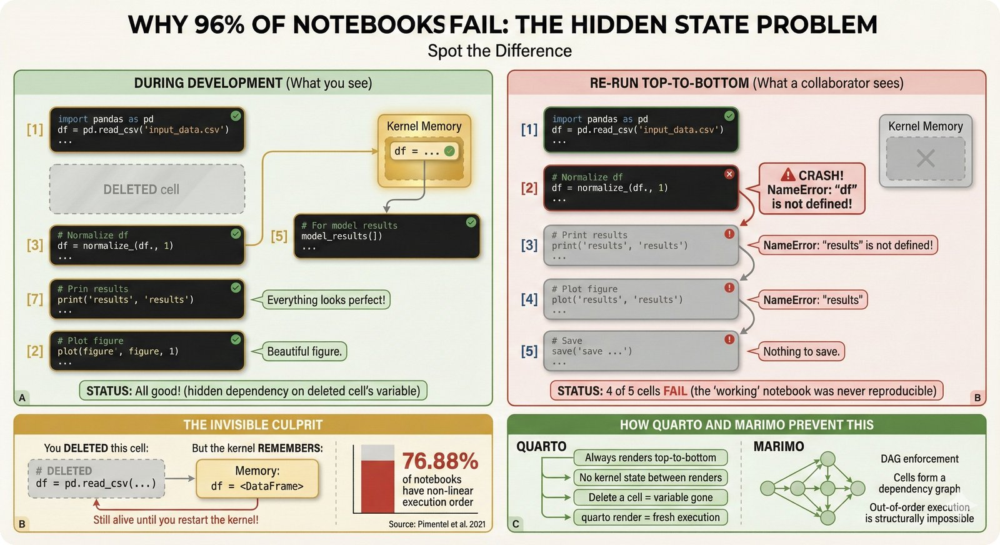
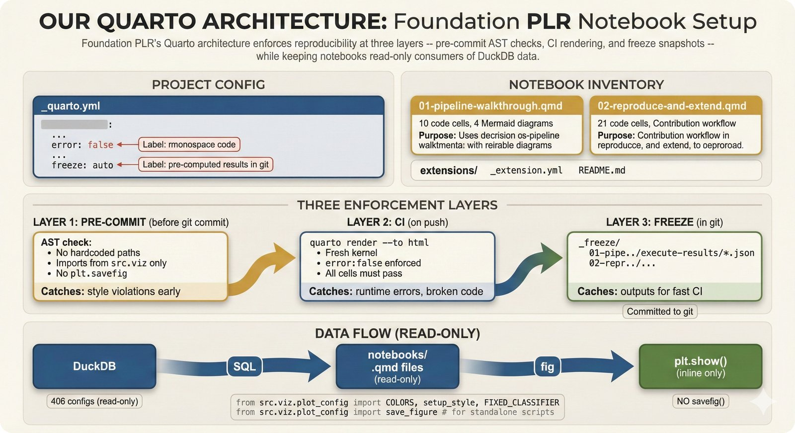
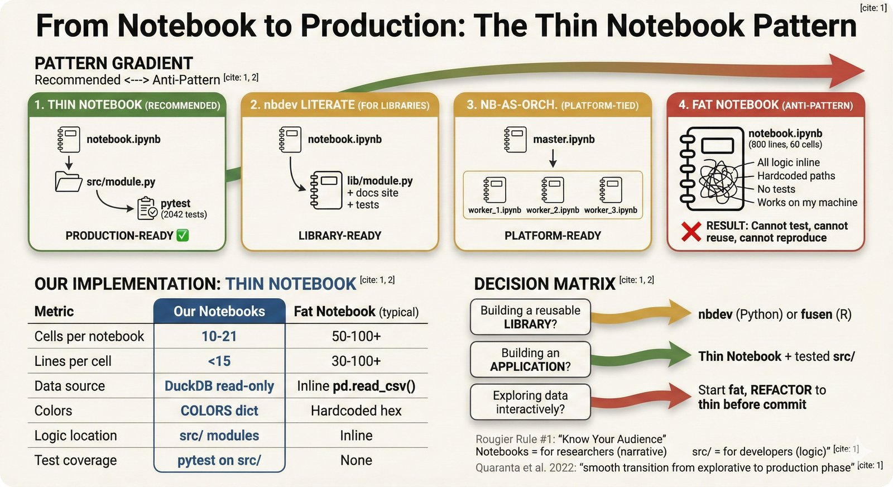
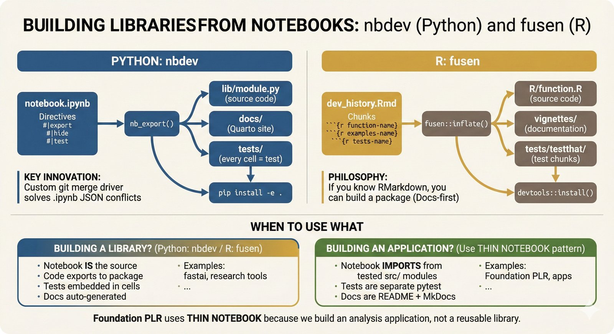
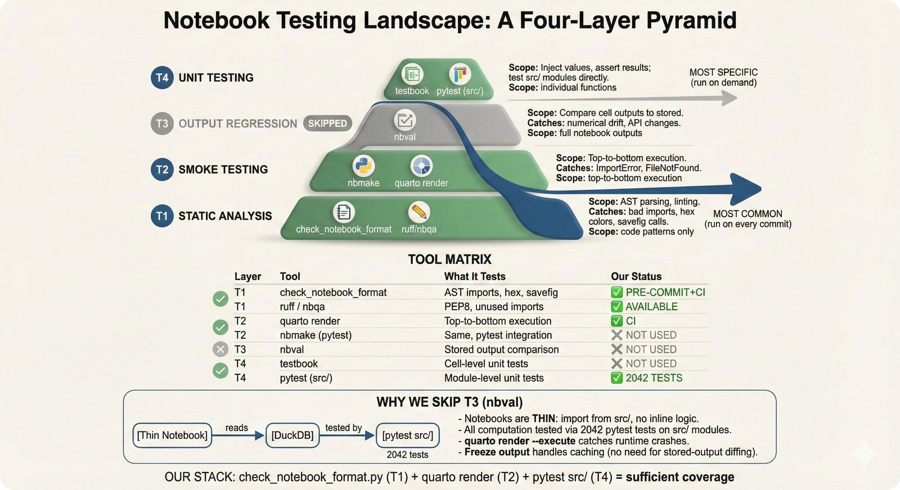
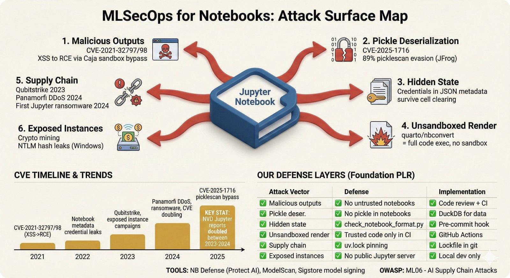

# Notebooks

Quarto tutorial notebooks for researchers wanting to understand and extend the Foundation PLR pipeline.

## Why Quarto (Not Jupyter)

This project uses **Quarto (`.qmd`) exclusively**. Jupyter (`.ipynb`) and marimo files are rejected by pre-commit hooks.

<p align="center">
  
</p>

<details>
<summary>Why not Jupyter?</summary>

Jupyter notebooks store code in JSON, producing noisy git diffs. More critically, **96% of published Jupyter notebooks fail to reproduce** (Pimentel et al. 2019, MSR) and 76.88% contain hidden execution-order dependencies (Pimentel et al. 2021, Empirical Software Engineering).

<p align="center">
  
</p>

Quarto solves this with plain-text `.qmd` files, mandatory top-to-bottom execution via `quarto render`, and the `freeze` mechanism for caching computation results.
</details>

| Rule | Enforcement |
|------|-------------|
| `.qmd` format only | Pre-commit hook + `.gitignore` + CI |
| No heavy logic in cells | Import from `src/` modules (thin notebook pattern) |
| Data via DuckDB read-only | AST-based import detection bans `sklearn.metrics` |
| No hardcoded colors/paths | Pre-commit regex + pattern checks |
| No `.ipynb` anywhere in repo | Repo-wide scan (not just `notebooks/`) |
| No marimo notebooks | `import marimo` detection in `.py` files |
| Must render in CI | `quarto render` in GitHub Actions |

## Available Notebooks

| Notebook | Audience | What You Learn |
|----------|----------|----------------|
| `01-pipeline-walkthrough.qmd` | New researchers, PIs | Research question, 4-stage pipeline, DuckDB exploration, STRATOS metrics overview |
| `02-reproduce-and-extend.qmd` | Researchers reproducing results | Two-block architecture, running analysis, custom queries, DCA curves, contribution workflow |

### 01 -- Pipeline Walkthrough

Walks through the research question, data provenance (Najjar et al. 2023), the four-stage preprocessing pipeline (outlier detection, imputation, featurization, classification), and demonstrates querying the results database. Includes 4 Mermaid diagrams and interactive DuckDB queries.

### 02 -- Reproduce and Extend

Shows the two-block architecture (extraction vs analysis), how to reproduce published numbers with assertions, query calibration/DCA data, and build custom analyses. Demonstrates the thin notebook pattern: all computation lives in `src/`, notebooks only orchestrate and visualize.

## Architecture

<p align="center">
  
</p>

```
_quarto.yml                    Project config (freeze, theme, error:false)
    |
    +-- 01-pipeline-walkthrough.qmd
    |       |-- DuckDB read-only queries
    |       |-- 4 Mermaid diagrams (pipeline, data, methods, metrics)
    |       +-- matplotlib histogram (via setup_style() + COLORS)
    |
    +-- 02-reproduce-and-extend.qmd
    |       |-- DuckDB read-only queries
    |       |-- src.viz.plot_config (imported for styling)
    |       |-- Assertions against published numbers
    |       +-- DCA curve visualization
    |
    +-- extensions/
            |-- _template.qmd      Contribution template
            +-- README.md           DuckDB table reference
```

### The Thin Notebook Pattern

<p align="center">
  
</p>

Notebooks are **orchestration layers**, not computation engines:

- **Logic** lives in `src/stats/`, `src/viz/` (tested by 2042 pytest tests)
- **Data** comes from DuckDB (`data/public/foundation_plr_results.db`)
- **Style** uses `setup_style()` + `COLORS` dict from `plot_config.py`
- **Results** are never computed in cells -- only read from the database

<details>
<summary>Alternative patterns: nbdev and fusen</summary>

If you're building a **reusable library** (not an analysis application), consider nbdev (Python) or fusen (R) instead of the thin notebook pattern.

<p align="center">
  
</p>

Foundation PLR uses the thin notebook pattern because we build an analysis application, not a reusable library.
</details>

### Quarto Freeze

<p align="center">
  
</p>

The `freeze: auto` setting in `_quarto.yml` captures computation results in `_freeze/`. CI renders from frozen results without needing Python, DuckDB, or any compute dependencies -- just Quarto + Pandoc.

## Quick Start

```bash
# From project root -- activate environment
source .venv/bin/activate

# Preview notebooks interactively (opens browser)
cd notebooks
quarto preview

# Or render to HTML (output in notebooks/_output/)
quarto render
```

## Prerequisites

```bash
# Quarto CLI (>= 1.6)
# See: https://quarto.org/docs/get-started/

# Python environment (from project root)
uv sync --dev

# Set Quarto to use project Python
export QUARTO_PYTHON=.venv/bin/python
```

## Enforcement & Security

### Testing Pyramid

<p align="center">
  
</p>

Three layers enforce notebook quality:

| Layer | Tool | What It Catches |
|-------|------|-----------------|
| **Pre-commit** | `check_notebook_format.py` | `.ipynb` files, banned imports (AST), hex colors, `.savefig()`, sensitive data patterns, marimo |
| **CI smoke test** | `quarto render` | ImportError, FileNotFound, stale DB queries, execution errors |
| **CI policy check** | Same script as pre-commit | Repo-wide enforcement on PRs and pushes to `main` |

The pre-commit hook uses **AST parsing** (not regex) to detect banned imports like `sklearn.metrics` and `sklearn.calibration`. This catches all import forms including `from sklearn import metrics` and aliased imports.

Sensitive data patterns (patient IDs matching `PLR\d{4}`, absolute home paths) are scanned in **code cells only** to avoid false positives from documentation.

### Notebook Security Landscape

The security landscape for computational notebooks has evolved rapidly. We document it in two complementary figures:

**fig-nb-06** covers the **Jupyter-centric** attack surface -- where most CVEs and documented incidents exist. Jupyter's architecture (persistent kernel server, JSON format with embedded outputs, exposed notebook instances) has produced the majority of notebook security research, including XSS-to-RCE exploits (CVE-2021-32797/98), pickle deserialization bypasses (89% evasion rate), and targeted campaigns (Qubitstrike, Panamorfi DDoS, ransomware).

<p align="center">
  
</p>

**What does Quarto change?** Moving to Quarto eliminates several Jupyter-specific vectors -- stored-output XSS is gone (plain-text `.qmd` has no embedded outputs), there's no persistent kernel server to attack, and JSON metadata injection is eliminated. However, Quarto introduces its own security considerations:

- **Code still executes unsandboxed** during `quarto render` -- the fundamental risk of computational documents
- **Lua filters** in Quarto extensions can call `os.execute()` and `io.popen()` with full system access
- **The extension trust model** relies on a single Y/n prompt at install time -- no code signing, no permission system
- **`_freeze/` JSON files** are committed to git without cryptographic integrity verification
- **CVE-2024-38526** (the only Quarto-specific CVE so far): the polyfill.io supply chain compromise affected all Quarto HTML documents via the default MathJax template (patched in Quarto >= 1.4.557)
- **Inherited Pandoc CVEs**: arbitrary file write (CVE-2023-35936), SSRF (CVE-2025-51591), and LuaTeX shell escape bypass (CVE-2023-32700)

<!-- fig-nb-06b will be generated separately to cover Quarto-specific security in detail -->
<!-- See: docs/repo-figures/figure-plans/fig-nb-06b-quarto-security.md -->

<details>
<summary>Our mitigations</summary>

| Vector | Defense |
|--------|---------|
| Untrusted `.qmd` execution | `error: false` halts on errors; CI uses freeze (no re-execution) |
| Lua filter injection | No third-party Quarto extensions installed |
| `_freeze/` tampering | Code review required on all `_freeze/` changes |
| Supply chain (CDN) | Quarto >= 1.4.557 (polyfill.io patched) |
| Supply chain (Python) | `uv.lock` pinning + Dependabot alerts |
| Sensitive data leaks | AST-based scanner for patient IDs + absolute paths |
| CI privilege escalation | `permissions: contents: read` in workflow |
| `.ipynb` smuggling | Repo-wide scan, not just `notebooks/` |
</details>

## Contributing New Notebooks

See `extensions/README.md` for the contribution guide and DuckDB table reference.

```bash
cp extensions/_template.qmd extensions/my_analysis.qmd
# Edit, then render:
quarto render extensions/my_analysis.qmd
```

## CI Workflow

The `.github/workflows/notebook-tests.yml` workflow:
1. Triggers on PRs touching `notebooks/`, `src/`, or validation scripts
2. Triggers on pushes to `main` touching `notebooks/` or `src/`
3. Runs `check_notebook_format.py` (repo-wide policy check)
4. Runs `quarto render --to html` (smoke test)
5. Uploads rendered output as artifact (7-day retention)
