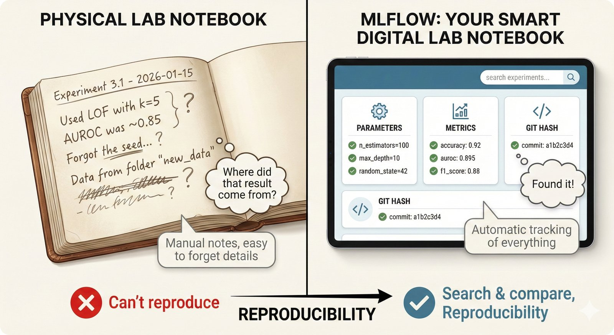
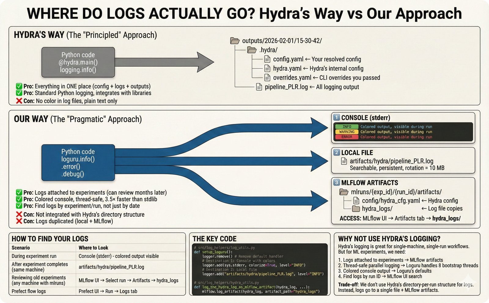

# Log Helpers (`src/log_helpers/`)

MLflow experiment tracking and logging utilities.

---

## Visual Guide: Experiment Tracking

<details>
<summary><b>Click to expand visual explanation</b></summary>

### MLflow Experiment Tracking


**What Gets Tracked**

Every pipeline run logs:
- **Parameters**: Outlier method, imputation method, classifier, hyperparameters
- **Metrics**: AUROC, Brier, calibration slope, Net Benefit (all STRATOS metrics)
- **Artifacts**: Model files, prediction arrays, figures

---

### The MLflow Concept



**Experiments → Runs → Artifacts**

```
mlruns/
├── 253031330985650090/          # Experiment (classification)
│   ├── run_abc123/              # Run (MOMENT + SAITS + CatBoost)
│   │   ├── params/              # Hyperparameters
│   │   ├── metrics/             # AUROC, Brier, etc.
│   │   └── artifacts/           # Model, predictions
│   └── run_def456/              # Another configuration
└── ...
```

---

### Where Logs Go



**Log File Locations**

| Log Type | Location |
|----------|----------|
| Loguru text logs | `logs/` |
| MLflow runs | `~/mlruns/` |
| Extracted metrics | `data/foundation_plr_results.db` |

</details>

---

## Overview

This module provides:
- MLflow experiment and run management
- Artifact logging (models, plots, data)
- Hydra configuration integration
- Retraining decisions based on existing runs

## Module Structure

```
log_helpers/
├── __init__.py
├── mlflow_utils.py              # Core MLflow setup and utilities
├── mlflow_artifacts.py          # Artifact logging
├── mlflow_tools/                # Additional MLflow tools
│   └── __init__.py
│
├── hydra_utils.py               # Hydra CLI integration
├── log_utils.py                 # Loguru setup
├── log_data.py                  # Data logging utilities
├── log_naming_uris_and_dirs.py  # Naming conventions
├── viz_log_utils.py             # Visualization logging
│
├── local_artifacts.py           # Local artifact management
├── polars_utils.py              # Polars DataFrame utilities
├── retrain_or_not.py            # Retraining decision logic
└── system_utils.py              # System utilities
```

## Key Functions

### MLflow Initialization

```python
from src.log_helpers.mlflow_utils import (
    init_mlflow,
    init_mlflow_experiment,
    init_mlflow_run,
)

# Initialize MLflow tracking
init_mlflow(cfg=cfg)

# Create/get experiment
init_mlflow_experiment(experiment_name="outlier_detection")

# Start a run
init_mlflow_run(
    mlflow_cfg=cfg["MLFLOW"],
    run_name="MOMENT-gt-finetune",
    cfg=cfg,
    experiment_name="outlier_detection"
)
```

### Parameter Logging

```python
from src.log_helpers.mlflow_utils import log_mlflow_params

log_mlflow_params(
    mlflow_params=cfg["OUTLIER_MODELS"]["MOMENT"]["MODEL"],
    model_name="MOMENT",
    run_name="MOMENT-gt-finetune"
)
```

### Artifact Logging

```python
from src.log_helpers.mlflow_artifacts import (
    log_figure_to_mlflow,
    log_model_to_mlflow,
    log_dataframe_to_mlflow,
)

# Log figure
log_figure_to_mlflow(fig, "roc_curve.png")

# Log model
log_model_to_mlflow(model, "classifier")

# Log DataFrame
log_dataframe_to_mlflow(df, "predictions.parquet")
```

### Retraining Decisions

```python
from src.log_helpers.retrain_or_not import (
    if_retrain_the_imputation_model,
    if_refeaturize_from_imputation,
)

# Check if model needs retraining
train_ON, best_run = if_retrain_the_imputation_model(
    cfg=cfg,
    run_name="SAITS",
    model_type="imputation"
)

if train_ON:
    # Train new model
    ...
else:
    # Load existing model from best_run
    ...
```

### Hydra Integration

```python
from src.log_helpers.hydra_utils import add_hydra_cli_args

# Add Hydra CLI arguments
args = parse_args()
add_hydra_cli_args(args)
```

## MLflow Configuration

Configure MLflow in `configs/SERVICES/services.yaml`:

```yaml
MLFLOW:
  tracking_uri: 'file:////home/petteri/Dropbox/mlruns'
  experiment_name: 'foundation_plr'
  artifact_location: null  # Use default
```

## Experiment Structure

```
mlruns/
├── 253031330985650090/          # Experiment ID
│   ├── run_id_1/
│   │   ├── params/              # Run parameters
│   │   ├── metrics/             # Run metrics
│   │   └── artifacts/           # Saved artifacts
│   │       ├── model/
│   │       ├── predictions.parquet
│   │       └── figures/
│   └── run_id_2/
│       └── ...
└── ...
```

## Accessing MLflow UI

```bash
export MLFLOW_TRACKING_URI='file:////home/petteri/Dropbox/mlruns'
mlflow ui --port 5000
# Open http://127.0.0.1:5000
```

## Run Naming Conventions

```python
from src.log_helpers.log_naming_uris_and_dirs import (
    define_run_name,
    update_outlier_detection_run_name,
)

# Generate run name from config
run_name = define_run_name(cfg=cfg)
# Returns: "MOMENT-gt-finetune_SAITS_CatBoost"
```

## Loguru Setup

```python
from src.log_helpers.log_utils import setup_loguru

# Initialize Loguru logging
log_file_path = setup_loguru()
```

## Best Practices

1. **Always use MLflow context managers:**
   ```python
   with mlflow.start_run():
       # Your code
       mlflow.log_metric("auroc", 0.913)
   ```

2. **Log all relevant parameters:**
   ```python
   mlflow.log_params({
       "model": "CatBoost",
       "outlier_method": "MOMENT-gt-finetune",
       "imputation_method": "SAITS"
   })
   ```

3. **Use consistent naming:**
   - Experiments: `{task}_{version}`
   - Runs: `{method}_{variant}_{config}`

## See Also

- [ARCHITECTURE.md](../../ARCHITECTURE.md) - Pipeline overview
- [configs/SERVICES/services.yaml](../../configs/SERVICES/services.yaml) - Service configuration
