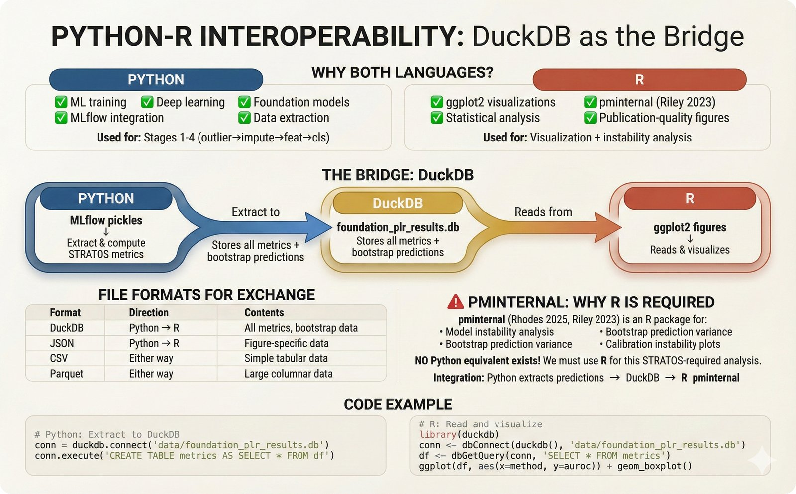
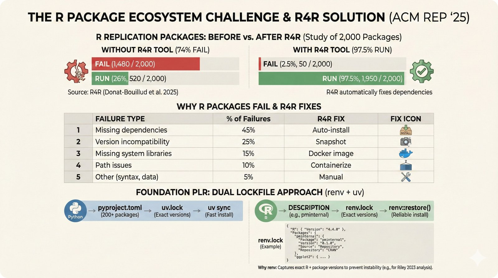
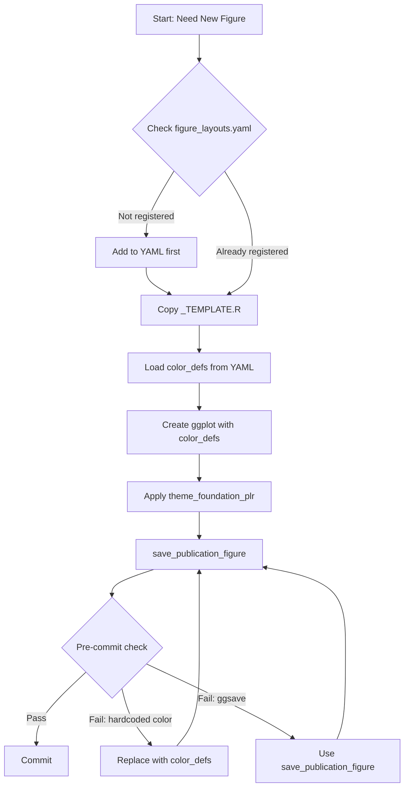

# R Figure System

Publication-quality figure generation for Foundation PLR using ggplot2 with strict anti-hardcoding enforcement.

---

## Visual Guide: Python-R Interoperability

<details>
<summary><b>Click to expand visual explanation</b></summary>

### Why R? The pminternal Package



**Python + R = Best of Both Worlds**

- **Python**: Data extraction, DuckDB, most visualizations
- **R**: Specialized statistical packages (pminternal, dcurves)

We don't reimplement verified R packages in Python - we call them via interop.

---

### Prediction Instability (pminternal)


**What pminternal Shows**

The pminternal package (Riley et al. 2023) measures prediction **stability**:
- Can we trust individual predictions?
- Do predictions vary wildly across bootstrap samples?
- Which patients need "second opinion"?

*Learn more: [Riley et al. 2023 - BMC Medicine](https://doi.org/10.1186/s12916-023-03050-0)*

---

### R Package Ecosystem



**Managing R Dependencies with renv**

```r
# Restore exact package versions
renv::restore()
```

The `renv.lock` file pins all R package versions for reproducibility.

</details>

---

## Quick Start

```r
# Find project root
PROJECT_ROOT <- (function() {
  d <- getwd()
  while (d != dirname(d)) {
    if (file.exists(file.path(d, "CLAUDE.md"))) return(d)
    d <- dirname(d)
  }
  stop("Could not find project root")
})()

# Load figure system
source(file.path(PROJECT_ROOT, "src/r/figure_system/config_loader.R"))
source(file.path(PROJECT_ROOT, "src/r/figure_system/save_figure.R"))
source(file.path(PROJECT_ROOT, "src/r/theme_foundation_plr.R"))

# Load colors from YAML
color_defs <- load_color_definitions()

# Create plot with proper colors
p <- ggplot(mtcars, aes(mpg, wt)) +
  geom_point(color = color_defs[["--color-primary"]]) +
  theme_foundation_plr()

# Save using figure system
save_publication_figure(p, "fig_example")
```

## Directory Structure

```
src/r/
├── README.md                    # This file
├── theme_foundation_plr.R       # Economist-style ggplot2 theme
├── color_palettes.R             # Color palette definitions
├── setup.R                      # R environment setup
├── load_data.R                  # Data loading utilities
├── figure_system/               # Core figure system
│   ├── config_loader.R          # YAML config loading
│   ├── save_figure.R            # Publication-ready saving
│   ├── common.R                 # Shared utilities
│   └── README.md                # Detailed API docs
├── figures/                     # Individual figure scripts
│   ├── _TEMPLATE.R              # Use this for new figures!
│   ├── fig_cd_diagrams.R
│   ├── fig_calibration_stratos.R
│   └── ... (37 more scripts)
└── utils/                       # Helper utilities
    └── load_display_names.R
```

## Anti-Hardcoding Rules (ENFORCED)

These rules are **automatically enforced** via pre-commit hook (`scripts/check_r_hardcoding.py`).

| Rule | Correct | Incorrect |
|------|---------|-----------|
| Colors | `color_defs[["--color-primary"]]` | `"#006BA2"` |
| Saving | `save_publication_figure(p, "name")` | `ggsave("file.png", p)` |
| Theme | `theme_foundation_plr()` | Custom `theme()` calls |
| Dimensions | Load from config | `width = 10, height = 8` |

### Why These Rules?

1. **Consistency**: All figures use the same color palette
2. **Maintainability**: Change colors in one YAML file, not 40 scripts
3. **Quality**: Consistent dimensions and export settings
4. **Reviewability**: Pre-commit catches violations before they're committed

## Creating a New Figure

### Step 1: Copy the Template

```bash
cp src/r/figures/_TEMPLATE.R src/r/figures/fig_my_new_figure.R
```

### Step 2: Register in YAML

Add your figure to `configs/VISUALIZATION/figure_layouts.yaml`:

```yaml
figures:
  fig_my_new_figure:
    layout: "single"
    dimensions:
      width: 7.0
      height: 5.25
    filename: "fig_my_new_figure"
    outputs:
      pdf: "figures/generated/ggplot2/fig_my_new_figure.pdf"
      png: "figures/generated/ggplot2/fig_my_new_figure.png"
```

### Step 3: Fill in the Template

```r
# Load mandatory header (already in template)
source(file.path(PROJECT_ROOT, "src/r/figure_system/config_loader.R"))
source(file.path(PROJECT_ROOT, "src/r/figure_system/save_figure.R"))
source(file.path(PROJECT_ROOT, "src/r/theme_foundation_plr.R"))

color_defs <- load_color_definitions()

# Load your data
data <- jsonlite::fromJSON(
  file.path(PROJECT_ROOT, "figures/generated/data/my_data.json")
)

# Create plot using color_defs
p <- ggplot(data, aes(x, y)) +
  geom_line(color = color_defs[["--color-fm-primary"]]) +
  theme_foundation_plr() +
  labs(title = "My Figure")

# Save using figure system
save_publication_figure(p, "fig_my_new_figure")
```

### Step 4: Test

```bash
# Run the script
Rscript src/r/figures/fig_my_new_figure.R

# Check pre-commit
pre-commit run check-r-hardcoding --files src/r/figures/fig_my_new_figure.R
```

## Workflow Diagram



## Available Color Variables

Colors are defined in `configs/VISUALIZATION/combos.yaml`:

| Variable | Usage |
|----------|-------|
| `--color-primary` | Primary blue (#006BA2) |
| `--color-ground-truth` | Ground truth (#2E5B8C) |
| `--color-fm-primary` | Foundation model (#932834) |
| `--color-traditional` | Traditional methods (#666666) |
| `--color-success` | Success/good (#379A8B) |
| `--color-warning` | Warning/caution (#EBB434) |
| `--color-error` | Error/bad (#E3120B) |

## Theme Variants

| Function | Use Case |
|----------|----------|
| `theme_foundation_plr()` | Default - horizontal grid only |
| `theme_calibration()` | Calibration plots - both grids |
| `theme_forest()` | Forest plots - vertical grid |
| `theme_heatmap()` | Heatmaps - no grid |
| `theme_scatter()` | Scatter plots - both grids |

## Running All R Figures

```bash
Rscript src/r/figures/generate_all_r_figures.R
```

## Data Flow

```
Python Extraction → JSON → R Figures → PNG/PDF
     ↓                        ↓
  DuckDB              save_publication_figure()
```

R scripts **never compute metrics** - they only visualize data exported from Python.

## See Also

### Tutorials & Interpretation
- [How to Read the Plots](../../docs/tutorials/reading-plots.md) - Visual interpretation guide
- [STRATOS Metrics](../../docs/tutorials/stratos-metrics.md) - Why these metrics matter
- [Instability Plots Guide](../../docs/tutorials/reading-plots.md#instability-plots) - pminternal interpretation

### Configuration & Implementation
- [Figure System API](figure_system/README.md) - Detailed function documentation
- [Combos Configuration](../../configs/VISUALIZATION/combos.yaml) - Color and combo definitions
- [Figure Registry](../../configs/VISUALIZATION/figure_registry.yaml) - Figure specifications
- [Meta-Learning: Hardcoding Ban](../../.claude/docs/meta-learnings/CRITICAL-FAILURE-004-r-figure-hardcoding.md) - Why these rules exist
