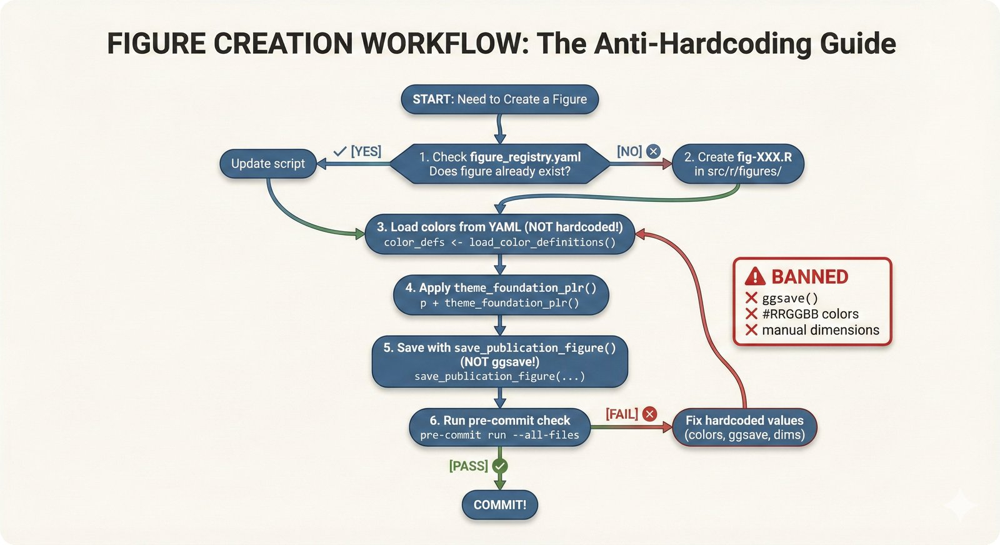
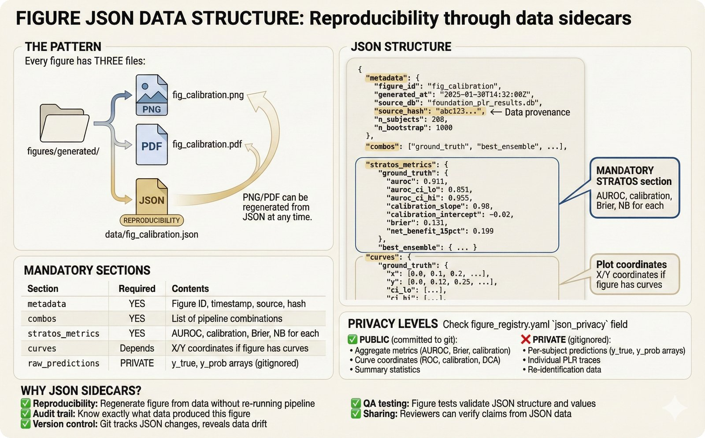

# Visualization (`src/viz/`)

Figure generation pipeline for the Foundation PLR manuscript.

---

## Visual Guide: Figure Generation

<details>
<summary><b>Click to expand visual explanation</b></summary>

### The Figure Workflow



**From Data to Publication**

Every figure follows this pipeline:
1. **Extract** data from MLflow → DuckDB
2. **Load** from DuckDB (never compute metrics in viz code!)
3. **Visualize** using Python (matplotlib) or R (ggplot2)
4. **Save** with JSON sidecar for reproducibility

---

### JSON Sidecars: Figure Reproducibility



**Every Figure Has a Data File**

```
figures/generated/
├── fig_calibration_curves.png      # The figure
├── fig_calibration_curves.pdf      # Vector version
└── data/
    └── fig_calibration_curves.json # Exact data used
```

This means:
- Figures can be regenerated from JSON alone
- Data provenance is clear
- Reviewers can verify the numbers

---

### STRATOS Metrics: Not Just AUROC


**We Report ALL STRATOS Metrics**

AUROC alone is insufficient. Every comparison includes:
- **Discrimination**: AUROC with 95% CI
- **Calibration**: Slope, intercept, calibration curves
- **Overall**: Brier score, Scaled Brier
- **Clinical Utility**: Net Benefit, DCA curves

*Learn more: [STRATOS Metrics Tutorial](../../docs/tutorials/stratos-metrics.md)*

---

### How to Read the Plots

New to these visualization types? See the guide:

| Plot | What It Shows | Guide |
|------|---------------|-------|
| CD Diagram | Statistical ranking | [Reading Guide](../../docs/tutorials/reading-plots.md#critical-difference-diagrams) |
| Calibration | Probability accuracy | [Reading Guide](../../docs/tutorials/reading-plots.md#calibration-plots) |
| DCA | Clinical utility | [Reading Guide](../../docs/tutorials/reading-plots.md#decision-curve-analysis-dca) |
| SHAP | Feature importance | [Reading Guide](../../docs/tutorials/reading-plots.md#shap-values) |

</details>

---

## Quick Start

```bash
# Generate all figures
python src/viz/generate_all_figures.py

# Generate specific figure
python src/viz/generate_all_figures.py --figure R7

# List available figures
python src/viz/generate_all_figures.py --list
```

## Module Structure

```
viz/
├── __init__.py
├── generate_all_figures.py      # Main entry point
├── plot_config.py               # Style configuration
├── metric_registry.py           # Metric definitions (USE THIS!)
├── config_loader.py             # Load YAML configs
├── data_loader.py               # Load data from MLflow/DuckDB
├── figure_data.py               # Figure data management
├── figure_export.py             # Export figures + JSON
│
├── # Core pipeline visualizations
├── viz_data_import.py           # Data import viz
├── viz_outlier_detection.py     # Outlier detection viz
├── viz_imputations.py           # Imputation viz
├── viz_features.py              # Feature viz
│
├── # STRATOS-compliant figures
├── calibration_plot.py          # Smoothed calibration curves
├── dca_plot.py                  # Decision curve analysis
├── retained_metric.py           # Retention curves
├── prob_distribution.py         # Probability distributions
├── uncertainty_scatter.py       # Uncertainty scatter plots
│
├── # Manuscript figures
├── factorial_matrix.py          # M3: Factorial design
├── featurization_comparison.py  # R7: Handcrafted vs embeddings
├── foundation_model_dashboard.py # R8: FM by task
├── utility_matrix.py            # C3: Utility matrix
├── cd_diagram.py                # CD diagrams
├── cd_diagram_preprocessing.py  # CD for preprocessing
├── forest_plot.py               # Forest plots
├── specification_curve.py       # Specification curves
├── heatmap_sensitivity.py       # Sensitivity heatmaps
│
├── # Instability figures
├── fig_instability_plots.py     # pminternal instability
├── generate_instability_figures.py
│
├── # Supplementary
├── individual_subject_traces.py # Subject PLR traces
├── light_protocol_plot.py       # Light protocol diagram
├── parallel_coordinates_preprocessing.py
├── metric_vs_cohort.py
├── outlier_difficulty_analysis.py
├── preprocessing_correlation_scatter.py
│
├── # Utilities
├── viz_utils.py                 # General utilities
├── viz_styling_utils.py         # Styling helpers
├── viz_subplots.py              # Subplot management
└── stratos_figures.py           # STRATOS figure templates
```

## Key Components

### `plot_config.py`

**ALWAYS call `setup_style()` before any matplotlib operations:**

```python
from src.viz.plot_config import setup_style, COLORS, save_figure

setup_style()  # Configure matplotlib

# Use semantic colors
fig, ax = plt.subplots()
ax.plot(x, y, color=COLORS['ground_truth'])

# Save with JSON data
save_figure(fig, 'fig_name', data=data_dict)
```

### `metric_registry.py`

**NEVER hardcode metric names - use the registry:**

```python
from src.viz.metric_registry import MetricRegistry

# Get metric definition
auroc = MetricRegistry.get('auroc')
print(auroc.display_name)  # "AUROC"
print(auroc.higher_is_better)  # True

# Check if metric exists
if MetricRegistry.has('brier'):
    ...
```

### `config_loader.py`

Load standard combinations from YAML:

```python
from src.viz.config_loader import load_standard_combos

combos = load_standard_combos()
# Returns: [ground_truth, best_ensemble, best_single_fm, traditional]
```

## Standard Combinations

From `configs/VISUALIZATION/plot_hyperparam_combos.yaml`:

| ID | Outlier | Imputation | AUROC |
|----|---------|------------|-------|
| `ground_truth` | pupil-gt | pupil-gt | 0.9110 |
| `best_ensemble` | Ensemble | CSDI | 0.9130 |
| `best_single_fm` | MOMENT-gt-finetune | SAITS | 0.9099 |
| `traditional` | LOF | SAITS | 0.8599 |

**ALWAYS include ground_truth in comparisons!**

## Figure Generation Pattern

```python
import yaml
from src.viz.plot_config import setup_style, COLORS, save_figure

def create_my_figure():
    # 1. Load combos from YAML (never hardcode!)
    cfg = yaml.safe_load(open("configs/VISUALIZATION/plot_hyperparam_combos.yaml"))
    combos = cfg["standard_combos"]

    # 2. Setup style
    setup_style()

    # 3. Create figure
    fig, ax = plt.subplots()

    # 4. Use semantic colors
    for combo in combos:
        ax.plot(..., color=COLORS[combo["id"]])

    # 5. Prepare data for JSON export
    data_dict = {
        "values": [...],
        "stratos_metrics": {...}
    }

    return fig, data_dict

# Main
fig, data = create_my_figure()
save_figure(fig, "fig_my_figure", data=data)
```

## Main Figures

| ID | Description | Function |
|----|-------------|----------|
| M3 | Factorial experiment design | `factorial_matrix.py` |
| R7 | Handcrafted vs embeddings | `featurization_comparison.py` |
| R8 | FM performance dashboard | `foundation_model_dashboard.py` |
| C3 | Utility matrix | `utility_matrix.py` |
| CD | CD diagrams | `cd_diagram_preprocessing.py` |

## STRATOS Figures

| Figure | Function | Metric |
|--------|----------|--------|
| Calibration curves | `calibration_plot.py` | Calibration |
| DCA curves | `dca_plot.py` | Clinical utility |
| Retention curves | `retained_metric.py` | Multiple metrics |
| Probability dist. | `prob_distribution.py` | Discrimination |

## Constraints

| Rule | Limit |
|------|-------|
| Main figure curves | MAX 4 |
| Supplementary curves | MAX 8 |
| Ground truth | REQUIRED in all comparisons |
| Hardcoded combos | FORBIDDEN |
| Hardcoded colors | FORBIDDEN (use COLORS dict) |

## See Also

- [figures/README.md](../../figures/README.md) - Generated figures
- [configs/VISUALIZATION/figure_registry.yaml](../../configs/VISUALIZATION/figure_registry.yaml) - Figure specifications
- [configs/VISUALIZATION/plot_hyperparam_combos.yaml](../../configs/VISUALIZATION/plot_hyperparam_combos.yaml) - Standard combinations
