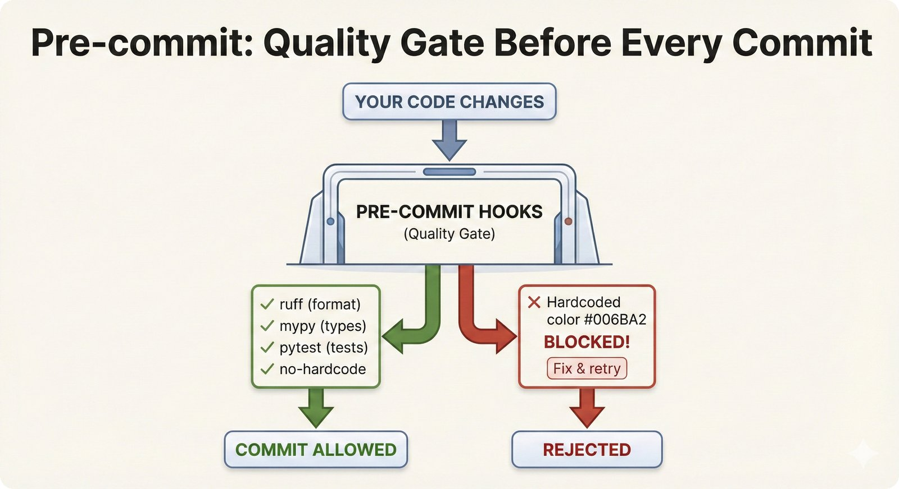
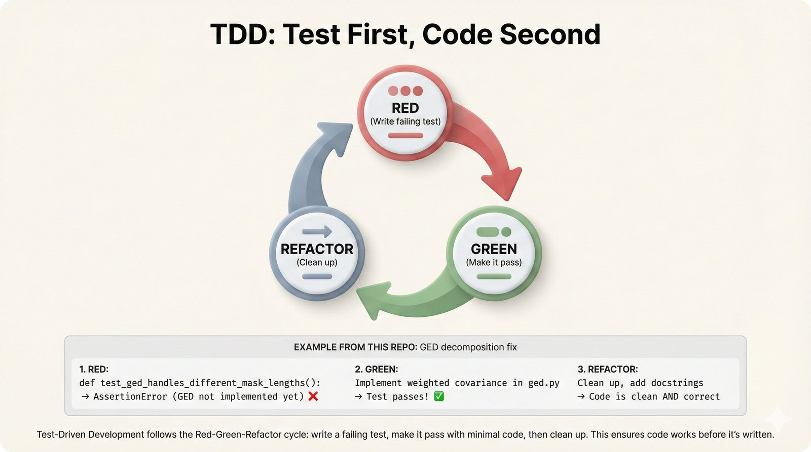

# Tests (`tests/`)

This directory contains the test suite for Foundation PLR.

---

## Visual Guide: Testing & Quality Gates

<details>
<summary><b>Click to expand visual explanation</b></summary>

### Pre-commit Quality Gates



**Automatic Quality Checks**

Every commit triggers:
- **Ruff**: Fast Python linting
- **Black**: Code formatting
- **MyPy**: Type checking
- **pytest**: Unit tests

If any check fails, the commit is blocked.

---

### Test-Driven Development



**The TDD Cycle**

1. **Red**: Write a failing test
2. **Green**: Write minimal code to pass
3. **Refactor**: Clean up without breaking tests

---

### Learning from Failures


**Meta-Learning from Bugs**

Every critical bug becomes a documented meta-learning:
- What happened?
- Why did it happen?
- How do we prevent it?

See `.claude/docs/meta-learnings/` for examples.

</details>

---

## Quick Start

```bash
# Run all tests
pytest tests/

# Run with coverage
pytest --cov=src tests/

# Run specific test file
pytest tests/unit/test_stats.py

# Run specific test
pytest tests/unit/test_stats.py::test_compute_auroc -v
```

---

## For Reviewers

This section summarizes the test strategy for manuscript reviewers. For developer documentation, see sections below.

### Test Summary

- **Total**: 2000+ tests (run `pytest --co -q | tail -1` for exact count)
- **Out-of-the-box from fresh clone**: `make test-fast` runs unit + guardrail tests with zero external dependencies

### Test Categories

| Category | Marker | Count | Description |
|----------|--------|-------|-------------|
| Unit | `unit` | ~50 | Fast, isolated function tests |
| Guardrail | `guardrail` | ~30 | Code quality enforcement (no data needed) |
| Integration | `integration` | ~20 | Multi-component tests with synthetic data |
| Data | `data` | ~100 | Tests requiring `data/public/` or `outputs/r_data/` |
| Figure QA | (in `test_figure_qa/`) | ~50 | Scientific figure integrity |
| R Required | `r_required` | ~10 | Tests requiring R/Rscript |

Note: exact counts vary as tests are added. The markers above are the pytest markers defined in `pyproject.toml`.

### Guardrail Tests

These tests enforce project-level code quality rules:

- **Computation Decoupling**: `src/viz/` must NOT import sklearn/stats computation modules -- visualization reads DuckDB only
- **Registry Integrity**: Exactly 11 outlier, 8 imputation, 5 classifier methods (from `configs/mlflow_registry/`)
- **Makefile Compliance**: No `pip install`, all Python calls use `uv run python`
- **Metadata Accuracy**: `DATA_MANIFEST.yaml` git_tracked fields match reality, `CITATION.cff` has required fields
- **Configuration Validation**: Hydra configs parse correctly, no orphan references

### CI Tier Structure

| Tier | Content | Duration | Trigger |
|------|---------|----------|---------|
| 0 | Lint (ruff) | ~30s | Every push |
| 1 | Unit + guardrail | ~90s | Every push |
| 2 | Data tests (with mounts) | ~5min | PR only |
| 3 | Integration + E2E | ~10min | Release/manual |

### Skipped Tests

Approximately 181 tests are skipped when run without production outputs. These tests verify figures and analysis outputs that require `make analyze` to generate first (which needs local MLflow data). **These are NOT failures** -- they verify outputs that only exist after full pipeline execution.

### Figure QA Tests (CRITICAL-FAILURE-001)

After an incident where AI-generated code produced calibration plots with synthetic data instead of real predictions, mandatory figure QA tests were added:

```bash
pytest tests/test_figure_qa/ -v  # MUST pass before any figure commit
```

These tests verify: data provenance (no synthetic data in figures), statistical validity, rendering quality, and publication standards.

---

## Test Organization

```
tests/
├── conftest.py              # Shared fixtures
├── __init__.py
├── test_foundation_plr.py   # Basic sanity tests
├── mlflow_tests.py          # MLflow integration tests
│
├── unit/                    # Unit tests (fast, isolated)
│   └── test_*.py
│
├── integration/             # Integration tests (slower)
│   └── test_*.py
│
└── smoke/                   # Smoke tests (minimal validation)
    └── test_*.py
```

## Test Categories

### Unit Tests (`unit/`)

Fast, isolated tests for individual functions:

```bash
pytest tests/unit/ -v
```

- Test individual functions in isolation
- Mock external dependencies
- Run in <1 second each

### Integration Tests (`integration/`)

Tests that verify components work together:

```bash
pytest tests/integration/ -v
```

- Test pipeline stages end-to-end
- May use real data samples
- Run in <30 seconds each

### Smoke Tests (`smoke/`)

Quick validation that critical paths work:

```bash
pytest tests/smoke/ -v
```

- Minimal tests for CI/CD
- Catch obvious breakages
- Run in <5 seconds each

## Fixtures

Common fixtures are defined in `conftest.py`:

```python
import pytest

@pytest.fixture
def sample_plr_signal():
    """Sample PLR signal for testing."""
    return np.random.randn(1981)

@pytest.fixture
def sample_predictions():
    """Sample predictions for metric tests."""
    return {
        'y_true': np.array([0, 0, 1, 1]),
        'y_prob': np.array([0.1, 0.3, 0.7, 0.9])
    }
```

## Docker Tests

Some tests require Docker for isolated R environments:

```bash
# Run only Docker-dependent tests
pytest tests/ -m docker

# Skip Docker tests
pytest tests/ -m "not docker"
```

### Marking Docker Tests

```python
import pytest

@pytest.mark.docker
def test_pminternal_wrapper():
    """Test that requires Docker R environment."""
    ...
```

## Coverage

Generate coverage report:

```bash
# Terminal report
pytest --cov=src tests/

# HTML report
pytest --cov=src --cov-report=html tests/
# Open htmlcov/index.html
```

### Coverage Targets

| Module | Target | Reason |
|--------|--------|--------|
| `src/stats/` | 90%+ | Critical statistical methods |
| `src/viz/` | 70%+ | Visualization code |
| `src/classification/` | 80%+ | Core classification logic |
| Vendored code | N/A | Excluded from coverage |

## Writing Tests

### Test Structure

```python
def test_compute_auroc_perfect_discrimination():
    """
    Test AUROC computation with perfect discrimination.

    Given: Perfect predictions (all 0s before all 1s)
    When: AUROC is computed
    Then: AUROC should be 1.0
    """
    y_true = np.array([0, 0, 1, 1])
    y_prob = np.array([0.0, 0.1, 0.9, 1.0])

    auroc = compute_auroc(y_true, y_prob)

    assert auroc == 1.0
```

### Testing STRATOS Metrics

```python
from src.stats.calibration_extended import compute_calibration_slope

def test_calibration_slope_perfect():
    """Perfect calibration should have slope ~1.0."""
    y_true = np.array([0, 0, 0, 1, 1, 1])
    y_prob = np.array([0.1, 0.2, 0.3, 0.7, 0.8, 0.9])

    slope = compute_calibration_slope(y_true, y_prob)

    assert 0.9 < slope < 1.1
```

## Running in CI

The test suite is designed for CI/CD:

```yaml
# Example GitHub Actions
- name: Run tests
  run: |
    pytest tests/ --tb=short
```

## Excluding Vendored Code

Vendored code is excluded from tests and coverage:

```ini
# pyproject.toml
[tool.pytest.ini_options]
testpaths = ["tests"]
addopts = "--ignore=src/imputation/pypots --ignore=src/imputation/nuwats"

[tool.coverage.run]
omit = [
    "src/imputation/pypots/*",
    "src/imputation/nuwats/*",
    "src/classification/tabpfn/*",
    "src/classification/tabpfn_v1/*",
]
```
